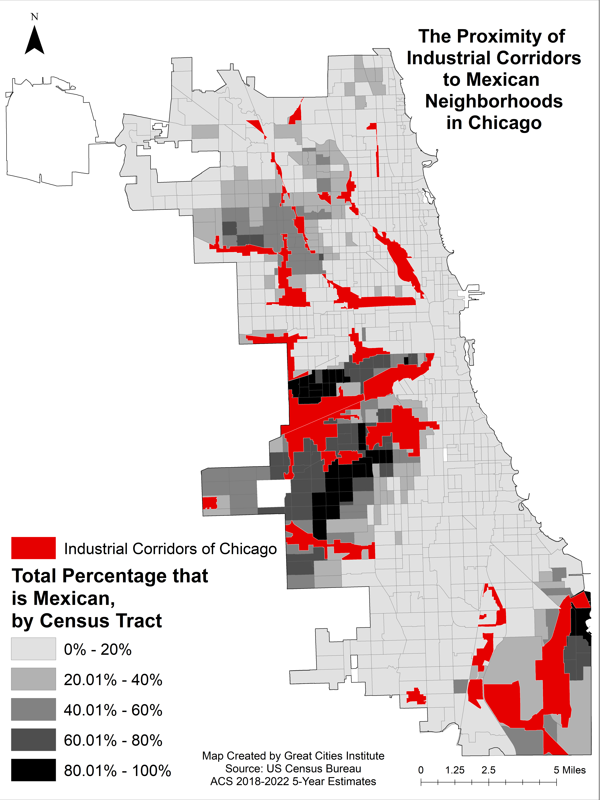

```{r setup, include=FALSE}
knitr::opts_chunk$set(echo = FALSE, message = F, warning = F, fig.pos="H")


```


```{r echo=FALSE, message=FALSE, warning=FALSE, include=FALSE}

library(ipumsr)
library(tidyverse)
library(purrr)
library(sf)
library(tidycensus)
library(tidyr)
library(readxl)
library(sf)
library(htmltools)
library(leaflet)
library(janitor)
library(data.table)
library(tinytex)
library(survey) # for survey analysis
library(srvyr)  # for tidy survey analysis
library(tmap)
library(readr)
library("kableExtra") 
library(tmaptools)
library("RColorBrewer") 
# library(OpenStreetMap)
# remotes::install_github('yihui/knitr')
# install.packages("knitr")
# library(knitr)
# options(tinytex.verbose = TRUE)
# tinytex::reinstall_tinytex()
# install.packages('tinytex')

# update.packages(ask = FALSE, checkBuilt = TRUE)
# tinytex::tlmgr_update()
# tinytex::latexmk("Housing_Visual.tex")
options(knitr.kable.NA = '-') 

# Read Data

usa_data <- read.csv("C:/Users/elhamp2/Box/Great Cities Institute/Research/Mexican Report/final_Mexican_IL_2000_22.csv") %>% 
  mutate(race_ethnicity = case_when(hispan ==0 & race == 1 ~ "White (non-Hispanic or Latino)",
                                    hispan ==0 & race == 2 ~ "Black (non-Hispanic or Latino)",
                                    hispan %in% c(2,3,4) ~ "Other Hispanics or Latinos",
                                    hispan ==1 ~ "Mexican", 
                                    hispan ==0 & race %in%c(3:9) ~ "Other (non-Hispanic or Latino)",
                                    TRUE ~ NA_character_),
         
  race_ethnicity = factor(race_ethnicity, level = c("Mexican", "Other Hispanics or Latinos","White (non-Hispanic or Latino)", "Black (non-Hispanic or Latino)",  "Other (non-Hispanic or Latino)")),
  
  hispan_breakdown = case_when(
  hispand == 0 ~ "Not Hispanic",
  hispand == 100 ~ "Mexican", 
  hispand == 200 ~ "Puerto Rican",
  hispand == 300 ~ "Cuban",
  hispand == 411 ~ "Costa Rican",
  hispand == 412 ~ "Guatemalan",
  hispand == 413 ~ "Honduran",
  hispand == 414 ~ "Nicaraguan",
  hispand == 415 ~ "Panamanian",
  hispand == 416 ~ "Salvadoran",
  hispand == 417 ~ "Central American, not specified",
  hispand == 420 ~ "Argentinean",
  hispand == 421 ~ "Bolivian",
  hispand == 422 ~ "Chilean",
  hispand == 423 ~ "Colombian",
  hispand == 424 ~ "Ecuadorian",
  hispand == 425 ~ "Paraguayan",
  hispand == 426 ~ "Peruvian",
  hispand == 427 ~ "Uruguayan",
  hispand == 428 ~ "Venezuelan",
  hispand == 431 ~ "South American, not specified",
  hispand == 450 ~ "Spaniard",
  hispand == 460 ~ "Dominican",
  hispand == 498 ~ "Other, not specified",
  TRUE ~ "Other"
),
mex_foreign_born = case_when(
    race_ethnicity == "Mexican" & bpl %in% as.character(1:56) ~ "U.S. Born",
    race_ethnicity == "Mexican" & bpl == "200" ~ "Mexico Born",
    TRUE ~ NA_character_  # Optional: default case for other values or groups
  )) %>% ## filter for hispanic groups here ##
 mutate(hispan_breakdown = factor(hispan_breakdown, level = c("Mexican", "Puerto Rican","Ecuadorian", "Cuban", "Guatemalan", "Colombian"))
  )


# Construct the full file path
chicago_ca_pop <- read_sf("Data Tables/shp/comm_pop_chi_2022.shp") %>% as.data.frame() 

##### Chicago boarder
Chicago_boundary_shp <- read_sf("C:/Users/elhamp2/Box/Great Cities Institute/Research/Mexican Report/Boundaries_Chicago/geo_export_8881adc5-2460-457b-892f-04f4d6028b72.shp") %>% 
  st_transform(crs = 4326)
# mapview(community_shp)

# Get the current bounding box of the data
bbox_data <- st_bbox(Chicago_boundary_shp)

# Calculate the range of x and y values in degrees
xrange <- bbox_data$xmax - bbox_data$xmin
yrange <- bbox_data$ymax - bbox_data$ymin

# Calculate the center of the bounding box
center_x <- (bbox_data$xmin + bbox_data$xmax) / 2
center_y <- (bbox_data$ymin + bbox_data$ymax) / 2
# Modify the bounding box to fit the desired width while keeping the height the same
bbox_new <- c(center_x - 0.24,
              center_y - 0.23,
              center_x + 0.23,
              center_y + 0.23)

# osm_chicago <- read_osm(bbox_new, 
#                         type = "bing")


theme_plots <-
  theme_minimal() +
  theme(panel.background = element_blank(),
        panel.grid.major = element_blank(), 
        panel.grid.minor = element_blank(),
        axis.line = element_line(color="#969696", linewidth = 1),
        plot.title = element_text(face ="bold", size = 10, hjust = 0.5),
      plot.subtitle = element_text(face ="italic", size = 8, color = "#636363"),
      axis.text = element_text(size = 9),
      axis.title = element_text(face ="bold", size = 9),
      plot.caption = element_text(hjust = 0, size = 8, color = "black"),
      legend.text = element_text(size = 8, color = "#636363"),
      legend.title = element_text(face = "bold", size = 8, color = "#636363")) 


color_hispan_breakdown <- c(
  "Mexican" = "#CE1126", 
  "Puerto Rican" = "#32C2DC", 
  "Ecuadorian" =  "#A9AD72",
  "Cuban" = "#AB6E29", 
  "Guatemalan" =  "#D3A668",
  "Colombian" = "#F9C93C"
)

color_race_ethnicity <- c("Mexican" = "#CE1126", "Other Hispanics or Latinos" = "#F9AA51",
                               "White (non-Hispanic or Latino)" = "#9CA168",
                               "Black (non-Hispanic or Latino)" = "#8CBEC0",
                               "Other (non-Hispanic or Latino)" = "#0B8489")

race_group = c(Prc_Ownership_With_Employees = "#4D2B18",
               prc_pop = "#D3A668")

school_indicator <- read_csv("School/df_school.csv")


chicago_health <- read_csv("Health Data/Chicago Health Atlas Data Download - Community areas.csv") %>% clean_names() %>% rename(
  obesity_rate = hcsobp_2022_2023,
  diabetes_rate = hcsdiap_2022_2023,
  asthma_rate = hcsathp_2022_2023,
  lbw_rate = vrbwp_2017_2021,
  unmet_mental_health_rate = hcsumhap_2022_2023,
  cancer_diagnosis_rate = ccr_2017_2021,
  hyper_tension_rate = hcshytp_2022_2023,
  psych_distress_rate =   hcsspdp_2022_2023,
  lung_cancer_rate =ccg_2017_2021,
  loneliness_rate = chavqos_2022_2023
)


# merge chicago ca with health atlas
df_health <- chicago_ca_pop %>% select(commnty, prc_mxc, prc_nh_w, prc_nh_b) %>% mutate(commnty = str_to_title(tolower(commnty))) %>% left_join(chicago_health, by = c("commnty" = "name")) %>% select(-layer)  %>%
 mutate(across(matches("rate$"), ~ format(round(as.numeric(.), 1), nsmall = 1))) %>% mutate(across(ends_with("rate"), ~ as.numeric(as.character(.))))

comm_2000_2022 <- st_read ("Data Tables/shp/comm_pop_chi_2000_2022.shp" ) %>% 
  mutate(prc2 = paste0(prc, "%"))


```


\renewcommand{\arraystretch}{1.4}

\clearpage

# Demographic

## 1A.1: Mexican population in Chicago, 2000 to 2018-2022:

```{r include=FALSE}

comm_2000_2022 <- st_read ("Data Tables/shp/comm_pop_chi_2000_2022.shp" ) %>% 
  mutate(prc2 = paste0(format(round(prc, 1), nsmall = 1), "%")) %>% 
  mutate(prc = round(prc, 1)) %>% 
  mutate(comm_prc_label = paste0(str_to_title(tolower(commnty)), ":\n", prc2)) %>% 
  mutate(comm_pop_label = paste0(str_to_title(tolower(commnty)), ":\n", ttl_mxc2))
```


### Mexican Population by Community Areas in Chicago, 2018-2022


```{r fig.height=11, fig.width=8}

comm_mexican_pop_map_2022 <-

  tm_shape(comm_2000_2022 %>% filter(year == "2018-2022"), bbox = bbox_new) +
  tm_polygons(
    col = "ttl_mxc",
    breaks = c(0, 15000, 30000, 45000, 60000, 75000),
    border.col = "#6c757d",
              palette="Blues",
              alpha = 1,
              # n = 5,
              title = "Mexican Population",
              lwd = 0.3,
    legend.show = FALSE
    ) +
 
   tm_text("ttl_mxc2" , size = 0.7, alpha = 0.9, fontface="bold", fontfamily = "sans") +

  
  tm_shape(comm_2000_2022 %>% filter(prc>=50 & year == "2018-2022")) +
  tm_borders(col = "#9b2226",
             alpha = 1,
             lwd = 2) +


  tm_shape(Chicago_boundary_shp) +
  tm_borders(col = "#343a40",
             alpha = 1,
             lwd = 2.5) +

  tm_layout( frame = TRUE,
             # main.title.position = c("left", "top"),
             # main.title = "Density of Hispanic or Latino Population by their Origins in Chicago, 2010",
             # main.title.size = 1.2,
            legend.outside = FALSE,
            legend.width = 1.5,
            legend.title.size = .9,
            legend.text.size = 0.8,
            legend.title.fontface = "bold",
            # legend.position = c("left", "bottom"),
            legend.position = c(0.03, 0.12),
            legend.bg.color = "white",
            legend.bg.alpha = .3) +      # manually position legend) +
  
  tm_credits("Data Source: IPUMS NHGIS, University of Minnesota, www.nhgis.org\n(2018-2022 American Community Survey 5-year Estimates).\nTabulations by Great Cities Institute. ",
             fontface = "bold",
             position = c("left","bottom"), size = 0.8)+


  tm_credits("Mexican Population by Community Area in Chicago,\n2018-2022 (ACS 5-year Estimates)",
             fontface = "bold",
             position = c("left","top"), size = 1.25) +
  
  tm_add_legend("fill", 
                labels = c("0 - 15,000", "15,001 - 30,000", "30,001 - 45,000", "45,001 - 60,000", "60,001 - 75,000"), 
                col = c("#eff3ff", "#bdd7e7", "#6baed6", "#3182bd", "#08519c"),
                alpha = 1,
                lwd = .3,

                border.col = "#ced4da",
                title = "Mexican Population",
                size = 0.7) +
  
  tm_add_legend("line",
                labels = c("Chicago", "Community Areas", "" ,"Community Areas with More Than\n50% Share of Mexican Population", ""),
                col = c("#343a40" , "#6c757d" , "white","#9b2226", "white"),
                lwd = c(2.5, 2, 2.5, 2.5,2.5),
                title = "",
                size = 0.8) +

  tm_compass(position = c("right", "bottom"), size = 1) +
  tm_scale_bar(position = c("right", "bottom"), width = 0.15)

comm_mexican_pop_map_2022

```


### Mexican Population by Community Areas in Chicago, 2010


```{r fig.height=11, fig.width=8}

comm_mexican_pop_map_2010 <-

  tm_shape(comm_2000_2022 %>% filter(year == "2010"), bbox = bbox_new) +
  tm_polygons(
    col = "ttl_mxc",
    breaks = c(0, 15000, 30000, 45000, 60000, 75000),
    border.col = "#6c757d",
              palette="Blues",
              alpha = 1,
              # n = 5,
              title = "Mexican Population",
              lwd = 0.3,
    legend.show = FALSE
    ) +
 
   tm_text("ttl_mxc2" , size = 0.7, alpha = 0.9, fontface="bold", fontfamily = "sans") +

  
  tm_shape(comm_2000_2022 %>% filter(prc>=50 & year == "2010")) +
  tm_borders(col = "#9b2226",
             alpha = 1,
             lwd = 2) +


  tm_shape(Chicago_boundary_shp) +
  tm_borders(col = "#343a40",
             alpha = 1,
             lwd = 2.5) +

  tm_layout( frame = TRUE,
             # main.title.position = c("left", "top"),
             # main.title = "Density of Hispanic or Latino Population by their Origins in Chicago, 2010",
             # main.title.size = 1.2,
            legend.outside = FALSE,
            # legend.width = 1.5,
            legend.title.size = .9,
            legend.text.size = 0.8,
            legend.title.fontface = "bold",
            # legend.position = c("left", "bottom"),
            legend.position = c(0.03, 0.12),
            legend.bg.color = "white",
            legend.bg.alpha = .3) +      # manually position legend) +
  
  tm_credits("Data Source: IPUMS NHGIS, University of Minnesota, www.nhgis.org \n(2010 Decennial Censuses).\nTabulations by Great Cities Institute. ",
             fontface = "bold",
             position = c("left","bottom"), size = 0.8)+


  tm_credits("Mexican Population by Community Area in Chicago,\n2010 (Decennial Census)",
             fontface = "bold",
             position = c("left","top"), size = 1.25) +
  
  tm_add_legend("fill", 
                labels = c("0 - 15,000", "15,001 - 30,000", "30,001 - 45,000", "45,001 - 60,000", "60,001 - 75,000"), 
                col = c("#eff3ff", "#bdd7e7", "#6baed6", "#3182bd", "#08519c"),
                alpha = 1,
                lwd = .3,

                border.col = "#ced4da",
                title = "Mexican Population",
                size = 0.7) +
  
  tm_add_legend("line",
                labels = c("Chicago", "Community Areas", "" ,"Community Areas with More Than\n50% Share of Mexican Population", ""),
                col = c("#343a40" , "#6c757d" , "white","#9b2226", "white"),
                lwd = c(2.5, 2, 2.5, 2.5,2.5),
                title = "",
                size = 0.8) +

  tm_compass(position = c("right", "bottom"), size = 1) +
  tm_scale_bar(position = c("right", "bottom"), width = 0.15)

comm_mexican_pop_map_2010

```


### Mexican Population by Community Areas in Chicago, 2000


```{r fig.height=11, fig.width=8}

comm_mexican_pop_map_2000 <-

  tm_shape(comm_2000_2022 %>% filter(year == "2000"), bbox = bbox_new) +
  tm_polygons(
    col = "ttl_mxc",
    breaks = c(0, 15000, 30000, 45000, 60000, 75000),
    border.col = "#6c757d",
              palette="Blues",
              alpha = 1,
              # n = 5,
              title = "Mexican Population",
              lwd = 0.3,
    legend.show = FALSE
    ) +
 
   tm_text("ttl_mxc2" , size = 0.7, alpha = 0.9, fontface="bold", fontfamily = "sans") +

  
  tm_shape(comm_2000_2022 %>% filter(prc>=50 & year == "2000")) +
  tm_borders(col = "#9b2226",
             alpha = 1,
             lwd = 2) +


  tm_shape(Chicago_boundary_shp) +
  tm_borders(col = "#343a40",
             alpha = 1,
             lwd = 2.5) +

  tm_layout( frame = TRUE,
             # main.title.position = c("left", "top"),
             # main.title = "Density of Hispanic or Latino Population by their Origins in Chicago, 2010",
             # main.title.size = 1.2,
            legend.outside = FALSE,
            # legend.width = 1.5,
            legend.title.size = .9,
            legend.text.size = 0.8,
            legend.title.fontface = "bold",
            # legend.position = c("left", "bottom"),
            legend.position = c(0.03, 0.12),
            legend.bg.color = "white",
            legend.bg.alpha = .3) +      # manually position legend) +
  
  tm_credits("Data Source: IPUMS NHGIS, University of Minnesota, www.nhgis.org \n(2000 Decennial Censuses).\nTabulations by Great Cities Institute. ",
             fontface = "bold",
             position = c("left","bottom"), size = 0.8)+


  tm_credits("Mexican Population by Community Area in Chicago,\n2000 (Decennial Census)",
             fontface = "bold",
             position = c("left","top"), size = 1.25) +
  
  tm_add_legend("fill", 
                labels = c("0 - 15,000", "15,001 - 30,000", "30,001 - 45,000", "45,001 - 60,000", "60,001 - 75,000"), 
                col = c("#eff3ff", "#bdd7e7", "#6baed6", "#3182bd", "#08519c"),
                alpha = 1,
                lwd = .3,

                border.col = "#ced4da",
                title = "Mexican Population",
                size = 0.7) +
  
  tm_add_legend("line",
                labels = c("Chicago", "Community Areas", "" ,"Community Areas with More Than\n50% Share of Mexican Population", ""),
                col = c("#343a40" , "#6c757d" , "white","#9b2226", "white"),
                lwd = c(2.5, 2, 2.5, 2.5,2.5),
                title = "",
                size = 0.8) +

  tm_compass(position = c("right", "bottom"), size = 1) +
  tm_scale_bar(position = c("right", "bottom"), width = 0.15)

comm_mexican_pop_map_2000

```


## Percentage of the Mexican Population, 2000 to 2018-2022

### Percentage of the Mexican Population by Community Areas in Chicago, 2018-2022

```{r fig.height=11, fig.width=8}
# fig.height=11, fig.width=24
comm_mexican_prc_map_2022 <-

  tm_shape(comm_2000_2022 %>% filter(year == "2018-2022"), bbox = bbox_new) +
  tm_polygons(
    col = "prc",
              # style = "jenks",
              border.col = "#6c757d",
              palette="Blues",
              alpha = 1,
              # n = 5,
    breaks = c(0, 20.1, 40.1, 60.1, 80.1, 100),
    legend.show = FALSE,
              title = "Percentage",
              lwd = 0.3) +
   tm_text("prc2" , size = 0.65, alpha = 1, fontface="bold", fontfamily = "sans")+

  tm_shape(Chicago_boundary_shp) +
  tm_borders(col = "#343a40",
             alpha = 1,
             lwd = 2.5) +
  

   tm_layout( frame = TRUE,
             # main.title.position = c("left", "top"),
             # main.title = "Density of Hispanic or Latino Population by their Origins in Chicago, 2010",
             # main.title.size = 1.2,
            legend.outside = FALSE,
            # legend.width = 1.5,
            legend.title.size = .9,
            legend.text.size = 0.8,
            legend.title.fontface = "bold",
            # legend.position = c("left", "bottom"),
            legend.position = c(0.03, 0.12),
            legend.bg.color = "white",
            legend.bg.alpha = .3) + 
  
  tm_credits("Percent Mexican Population by Community Area in Chicago,\n2018-2022 (ACS 5-year Estimates) ",
             fontface = "bold",
             position = c("left","top"), size = 1.25) +
  
  
  tm_credits("Data Source: IPUMS NHGIS, University of Minnesota, www.nhgis.org\n(2018-2022 American Community Survey 5-year Estimates).\nTabulations by Great Cities Institute. ",
             fontface = "bold",
             position = c("left","bottom"), size = 0.8)+
  
  
  tm_add_legend("fill", 
                labels = c("0.0% - 20.0%", "20.1% - 40.0%", "40.1% - 60.0%", "60.1% - 80.0%", "80.1% - 100%"), 
                col = c("#eff3ff", "#bdd7e7", "#6baed6", "#3182bd", "#08519c"),
                alpha = 1,
                lwd = .3,

                border.col = "#ced4da",
                title = "Percent",
                size = 0.7)+
  
  tm_add_legend("line",
                labels = c("Chicago", "Community Areas"),
                col = c("#343a40","#6c757d"),
                lwd = c(2.5, 2),
                title = "",
                size = 0.8) 
  

  


comm_mexican_prc_map_2022

```


### Percentage of the Mexican Population by Community Areas in Chicago, 2010

```{r fig.height=11, fig.width=8}
# fig.height=11, fig.width=24
comm_mexican_prc_map_2010 <-

  tm_shape(comm_2000_2022 %>% filter(year == "2010"), bbox = bbox_new) +
  tm_polygons(
    col = "prc",
              # style = "jenks",
              border.col = "#6c757d",
              palette="Blues",
              alpha = 1,
              # n = 5,
    breaks = c(0, 20.1, 40.1, 60.1, 80.1, 100),
    legend.show = FALSE,
              title = "Percentage",
              lwd = 0.3) +
   tm_text("prc2" , size = 0.65, alpha = 1, fontface="bold", fontfamily = "sans")+

  tm_shape(Chicago_boundary_shp) +
  tm_borders(col = "#343a40",
             alpha = 1,
             lwd = 2.5) +
  

   tm_layout( frame = TRUE,
             # main.title.position = c("left", "top"),
             # main.title = "Density of Hispanic or Latino Population by their Origins in Chicago, 2010",
             # main.title.size = 1.2,
            legend.outside = FALSE,
            # legend.width = 1.5,
            legend.title.size = .9,
            legend.text.size = 0.8,
            legend.title.fontface = "bold",
            # legend.position = c("left", "bottom"),
            legend.position = c(0.03, 0.12),
            legend.bg.color = "white",
            legend.bg.alpha = .3) + 
  
  tm_credits("Percent Mexican Population by Community Area in Chicago,\n  2010  (Decennial Census) ",
             fontface = "bold",
             position = c("left","top"), size = 1.25) +
  
  
  tm_credits("Data Source: IPUMS NHGIS, University of Minnesota, www.nhgis.org \n(2010 Decennial Census),\nTabulations by Great Cities Institute. ",
             fontface = "bold",
             position = c("left","bottom"), size = 0.8)+
  
  
  tm_add_legend("fill", 
                labels = c("0.0% - 20.0%", "20.1% - 40.0%", "40.1% - 60.0%", "60.1% - 80.0%", "80.1% - 100%"), 
                col = c("#eff3ff", "#bdd7e7", "#6baed6", "#3182bd", "#08519c"),
                alpha = 1,
                lwd = .3,

                border.col = "#ced4da",
                title = "Percent",
                size = 0.7)+
  
  tm_add_legend("line",
                labels = c("Chicago", "Community Areas"),
                col = c("#343a40","#6c757d"),
                lwd = c(2.5, 2),
                title = "",
                size = 0.8) 
  

  


comm_mexican_prc_map_2010

```


### Percentage of the Mexican Population by Community Areas in Chicago, 2000

```{r fig.height=11, fig.width=8}
# fig.height=11, fig.width=24
comm_mexican_prc_map_2000 <-

  tm_shape(comm_2000_2022 %>% filter(year == "2000"), bbox = bbox_new) +
  tm_polygons(
    col = "prc",
              # style = "jenks",
              border.col = "#6c757d",
              palette="Blues",
              alpha = 1,
              # n = 5,
    breaks = c(0, 20.1, 40.1, 60.1, 80.1, 100),
    legend.show = FALSE,
              title = "Percentage",
              lwd = 0.3) +
   tm_text("prc2" , size = 0.65, alpha = 1, fontface="bold", fontfamily = "sans")+

  tm_shape(Chicago_boundary_shp) +
  tm_borders(col = "#343a40",
             alpha = 1,
             lwd = 2.5) +
  

   tm_layout( frame = TRUE,
             # main.title.position = c("left", "top"),
             # main.title = "Density of Hispanic or Latino Population by their Origins in Chicago, 2010",
             # main.title.size = 1.2,
            legend.outside = FALSE,
            # legend.width = 1.5,
            legend.title.size = .9,
            legend.text.size = 0.8,
            legend.title.fontface = "bold",
            # legend.position = c("left", "bottom"),
            legend.position = c(0.03, 0.12),
            legend.bg.color = "white",
            legend.bg.alpha = .3) + 
  
  tm_credits("Percent Mexican Population by Community Area in Chicago,\n2000 (Decennial Census) ",
             fontface = "bold",
             position = c("left","top"), size = 1.25) +
  
  
  tm_credits("Data Source: IPUMS NHGIS, University of Minnesota, www.nhgis.org \n(2000 Decennial Census),\nTabulations by Great Cities Institute. ",
             fontface = "bold",
             position = c("left","bottom"), size = 0.8)+
  
  
  tm_add_legend("fill", 
                labels = c("0.0% - 20.0%", "20.1% - 40.0%", "40.1% - 60.0%", "60.1% - 80.0%", "80.1% - 100%"), 
                col = c("#eff3ff", "#bdd7e7", "#6baed6", "#3182bd", "#08519c"),
                alpha = 1,
                lwd = .3,

                border.col = "#ced4da",
                title = "Percent",
                size = 0.7)+
  
  tm_add_legend("line",
                labels = c("Chicago", "Community Areas"),
                col = c("#343a40","#6c757d"),
                lwd = c(2.5, 2),
                title = "",
                size = 0.8) 
  

  


comm_mexican_prc_map_2000

```

## Community Areas in Chicago

```{r fig.height=11, fig.width=8}
# fig.height=11, fig.width=24
Community_areas <-

  tm_shape(comm_2000_2022 %>% filter(year == "2018-2022"), bbox = bbox_new) +
  tm_polygons(
    col = "#ced4da",
              # border.col = "#6c757d",
              alpha = 0.3,
    legend.show = FALSE) +
  tm_borders(col = "#6c757d",
             alpha = 0.8,
             lwd = 0.3) +
  tm_text("lable" , size = 0.6, alpha = 1, fontface="bold", fontfamily = "sans") +
   

  tm_shape(Chicago_boundary_shp) +
  tm_borders(col = "#343a40",
             alpha = 1,
             lwd = 2.5) +
  
  

   tm_layout( frame = TRUE,
             # main.title.position = c("left", "top"),
             # main.title = "Density of Hispanic or Latino Population by their Origins in Chicago, 2010",
             # main.title.size = 1.2,
            legend.outside = FALSE,
            # legend.width = 1.5,
            legend.title.size = .9,
            legend.text.size = 0.8,
            legend.title.fontface = "bold",
            # legend.position = c("left", "bottom"),
            legend.position = c(0.03, 0.12),
            legend.bg.color = "white",
            legend.bg.alpha = .3) + 
  
  tm_credits("Community Areas in Chicago",
             fontface = "bold",
             position = c("left","top"), size = 1.25) +
  
  
  tm_credits("Data Source: City of Chicago Data Portal,\nTabulations by Great Cities Institute.",
             fontface = "bold",
             position = c("left","bottom"), size = 0.8)+
  
  
  tm_add_legend("fill", 
                labels = c("Community Areas"), 
                col = c("#ced4da"),
                alpha = 0.5,
                lwd = .3,

                border.col = "#6c757d",
                title = "",
                size = 0.7)+
  
  tm_add_legend("line",
                labels = c("Chicago"),
                col = c("#343a40"),
                lwd = c(2.5),
                title = "",
                size = 0.8) 
 

Community_areas

```

\clearpage


```{r}

# Read Data

usa_data <- read.csv("C:/Users/elhamp2/Box/Great Cities Institute/Research/Mexican Report/final_Mexican_IL_2000_22.csv") %>% 
  mutate(race_ethnicity = case_when(hispan ==0 & race == 1 ~ "White (non-Hispanic or Latino)",
                                    hispan ==0 & race == 2 ~ "Black (non-Hispanic or Latino)",
                                    hispan %in% c(2,3,4) ~ "Other Hispanics or Latinos",
                                    hispan ==1 ~ "Mexican", 
                                    hispan ==0 & race %in%c(3:9) ~ "Other (non-Hispanic or Latino)",
                                    TRUE ~ NA_character_),
         
  race_ethnicity = factor(race_ethnicity, level = c("Mexican", "Other Hispanics or Latinos","White (non-Hispanic or Latino)", "Black (non-Hispanic or Latino)",  "Other (non-Hispanic or Latino)")),
  
  hispan_breakdown = case_when(
  hispand == 0 ~ "Not Hispanic",
  hispand == 100 ~ "Mexican", 
  hispand == 200 ~ "Puerto Rican",
  hispand == 300 ~ "Cuban",
  hispand == 411 ~ "Costa Rican",
  hispand == 412 ~ "Guatemalan",
  hispand == 413 ~ "Honduran",
  hispand == 414 ~ "Nicaraguan",
  hispand == 415 ~ "Panamanian",
  hispand == 416 ~ "Salvadoran",
  hispand == 417 ~ "Central American, not specified",
  hispand == 420 ~ "Argentinean",
  hispand == 421 ~ "Bolivian",
  hispand == 422 ~ "Chilean",
  hispand == 423 ~ "Colombian",
  hispand == 424 ~ "Ecuadorian",
  hispand == 425 ~ "Paraguayan",
  hispand == 426 ~ "Peruvian",
  hispand == 427 ~ "Uruguayan",
  hispand == 428 ~ "Venezuelan",
  hispand == 431 ~ "South American, not specified",
  hispand == 450 ~ "Spaniard",
  hispand == 460 ~ "Dominican",
  hispand == 498 ~ "Other, not specified",
  TRUE ~ "Other"
),
mex_foreign_born = case_when(
    race_ethnicity == "Mexican" & bpl %in% as.character(1:56) ~ "U.S. Born",
    race_ethnicity == "Mexican" & bpl == "200" ~ "Mexico Born",
    TRUE ~ NA_character_  # Optional: default case for other values or groups
  )) %>% ## filter for hispanic groups here ##
 mutate(hispan_breakdown = factor(hispan_breakdown, level = c("Mexican", "Puerto Rican","Ecuadorian", "Cuban", "Guatemalan", "Colombian"))
  )

# Chicago ca populationd data
chicago_ca_pop <- read_sf("Data Tables/shp/comm_pop_chi_2022.shp") %>% as.data.frame()


theme_plots <-
  theme_minimal() +
  theme(panel.background = element_blank(),
        panel.grid.major = element_blank(), 
        panel.grid.minor = element_blank(),
        axis.line = element_line(color="#969696", linewidth = 1),
        plot.title = element_text(face ="bold", size = 10, hjust = 0.5),
      plot.subtitle = element_text(face ="italic", size = 8, color = "#636363"),
      axis.text = element_text(size = 9),
      axis.title = element_text(face ="bold", size = 9),
      plot.caption = element_text(hjust = 0, size = 8, color = "black"),
      legend.text = element_text(size = 8, color = "#636363"),
      legend.title = element_text(face = "bold", size = 8, color = "#636363"))


```


## 1B(1): Population by Age for Mexicans and Other Racial/Ethnic Groups in Chicago, 2018-2022 (ACS 5-year Estimates) 

```{r}
# analysis

# filter for year 2022

data_chi_2018_22 <- usa_data %>% filter(year == 2022)

# 1B: Population pyramid of the percentage of Mexican population by age group compared to the rest of the population in Chicago and median age in Chicago (Data source: 2018-2022 ACS data)

df <-  data_chi_2018_22 %>%
  mutate(
    age_group = case_when(
      age < 20 ~ "Young (0-19)",
      age >= 20 & age < 40 ~ "Adults (20-39)",
      age >= 40 & age < 60 ~ "Middle-aged (40-59)",
      age >= 60 & age < 80 ~ "Older Adults (60-79)",
      age >= 80 ~ "Elderly (80+)"
    )
  )
# Create survey design object
survey_design <- df %>%
  as_survey_design(weights = perwt)


# Calculate weighted population counts by age group and ethnicity

# Calculate weighted population by ethnicity and age group
pop_pyramid <- df %>%
  as_survey_design(weights = perwt) %>% 
  survey_count(race_ethnicity, age_group, name="total_weighted_count")  %>%
  group_by(race_ethnicity) %>%
  mutate(total_weighted_percentage = total_weighted_count / sum(total_weighted_count) * 100,
         total_weighted_percentage  = paste0(format(round(total_weighted_percentage, 1), nsmall = 1), "%"))


# get median age

weighted_age  <- df %>%
  group_by(race_ethnicity) %>%
  summarize(
    weighted_age = matrixStats::weightedMedian(age, perwt)
  ) 


# combined

df_final  <- pop_pyramid %>% left_join(weighted_age)

```


```{r}
# visual

table_1b.1 <- df_final %>% 
  mutate(age_group = factor(age_group, levels = c("Young (0-19)", "Adults (20-39)", "Middle-aged (40-59)", "Older Adults (60-79)", "Elderly (80+)"))) %>% 
  arrange(age_group) %>%  # Explicitly arrange by factor levels
  pivot_wider(id_cols = c("age_group"), names_from = race_ethnicity, values_from = c("total_weighted_count", "total_weighted_percentage"))  %>% 
  select(age_group, 
         total_weighted_count_Mexican, total_weighted_percentage_Mexican,
         'total_weighted_count_Other Hispanics or Latinos', 'total_weighted_percentage_Other Hispanics or Latinos',
         'total_weighted_count_White (non-Hispanic or Latino)', 'total_weighted_percentage_White (non-Hispanic or Latino)',
         'total_weighted_count_Black (non-Hispanic or Latino)', 'total_weighted_percentage_Black (non-Hispanic or Latino)',
         'total_weighted_count_Other (non-Hispanic or Latino)', 'total_weighted_percentage_Other (non-Hispanic or Latino)') %>%
  
  # using kable 
  kbl(booktabs = T,
      col.names = c("", "Number", "Percent", "Number", "Percent", "Number", "Percent", "Number", "Percent", "Number", "Percent"),
      align = c("l", rep("r", 10)),  # Align headers and columns
      caption = "Population by Age for Mexicans and Other Racial/Ethnic Groups in Chicago, 2018-2022 (ACS 5-year Estimates)",
      format.args = list(big.mark = ","),
      linesep = "") %>% 
  kable_classic(full_width = F,  
                font_size = 8,
                html_font = "Arial",
                position = "center",
                latex_options = "HOLD_position") %>% 
  column_spec(1, width = "10em") %>%
  column_spec(2:11, width = "3em") %>%  # Align all columns with numbers and percentages to the right
  row_spec(0, align = "C") %>%  # Center column headers
 add_header_above(
  align = c("l", rep("c", 5)),  # Assuming 1 for Age Group and 10 divided into 5 groups
  c("Age Group", "Mexican" = 2, "Other Hispanics\n or Latinos" = 2, "White\n (non-Hispanic\n or Latino)" = 2, "Black\n (non-Hispanic\n or Latino)" = 2, "Other\n (non-Hispanic\n or Latino)" = 2),
  bold = TRUE, font_size = 8
) %>% 
  add_footnote(
    c("\\footnotesize{Data Source: IPUMS USA, University of Minnesota, www.ipums.org (2018-2022 American Community Survey 5-year Estimates). Tabulations by Great Cities Institute.}"),
    notation = "none",
    threeparttable = TRUE,
    escape = FALSE
  )
table_1b.1 
```


```{r fig.width=5, fig.height=4.5 ,fig.align='center'}
# visual

# Pivot data to long format and clean age_group names
df_long <- df_final %>%
  pivot_wider(id_cols = c("race_ethnicity"), 
              names_from = age_group, 
              values_from = c("total_weighted_count", "total_weighted_percentage")) %>% 
  select(race_ethnicity, 
         'total_weighted_percentage_Young (0-19)',
         'total_weighted_percentage_Adults (20-39)',
         'total_weighted_percentage_Middle-aged (40-59)',
         'total_weighted_percentage_Older Adults (60-79)',
         'total_weighted_percentage_Elderly (80+)') %>%
  pivot_longer(cols = starts_with("total_weighted_percentage_"), 
               names_to = "age_group", 
               values_to = "percentage") %>%
  mutate(age_group = gsub("total_weighted_percentage_", "", age_group),
         percentage = as.numeric(gsub("%", "", percentage))) # Convert percentage to numeric

# Reverse the order of age groups
df_long <- df_long %>%
  mutate(age_group = factor(age_group, 
                            levels = c("Young (0-19)", "Adults (20-39)", "Middle-aged (40-59)", "Older Adults (60-79)", "Elderly (80+)")))

# Define the custom colors for race_ethnicity
color_race_ethnicity <- c("Mexican" = "#CE1126", "Other Hispanics or Latinos" = "#F9AA51",
                               "White (non-Hispanic or Latino)" = "#9CA168",
                               "Black (non-Hispanic or Latino)" = "#8CBEC0",
                               "Other (non-Hispanic or Latino)" = "#0B8489")

# Create the bar chart with percentage labels
# Create the bar chart with percentage labels
ggplot(df_long, aes(x = age_group, y = percentage, fill = race_ethnicity)) +
  geom_bar(stat = "identity", position = "dodge") +
    geom_text(aes(label = sprintf("%.1f%%", percentage)), 
            position = position_dodge(width = 0.9), 
            vjust = -1, 
            size = 2.2, 
            fontface = "bold") +
  labs(title = "Figure 1: Population by Age for Mexicans and Other\nRacial/Ethnic Groups in Chicago, 2018-2022 (ACS 5-year Estimates) ", 
       caption = "Data Source: IPUMS USA, University of Minnesota, www.ipums.org (2018-2022 American\nCommunity Survey 5-year Estimates). Tabulations by Great Cities Institute.", fill = ''
) + 
  scale_y_continuous(limits = c(0, 50),breaks = seq(0, 50, by = 50)) +
  scale_x_discrete(labels = function(x) str_wrap(x, width = 12))+
  theme_minimal() +
  scale_fill_manual(values = color_race_ethnicity, name = "") +
  theme_plots +
 theme(axis.text.x = element_text(angle = 45, hjust = 1)) + theme_plots +   theme(axis.text.x = element_text(size = 8),
        panel.background = element_blank(),
        axis.ticks.y = element_blank(),
        axis.title.y = element_blank(),
         axis.title.x = element_blank(),
        axis.text.y = element_blank(),
        axis.line.y = element_blank(),
        legend.key.size = unit(0.5, "lines"),
        legend.position = "bottom",
        legend.text = element_text(size = 7, color = "#636363"), # Increase margins to fit legend
        plot.caption = element_text(size = 8))  + 
  guides(fill = guide_legend(nrow = 2, byrow = TRUE)) # Distribute legend items across 2 rows

```


## 1B(2) Population by Age for Hispanic or Latino Groups in Chicago, 2018-2022 (ACS 5-year Estimates)

```{r}
# analysis

# filter for year 2022

data_chi_2018_22 <- usa_data %>% filter(year == 2022)

# 1B: Population pyramid of the percentage of Mexican population by age group compared to the rest of the population in Chicago and median age in Chicago (Data source: 2018-2022 ACS data)

df <-  data_chi_2018_22 %>%
  mutate(
    age_group = case_when(
      age < 20 ~ "Young (0-19)",
      age >= 20 & age < 40 ~ "Adults (20-39)",
      age >= 40 & age < 60 ~ "Middle-aged (40-59)",
      age >= 60 & age < 80 ~ "Older Adults (60-79)",
      age >= 80 ~ "Elderly (80+)"
    )
  )
# Create survey design object
survey_design <- df %>%
  as_survey_design(weights = perwt)


# Calculate weighted population counts by age group and ethnicity

# Calculate weighted population by ethnicity and age group
pop_pyramid <- df %>%
  as_survey_design(weights = perwt) %>% 
  survey_count(hispan_breakdown, age_group, name="total_weighted_count")  %>%
  group_by(hispan_breakdown) %>%
  mutate(total_weighted_percentage = total_weighted_count / sum(total_weighted_count) * 100,
         total_weighted_percentage  = paste0(format(round(total_weighted_percentage, 1), nsmall = 1), "%"))


# get median age

weighted_age  <- df %>%
  group_by(hispan_breakdown) %>%
  summarize(
    weighted_age = matrixStats::weightedMedian(age, perwt)
  ) 


# combined

df_final  <- pop_pyramid %>% left_join(weighted_age) %>%   mutate(across(where(is.numeric), ~replace(., is.na(.), 0))) %>%
  mutate(across(where(~ !is.numeric(.)), ~replace(., is.na(.), "Missing Data"))) %>%
  filter(!is.na(hispan_breakdown))
```

```{r}
# visual

table_1b.2 <-  df_final %>%
  mutate(age_group = factor(age_group, levels = c("Young (0-19)", "Adults (20-39)", "Middle-aged (40-59)", "Older Adults (60-79)", "Elderly (80+)"))) %>%
  arrange(age_group) %>%  # Explicitly arrange by factor levels
  pivot_wider(id_cols = c("age_group"), names_from = hispan_breakdown, values_from = c("total_weighted_count", "total_weighted_percentage")) %>%
  select(age_group,
         total_weighted_count_Mexican, total_weighted_percentage_Mexican,
         'total_weighted_count_Puerto Rican', 'total_weighted_percentage_Puerto Rican',
         total_weighted_count_Ecuadorian, total_weighted_percentage_Ecuadorian,
         total_weighted_count_Cuban, total_weighted_percentage_Cuban,
         total_weighted_count_Guatemalan, total_weighted_percentage_Guatemalan,
         total_weighted_count_Colombian, total_weighted_percentage_Colombian) %>%

  # using kable
  kbl(, booktabs = T,
      col.names = c("", "Number", "Percent" , "Number", "Percent", "Number", "Percent", "Number", "Percent", "Number", "Percent", "Number", "Percent"),
      align = c("l", rep("r", 12)),
      caption = "Population by Age for Hispanic or Latino Groups in Chicago, 2018-2022 (ACS 5-year Estimates)",
     format.args = list(big.mark = ","),
      linesep = "") %>%
  kable_classic(full_width = F,
                font_size = 8,
                html_font = "Arial",
                position = "center",
                latex_options = "HOLD_position") %>%
  column_spec(1, width = "10em") %>%
  column_spec(2:13, width = "2.5em") %>%
   row_spec(0, align = "C", font_size = 7.5) %>%  # Center column headers
  add_header_above(align = c("l", rep("c", 6)),
                   c("Age Group", "Mexican" = 2, "Puerto Rican" = 2, "Ecuadorian" = 2, "Cuban" = 2, "Guatemalan" = 2, "Colombian" = 2),
                   bold = T, font_size = 7.5) %>%
  add_footnote(
  c("\\footnotesize{Data Source: IPUMS USA, University of Minnesota, www.ipums.org (2018-2022 American Community Survey 5-year Estimates). Tabulations by Great Cities Institute.}"),
  notation = "none",
  threeparttable = TRUE,
  escape = FALSE
)

table_1b.2
```


```{r fig.width=5, fig.height=4.5 ,fig.align='center'}
# visual

# Pivot data to long format and clean age_group names
df_long <- df_final %>%
  pivot_wider(id_cols = c("hispan_breakdown"), 
              names_from = age_group, 
              values_from = c("total_weighted_count", "total_weighted_percentage")) %>% 
  select(hispan_breakdown, 
         'total_weighted_percentage_Young (0-19)',
         'total_weighted_percentage_Adults (20-39)',
         'total_weighted_percentage_Middle-aged (40-59)',
         'total_weighted_percentage_Older Adults (60-79)',
         'total_weighted_percentage_Elderly (80+)') %>%
  pivot_longer(cols = starts_with("total_weighted_percentage_"), 
               names_to = "age_group", 
               values_to = "percentage") %>%
  mutate(age_group = gsub("total_weighted_percentage_", "", age_group),
         percentage = as.numeric(gsub("%", "", percentage))) # Convert percentage to numeric

# Reverse the order of age groups
df_long <- df_long %>%
  mutate(age_group = factor(age_group, 
                            levels = c("Young (0-19)", "Adults (20-39)", "Middle-aged (40-59)", "Older Adults (60-79)", "Elderly (80+)")))

# Define the custom colors for race_ethnicity
color_hispan_breakdown <- c(
  "Mexican" = "#CE1126", 
  "Puerto Rican" = "#32C2DC", 
  "Ecuadorian" =  "#A9AD72",
  "Cuban" = "#AB6E29", 
  "Guatemalan" =  "#D3A668",
  "Colombian" = "#F9C93C"
)

# Create the bar chart with percentage labels
ggplot(df_long, aes(x = age_group, y = percentage, fill = hispan_breakdown)) +
  geom_bar(stat = "identity", position = "dodge") +
   geom_text(aes(label = sprintf("%.1f%%", percentage)), 
            position = position_dodge(width = 0.9), 
            vjust = -1, 
            size = 2.2, 
            fontface = "bold") +
  labs(title = "Figure 2: Population by Age for Hispanic or Latino Groups in Chicago,\n2018-2022 (ACS 5-year Estimates)", 
      caption = "Data Source: IPUMS USA, University of Minnesota, www.ipums.org (2018-2022 American\n Community Survey 5-year Estimates). Tabulations by Great Cities Institute.", fill = ''
)  +
  scale_y_continuous(limits = c(0, 50),breaks = seq(0, 50, by = 50)) +
  scale_x_discrete(labels = function(x) str_wrap(x, width = 12))+
  theme_minimal() +
  scale_fill_manual(values = color_hispan_breakdown) +
  theme(axis.text.x = element_text(angle = 45, hjust = 1)) + theme_plots +   theme(axis.text.x = element_text(size = 8),
        panel.background = element_blank(),
        axis.ticks.y = element_blank(),
        axis.title.y = element_blank(),
         axis.title.x = element_blank(),
        axis.text.y = element_blank(),
        axis.line.y = element_blank(),
        legend.key.size = unit(0.5, "lines"),
        legend.position = "bottom",
          legend.text = element_text(size = 7, color = "#636363"), # Increase margins to fit legend
        plot.caption = element_text(size = 8))  + 
  guides(fill = guide_legend(nrow = 2, byrow = TRUE)) # Distribute legend items across 2 rows
```


## 1B(3): Median Age for Mexicans and Other Racial/Ethnic Groups in Chicago, 2018-2022 (ACS 5-year Estimates)

```{r}
# analysis

# filter for year 2022

data_chi_2018_22 <- usa_data %>% filter(year == 2022)

# 1B: Population pyramid of the percentage of Mexican population by age group compared to the rest of the population in Chicago and median age in Chicago (Data source: 2018-2022 ACS data)

df <-  data_chi_2018_22 %>%
  mutate(
    age_group = case_when(
      age < 20 ~ "Young (0-19)",
      age >= 20 & age < 40 ~ "Young Adults (20-39)",
      age >= 40 & age < 60 ~ "Middle-aged (40-59)",
      age >= 60 & age < 80 ~ "Older Adults (60-79)",
      age >= 80 ~ "Elderly (80+)"
    )
  )
# Create survey design object
survey_design <- df %>%
  as_survey_design(weights = perwt)


# Calculate weighted population counts by age group and ethnicity

# Calculate weighted population by ethnicity and age group
pop_pyramid <- df %>%
  as_survey_design(weights = perwt) %>% 
  survey_count(race_ethnicity, age_group, name="total_weighted_count")  %>%
  group_by(race_ethnicity) %>%
  mutate(total_weighted_percentage = total_weighted_count / sum(total_weighted_count) * 100,
         total_weighted_percentage  = paste0(format(round(total_weighted_percentage, 1), nsmall = 1), "%"))


# get median age

weighted_age  <- df %>%
  group_by(race_ethnicity) %>%
  summarize(
    weighted_age = matrixStats::weightedMedian(age, perwt)
  ) 


# combined

df_final  <- pop_pyramid %>% left_join(weighted_age)
```


```{r}
# visuals
# visuals

table_1b.3 <- weighted_age  %>% select(race_ethnicity, weighted_age) %>% 
 
   # using kable 
  
  kbl(, booktabs = T,
       col.names = c("Race/Ethnicity", "Median Age"),
      align = c("l",rep("r",1)),
      caption = "Median Age for Mexicans and Other Racial/Ethnic Groups in Chicago, 2018-2022 (ACS 5-year Estimates)",
      format.args = list(big.mark = ","),
      linesep = "")  %>% 
  kable_classic(full_width = F,  
                font_size = 8,
                html_font = "Arial",
                position = "center",
                latex_options = "HOLD_position") %>% 
  column_spec(1, width = "14.2em") %>%
  column_spec(2, width = "15.8em") %>%  

  row_spec(0, bold = T,
             #background = "#f2f0f7",
            font_size = 8) %>%
add_footnote(
  c("\\footnotesize{Data Source: IPUMS USA, University of Minnesota, www.ipums.org (2018-2022 American Community Survey 5-year Estimates). Tabulations by Great Cities Institute.}"),
  notation = "none",
  threeparttable = TRUE,
  escape = FALSE
)

table_1b.3


```


## 1B(4): Median Age for Hispanic or Latino Groups in Chicago, 2018-2022 (ACS 5-year Estimates)

```{r}
# analysis

# filter for year 2022

data_chi_2018_22 <- usa_data %>% filter(year == 2022)

# 1B: Population pyramid of the percentage of Mexican population by age group compared to the rest of Latino Population and median age in Chicago (Data source: 2018-2022 ACS data)

df <-  data_chi_2018_22 %>%
  mutate(
    age_group = case_when(
      age < 20 ~ "Young (0-19)",
      age >= 20 & age < 40 ~ "Young Adults (20-39)",
      age >= 40 & age < 60 ~ "Middle-aged (40-59)",
      age >= 60 & age < 80 ~ "Older Adults (60-79)",
      age >= 80 ~ "Elderly (80+)"
    )
  )
# Create survey design object
survey_design <- df %>%
  as_survey_design(weights = perwt)


# Calculate weighted population counts by age group and ethnicity

# Calculate weighted population by ethnicity and age group
pop_pyramid <- df %>%
  as_survey_design(weights = perwt) %>% 
  survey_count(hispan_breakdown, age_group, name="total_weighted_count")  %>%
  group_by(hispan_breakdown) %>%
  mutate(total_weighted_percentage = total_weighted_count / sum(total_weighted_count) * 100,
         total_weighted_percentage  = paste0(format(round(total_weighted_percentage, 1), nsmall = 1), "%"))


# get median age

weighted_age  <- df %>%
  group_by(hispan_breakdown) %>%
  summarize(
    weighted_age = matrixStats::weightedMedian(age, perwt)
  ) %>% mutate(
    weighted_age = format(round(weighted_age, 1), nsmall = 1)
  )  %>% filter(!is.na(hispan_breakdown))


# combined

df_final  <- pop_pyramid %>% left_join(weighted_age) %>% filter(!is.na(hispan_breakdown))
```


```{r}
# visuals
# visuals

table_1b.4 <- weighted_age  %>% select(hispan_breakdown, weighted_age) %>% 
 
   # using kable 
  
  kbl(, booktabs = T,
       col.names = c("Race/Ethnicity", "Median Age"),
      align = c("l",rep("r",1)),
      caption = "Median Age for Hispanic or Latino Groups in Chicago, 2018-2022 (ACS 5-year Estimates)",
      format.args = list(big.mark = ","),
      linesep = "")  %>% 
  kable_classic(full_width = F,  
                font_size = 8,
                html_font = "Arial",
                position = "center",
                latex_options = "HOLD_position") %>% 
  column_spec(1, width = "14.2em") %>%
  column_spec(2, width = "15.8em") %>%  

  row_spec(0, bold = T,
           # align = 'c',
             #background = "#f2f0f7",
            font_size = 8) %>%

 add_footnote(
  c("\\footnotesize{Data Source: IPUMS USA, University of Minnesota, www.ipums.org (2018-2022 American Community Survey 5-year Estimates). Tabulations by Great Cities Institute.}"),
  notation = "none",
  threeparttable = TRUE,
  escape = FALSE
)
  

table_1b.4


```


## 1C: Mean Household Size for Mexicans and Other Racial/Ethnic Groups in Chicago, 2018-2022 (ACS 5-year Estimates)

```{r}

# Step 1: Filter data for the year 2022
data_chi_2018_22 <- usa_data %>% filter(year == 2022)

# Step 2: Calculate household size for each household
household_size <- data_chi_2018_22 %>%
   group_by(serial) %>%
   summarize(household_size = n()) %>%
   ungroup()

# Step 3: Merge household size back to the original dataset
data_with_household_size <- data_chi_2018_22 %>%
   left_join(household_size, by = "serial")

# Step 4: Define the survey design using srvyr with household weights
survey_design <- data_with_household_size %>%
   as_survey_design(weights = hhwt)

# Step 5: Calculate the weighted mean household size by race/ethnicity group
mean_household_size <- survey_design %>%
   group_by(race_ethnicity) %>%
   summarize(
     mean_household_size = survey_mean(household_size, na.rm = TRUE)
   ) %>%
   mutate(
     mean_household_size = format(round(mean_household_size, 1), nsmall = 1)
   )


```

```{r}
# visuals

table_1c <- mean_household_size %>% select(race_ethnicity, mean_household_size) %>% 
 
   # using kable 
  
  kbl(, booktabs = T,
       col.names = c("Race/Ethnicity", "Mean Household Size"),
      align = c("l",rep("r",1)),
      caption = "Mean Household Size for Mexicans and Other Racial/Ethnic Groups in Chicago, 2018-2022 (ACS 5-year Estimates)",
      format.args = list(big.mark = ","),
      linesep = "")  %>% 
  kable_classic(full_width = F,  
                font_size = 8,
                html_font = "Arial",
                position = "center",
                latex_options = "HOLD_position") %>% 
  column_spec(1, width = "14.2em") %>%
  column_spec(2, width = "15.8em") %>%  

  row_spec(0, bold = T, 
           # align = "C",
             #background = "#f2f0f7",
            font_size = 8) %>%
 add_footnote(
  c("\\footnotesize{Data Source: IPUMS USA, University of Minnesota, www.ipums.org (2018-2022 American Community Survey 5-year Estimates). Tabulations by Great Cities Institute.}"),
  notation = "none",
  threeparttable = TRUE,
  escape = FALSE
)

table_1c


```


## 1D(1): Mean and Median Household Income for Mexicans and Other Racial/Ethnic Groups in Chicago, 2018-2022 (ACS 5-year Estimates)

```{r}
# analysis
# filter for 2022

data_chi_2018_22 <- usa_data %>% filter(year == 2022)

# 1D Income Levels and poverty rates for Mexicans, other Latinos, Black and White Populations in Chicago.

# Filter the data to remove negative and extreme values
filtered_data <- data_chi_2018_22 %>%
  filter(hhincome >= 0 & hhincome < 9999999, pernum == 1)
  
# Define the survey design using srvyr with only weights
survey_design <- filtered_data  %>%
  as_survey_design(weights = hhwt)

# Calculate the weighted Mean household income by group
weighted_avg_income <- survey_design %>% filter(pernum == 1) %>%
  group_by(race_ethnicity) %>%
  summarize(
    avg_hhincome = survey_mean(hhincome, vartype = "se", na.rm = TRUE)
  )   %>% mutate(avg_hhincome = round(avg_hhincome))


# weighted median: 

weighted_median_income <- data_chi_2018_22 %>%  filter(pernum == 1) %>%
  group_by(race_ethnicity) %>%
  summarize(
    weighted_median_hhincome = matrixStats::weightedMedian(hhincome, hhwt)
  ) %>%  
  ungroup() %>% mutate(weighted_median_hhincome = round(weighted_median_hhincome))


# final df with income levels
income_levels <- weighted_avg_income %>% left_join(weighted_median_income)  %>%
  mutate(
    avg_hhincome = paste0("$", format(avg_hhincome, big.mark = ",", scientific = FALSE)),
    weighted_median_hhincome = paste0("$", format(weighted_median_hhincome, big.mark = ",", scientific = FALSE))
  )


```


```{r}
# visuals


table_1d.1 <- income_levels %>% select(race_ethnicity, avg_hhincome, weighted_median_hhincome) %>% 
 
   # using kable 
  
  kbl(, booktabs = T,
      col.names = c("Race/Ethnicity", "Mean Household Income", "Median Household Income"),
      align = c("l",rep("r",2)),
      caption = "Mean and Median Household Income for Mexicans and Other Racial/Ethnic Groups in Chicago, 2018-2022 (ACS 5-year Estimates)",
      format.args = list(big.mark = ","),
      linesep = "")  %>% 
  kable_classic(full_width = F,  
                font_size = 8,
                html_font = "Arial",
                position = "center",
                latex_options = "HOLD_position") %>% 
  column_spec(1, width = "14.2em") %>%
  column_spec(2:3, width = "7.9em") %>%  

  row_spec(0, bold = T,align = "c",
             #background = "#f2f0f7",
            font_size = 8) %>%

 add_footnote(
  c("\\footnotesize{Data Source: IPUMS USA, University of Minnesota, www.ipums.org (2018-2022 American Community Survey 5-year Estimates). Tabulations by Great Cities Institute.}"),
  notation = "none",
  threeparttable = TRUE,
  escape = FALSE
)

table_1d.1
```


## 1D(2.1): Mean and Median Income of Full-time Workers for Mexicans and Other Racial/Ethnic Groups in Chicago, 2018-2022 (ACS 5-year Estimates)
```{r}
# analysis
# filter for 2022

data_chi_2018_22 <- usa_data %>% filter(year == 2022)


# 1D Income Levels and poverty rates for Mexicans, other Latinos, Black and White Populations in Chicago.

# Filter the data to remove negative and extreme values
filtered_data <- data_chi_2018_22 %>%
  filter(incwage  > 0 & incwage  < 999999, empstat == 1, uhrswork >= 35, wkswork1 >= 48)


# Define the survey design using srvyr with only weights
survey_design <- filtered_data  %>%
  as_survey_design(weights = perwt)

# Calculate the weighted Mean household income by group
weighted_avg_income <- survey_design %>%
  group_by(race_ethnicity) %>%
  summarize(
    avg_incwage  = survey_mean(incwage , vartype = "se", na.rm = TRUE)
  ) %>% mutate(avg_incwage = round(avg_incwage))


# weighted median: 

weighted_median_income <- filtered_data %>% 
  group_by(race_ethnicity) %>%
  summarize(
    weighted_median_incwage  = matrixStats::weightedMedian(incwage , perwt)
  ) %>%
  ungroup() %>% mutate(weighted_median_incwage = round(weighted_median_incwage))


# final df with income levels
income_levels <- weighted_avg_income %>% left_join(weighted_median_income)  %>%
  mutate(
    avg_incwage  = paste0("$", format(avg_incwage , big.mark = ",", scientific = FALSE)),
    weighted_median_incwage  = paste0("$", format(weighted_median_incwage , big.mark = ",", scientific = FALSE))
  )

```


```{r}
# visuals


table_1d.2.1 <- income_levels %>% select(race_ethnicity, avg_incwage , weighted_median_incwage) %>% 
 
   # using kable 
  
  kbl(, booktabs = T,
      col.names = c("Race/Ethnicity", "Mean Income", "Median Income"),
      align = c("l",rep("r",2)),
      caption = "Mean and Median Income of Full-time Workers for Mexicans and Other Racial/Ethnic Groups in Chicago, 2018-2022 (ACS 5-year Estimates)",
      format.args = list(big.mark = ","),
      linesep = "")  %>% 
  kable_classic(full_width = F,  
                font_size = 8,
                html_font = "Arial",
                position = "center",
                latex_options = "HOLD_position") %>% 
  column_spec(1, width = "14.2em") %>%
  column_spec(2:3, width = "7.9em") %>%  

  row_spec(0, bold = T,
             #background = "#f2f0f7",
            font_size = 8) %>%
  
   add_footnote(
  c("\\footnotesize{Note: Data covers full-time employees working a minimum of 35 hours per week for at least 48 weeks each year.}",
    "\\footnotesize{Data Source: IPUMS USA, University of Minnesota, www.ipums.org (2018-2022 American Community Survey 5-year Estimates). Tabulations by Great Cities Institute.}" ),
  notation = "none",
  threeparttable = TRUE,
  escape = FALSE
)


table_1d.2.1
```


## 1D(2.2): Mean and Median Income for Mexicans and Other Racial/Ethnic Groups in Chicago, 2018-2022 (ACS 5-year Estimates)

```{r}
# analysis
# filter for 2022

data_chi_2018_22 <- usa_data %>% filter(year == 2022)


# 1D Income Levels and poverty rates for Mexicans, other Latinos, Black and White Populations in Chicago.

# Filter the data to remove negative and extreme values
filtered_data <- data_chi_2018_22 %>%
  filter(incwage  > 0 & incwage  < 999999,  empstat == 1)


# Define the survey design using srvyr with only weights
survey_design <- filtered_data  %>%
  as_survey_design(weights = perwt)

# Calculate the weighted Mean household income by group
weighted_avg_income <- survey_design %>%
  group_by(race_ethnicity) %>%
  summarize(
    avg_incwage  = survey_mean(incwage , vartype = "se", na.rm = TRUE)
  ) %>% mutate(avg_incwage = round(avg_incwage))


# weighted median: 

weighted_median_income <- filtered_data %>% 
  group_by(race_ethnicity) %>%
  summarize(
    weighted_median_incwage  = matrixStats::weightedMedian(incwage , perwt)
  ) %>%
  ungroup() %>% mutate(weighted_median_incwage = round(weighted_median_incwage))


# final df with income levels
income_levels <- weighted_avg_income %>% left_join(weighted_median_income)  %>%
  mutate(
    avg_incwage  = paste0("$", format(avg_incwage , big.mark = ",", scientific = FALSE)),
    weighted_median_incwage  = paste0("$", format(weighted_median_incwage , big.mark = ",", scientific = FALSE))
  )

```


```{r}
# visuals


table_1d.2.2 <- income_levels %>% select(race_ethnicity, avg_incwage , weighted_median_incwage) %>% 
 
   # using kable 
  
  kbl(, booktabs = T,
      col.names = c("Race/Ethnicity", "Mean Income", "Median Income"),
      align = c("l",rep("r",2)),
      caption = "Mean and Median Income for Mexicans and Other Racial/Ethnic Groups in Chicago, 2018-2022 (ACS 5-year Estimates)",
      format.args = list(big.mark = ","),
      linesep = "")  %>% 
  kable_classic(full_width = F,  
                font_size = 8,
                html_font = "Arial",
                position = "center",
                latex_options = "HOLD_position") %>% 
  column_spec(1, width = "14.2em") %>%
  column_spec(2:3, width = "7.9em") %>%  

  row_spec(0, bold = T,
             #background = "#f2f0f7",
            font_size = 8) %>%
  
     add_footnote(
  c("\\footnotesize{Note: The data includes all employed individuals, regardless of whether they work full-time or part-time.}", 
    "\\footnotesize{Data Source: IPUMS USA, University of Minnesota, www.ipums.org (2018-2022 American Community Survey 5-year Estimates). Tabulations by Great Cities Institute.}"),
  notation = "none",
  threeparttable = TRUE,
  escape = FALSE
)

table_1d.2.2
```


## 1D(3.1): Mean and Median Income of Full-time Workers for Hispanic or Latino Groups in Chicago, 2018-2022 (ACS 5-year Estimates)

```{r}
# analysis
# filter for 2022

data_chi_2018_22 <- usa_data %>% filter(year == 2022)

# 1D Income Levels and poverty rates for Mexicans, other Latinos, Black and White Populations in Chicago.

# Filter the data to remove negative and extreme values
filtered_data <- data_chi_2018_22 %>%
  filter(incwage  > 0 & incwage  < 999999, empstat == 1, uhrswork >= 35, wkswork1 >= 48)

  
# Define the survey design using srvyr with only weights
survey_design <- filtered_data  %>%
  as_survey_design(weights = perwt)

# Calculate the weighted Mean household income by group
weighted_avg_income <- survey_design %>% 
  group_by(hispan_breakdown) %>%
  summarize(
    avg_incwage  = survey_mean(incwage , vartype = "se", na.rm = TRUE)
  ) %>% mutate(avg_incwage = round(avg_incwage))


# weighted median: 

weighted_median_income <- filtered_data %>% 
  group_by(hispan_breakdown) %>%
  summarize(
    weighted_median_incwage  = matrixStats::weightedMedian(incwage , perwt)
  ) %>%
  ungroup() %>% mutate(weighted_median_incwage = round(weighted_median_incwage))


# final df with income levels
income_levels <- weighted_avg_income %>% left_join(weighted_median_income)  %>%
  mutate(
    avg_incwage  = paste0("$", format(avg_incwage , big.mark = ",", scientific = FALSE)),
    weighted_median_incwage  = paste0("$", format(weighted_median_incwage , big.mark = ",", scientific = FALSE))
  ) %>% filter(!is.na( hispan_breakdown))


```


```{r}
# visuals


table_1d.3.1 <- income_levels %>% select(hispan_breakdown, avg_incwage , weighted_median_incwage ) %>% 
 
   # using kable 
  
  kbl(, booktabs = T,
      col.names = c("Race/Ethnicity", "Mean Income", "Median Income"),
      align = c("l",rep("r",2)),
      caption = "Mean and Median Income of Full-time Workers for Hispanic or Latino Groups in Chicago, 2018-2022 (ACS 5-year Estimates)",
      format.args = list(big.mark = ","),
      linesep = "")  %>% 
  kable_classic(full_width = F,  
                font_size = 8,
                html_font = "Arial",
                position = "center",
                latex_options = "HOLD_position") %>% 
  column_spec(1, width = "14.2em") %>%
  column_spec(2:3, width = "7.9em") %>%  

  row_spec(0, bold = T,
             #background = "#f2f0f7",
            font_size = 8) %>%

   add_footnote(
  c("\\footnotesize{Note: Data covers full-time employees working a minimum of 35 hours per week for at least 48 weeks each year.}", 
    "\\footnotesize{Data Source: IPUMS USA, University of Minnesota, www.ipums.org (2018-2022 American Community Survey 5-year Estimates). Tabulations by Great Cities Institute.}"),
  notation = "none",
  threeparttable = TRUE,
  escape = FALSE
)


table_1d.3.1
```


## 1D(3.2): Mean and Median Income for Hispanic or Latino Groups in Chicago, 2018-2022 (ACS 5-year Estimates)

```{r}
# analysis
# filter for 2022

data_chi_2018_22 <- usa_data %>% filter(year == 2022)

# 1D Income Levels and poverty rates for Mexicans, other Latinos, Black and White Populations in Chicago.

# Filter the data to remove negative and extreme values
filtered_data <- data_chi_2018_22 %>%
  filter(incwage  > 0 & incwage  < 999999, empstat == 1)

  
# Define the survey design using srvyr with only weights
survey_design <- filtered_data  %>%
  as_survey_design(weights = perwt)

# Calculate the weighted Mean household income by group
weighted_avg_income <- survey_design %>% 
  group_by(hispan_breakdown) %>%
  summarize(
    avg_incwage  = survey_mean(incwage , vartype = "se", na.rm = TRUE)
  ) %>% mutate(avg_incwage = round(avg_incwage))


# weighted median: 

weighted_median_income <- filtered_data %>% 
  group_by(hispan_breakdown) %>%
  summarize(
    weighted_median_incwage  = matrixStats::weightedMedian(incwage , perwt)
  ) %>%
  ungroup() %>% mutate(weighted_median_incwage = round(weighted_median_incwage))


# final df with income levels
income_levels <- weighted_avg_income %>% left_join(weighted_median_income)  %>%
  mutate(
    avg_incwage  = paste0("$", format(avg_incwage , big.mark = ",", scientific = FALSE)),
    weighted_median_incwage  = paste0("$", format(weighted_median_incwage , big.mark = ",", scientific = FALSE))
  ) %>% filter(!is.na( hispan_breakdown))


```


```{r}
# visuals


table_1d.3.2 <- income_levels %>% select(hispan_breakdown, avg_incwage , weighted_median_incwage) %>% 
 
   # using kable 
  
  kbl(, booktabs = T,
      col.names = c("Race/Ethnicity", "Mean Income", "Median Income"),
      align = c("l",rep("r",2)),
      caption = "Mean and Median Income for Hispanic or Latino Groups in Chicago, 2018-2022 (ACS 5-year Estimates)",
      format.args = list(big.mark = ","),
      linesep = "")  %>% 
  kable_classic(full_width = F,  
                font_size = 8,
                html_font = "Arial",
                position = "center",
                latex_options = "HOLD_position") %>% 
  column_spec(1, width = "14.2em") %>%
  column_spec(2:3, width = "7.9em") %>%  

  row_spec(0, bold = T,
             #background = "#f2f0f7",
            font_size = 8) %>%
  
     add_footnote(
  c("\\footnotesize{Note: The data includes all employed individuals, regardless of whether they work full-time or part-time.}",
    "\\footnotesize{Data Source: IPUMS USA, University of Minnesota, www.ipums.org (2018-2022 American Community Survey 5-year Estimates). Tabulations by Great Cities Institute.}"),
  notation = "none",
  threeparttable = TRUE,
  escape = FALSE
)

      

table_1d.3.2
```


## 1D(4.1): Mean and Median Income of Full-time Workers for Mexico Born and U.S. Born Mexicans in Chicago, 2018-2022 (ACS 5-year Estimates)

```{r}
# analysis
# filter for 2022

data_chi_2018_22 <- usa_data %>% filter(year == 2022) %>% filter(!is.na(mex_foreign_born))

# 1D Income Levels and poverty rates for Mexicans born in Mexico vs. United States
# Filter the data to remove negative and extreme values
filtered_data <- data_chi_2018_22 %>%
  filter(incwage  > 0 & incwage  < 999999, empstat == 1, uhrswork >= 35, wkswork1 >= 48)

  
# Define the survey design using srvyr with only weights
survey_design <- filtered_data  %>%
  as_survey_design(weights = perwt)

# Calculate the weighted Mean household income by group
weighted_avg_income <- survey_design %>%
  group_by(mex_foreign_born) %>%
  summarize(
    avg_incwage  = survey_mean(incwage , vartype = "se", na.rm = TRUE)
  ) %>% mutate(avg_incwage = round(avg_incwage))


# weighted median: 

weighted_median_income <- filtered_data %>% 
  group_by(mex_foreign_born) %>%
  summarize(
    weighted_median_incwage  = matrixStats::weightedMedian(incwage ,perwt)
  ) %>%
  ungroup() %>% mutate(weighted_median_incwage = round(weighted_median_incwage))


# final df with income levels
income_levels <- weighted_avg_income %>% left_join(weighted_median_income)  %>%
  mutate(
    avg_incwage  = paste0("$", format(avg_incwage , big.mark = ",", scientific = FALSE)),
    weighted_median_incwage  = paste0("$", format(weighted_median_incwage , big.mark = ",", scientific = FALSE))
  ) 

```

```{r}

# visuals


table_1d.4.1 <- income_levels %>% select(mex_foreign_born, avg_incwage , weighted_median_incwage ) %>% 
 
   # using kable 
  
  kbl(, booktabs = T,
      col.names = c("Mexican Nativity", "Mean Income", "Median Income"),
      align = c("l",rep("r",2)),
      caption = "Mean and Median Income of Full-time Workers for Mexico Born and U.S. Born Mexicans in Chicago, 2018-2022 (ACS 5-year Estimates)",
      format.args = list(big.mark = ","),
      linesep = "")  %>% 
  kable_classic(full_width = F,  
                font_size = 8,
                html_font = "Arial",
                position = "center",
                latex_options = "HOLD_position") %>% 
  column_spec(1, width = "14.2em") %>%
  column_spec(2:3, width = "7.9em") %>%  

  row_spec(0, bold = T,
             #background = "#f2f0f7",
            font_size = 8) %>%

       add_footnote(
  c( "\\footnotesize{Note: Data covers full-time employees working a minimum of 35 hours per week for at least 48 weeks each year.}",
    "\\footnotesize{Data Source: IPUMS USA, University of Minnesota, www.ipums.org (2018-2022 American Community Survey 5-year Estimates). Tabulations by Great Cities Institute.}"),
  notation = "none",
  threeparttable = TRUE,
  escape = FALSE
)

           
table_1d.4.1
```


## 1D(4.2): Mean and Median Income for Mexico Born and U.S. Born Mexicans in Chicago, 2018-2022 (ACS 5-year Estimates)

```{r}
# analysis
# filter for 2022

data_chi_2018_22 <- usa_data %>% filter(year == 2022) %>% filter(!is.na(mex_foreign_born))

# 1D Income Levels and poverty rates for Mexicans born in Mexico vs. United States
# Filter the data to remove negative and extreme values
filtered_data <- data_chi_2018_22 %>%
  filter(incwage  > 0 & incwage  < 999999, empstat == 1)

  
# Define the survey design using srvyr with only weights
survey_design <- filtered_data  %>%
  as_survey_design(weights = perwt)

# Calculate the weighted Mean household income by group
weighted_avg_income <- survey_design %>%
  group_by(mex_foreign_born) %>%
  summarize(
    avg_incwage  = survey_mean(incwage , vartype = "se", na.rm = TRUE)
  ) %>% mutate(avg_incwage = round(avg_incwage))


# weighted median: 

weighted_median_income <- filtered_data %>% 
  group_by(mex_foreign_born) %>%
  summarize(
    weighted_median_incwage  = matrixStats::weightedMedian(incwage ,perwt)
  ) %>%
  ungroup() %>% mutate(weighted_median_incwage = round(weighted_median_incwage))


# final df with income levels
income_levels <- weighted_avg_income %>% left_join(weighted_median_income)  %>%
  mutate(
    avg_incwage  = paste0("$", format(avg_incwage , big.mark = ",", scientific = FALSE)),
    weighted_median_incwage  = paste0("$", format(weighted_median_incwage , big.mark = ",", scientific = FALSE))
  ) 

```

```{r}

# visuals


table_1d.4.2 <- income_levels %>% select(mex_foreign_born, avg_incwage , weighted_median_incwage ) %>% 
 
   # using kable 
  
  kbl(, booktabs = T,
      col.names = c("Mexican Nativity", "Mean Income", "Median Income"),
      align = c("l",rep("r",2)),
      caption = "Mean and Median Income for Mexico Born and U.S. Born Mexicans in Chicago, 2018-2022 (ACS 5-year Estimates)",
      format.args = list(big.mark = ","),
      linesep = "")  %>% 
  kable_classic(full_width = F,  
                font_size = 8,
                html_font = "Arial",
                position = "center",
                latex_options = "HOLD_position") %>% 
  column_spec(1, width = "14.2em") %>%
  column_spec(2:3, width = "7.9em") %>%  

  row_spec(0, bold = T,
             #background = "#f2f0f7",
            font_size = 8) %>%
  
         add_footnote(
  c("\\footnotesize{Note: Data covers full-time employees working a minimum of 35 hours per week for at least 48 weeks each year.}",
    "\\footnotesize{Data Source: IPUMS USA, University of Minnesota, www.ipums.org (2018-2022 American Community Survey 5-year Estimates). Tabulations by Great Cities Institute.}"),
  notation = "none",
  threeparttable = TRUE,
  escape = FALSE
)


table_1d.4.2

```

## 1D(5): Population in Poverty and Poverty Rate for Mexicans and Other Racial/Ethnic Groups in Chicago, 2000 (Decennial Census), 2008-2012, and 2018-2022 (ACS 5-year Estimates)

```{r}
# analysis

# poverty
# filter for 2022

data_chi_2018_22 <- usa_data 

# Define the survey design using srvyr with only weights
survey_design2 <- data_chi_2018_22  %>%
  as_survey_design(weights = perwt)
  

  
# Calculate poverty rates by group

# Calculate total weighted count by race_category and ethnicity
total_weighted_pop_count <- survey_design2 %>%
  group_by(race_ethnicity, year) %>%
  summarise(total_weighted_pop_count = survey_total())

# Calculate total weighted count in poverty by race_category and ethnicity
total_weighted_poverty_count <- survey_design2 %>%
  filter(poverty <= 100) %>%
  group_by(race_ethnicity, year) %>%
  summarise(total_weighted_poverty_count = survey_total())

# Combine total counts and poverty counts
combined <- left_join(total_weighted_pop_count, total_weighted_poverty_count)


poverty_rate_trends <- combined %>% mutate(poverty_rate = (total_weighted_poverty_count/total_weighted_pop_count)*100)

poverty_rate_trends_wide <- poverty_rate_trends %>%  pivot_wider(
  id_cols = race_ethnicity,
    names_from = year,
    values_from = c(
      total_weighted_poverty_count,
      poverty_rate
    ),
    names_sep = "_"
  ) %>% select(race_ethnicity, total_weighted_poverty_count_2000, poverty_rate_2000,  total_weighted_poverty_count_2012, poverty_rate_2012,  total_weighted_poverty_count_2022, poverty_rate_2022) %>% mutate(diff_2022_2000 = poverty_rate_2022-poverty_rate_2000) %>%  mutate(across(starts_with("poverty_rate") | starts_with("diff"), ~ paste0(format(round(.x, 1), nsmall = 1), "%")))


```


```{r}
# visuals


table_1d.5 <- poverty_rate_trends_wide  %>% 
 
   # using kable 
  
  kbl(, booktabs = T,
      col.names = c("", "Number", "Percent", "Number", "Percent", "Number", "Percent", "Difference"),
      align = c("l",rep("r",8)),
      caption = "Population in Poverty and Poverty Rate for Mexicans and Other Racial/Ethnic Groups in Chicago, 2000 (Decennial Census), 2008-2012, and 2018-2022 (ACS 5-year Estimates)",
      format.args = list(big.mark = ","),
      linesep = "")  %>% 
  kable_classic(full_width = F,  
                font_size = 8,
                html_font = "Arial",
                position = "center",
                latex_options = "HOLD_position") %>% 
  column_spec(1, width = "14.2em") %>%
  column_spec(2:8, width = "3.68em") %>%  
 add_header_above(
    align = c("l",  rep("c", 4)),
    c(
      "Race/Ethnicity", 
      "Poverty\nin 2000 " = 2, 
      "Poverty\nin 2008-2012 " = 2, 
      "Poverty\nin 2018-2022" = 2,
     "Changes\nfrom 2000\nto 2018-2022" = 1),
    bold = TRUE, 
    font_size = 8) %>%
  row_spec(0, 
           # bold = T,
             #background = "#f2f0f7",
            font_size = 8, align = "c") %>%
  
   add_footnote(
  c("\\footnotesize{Data Source: IPUMS USA, University of Minnesota, www.ipums.org (2000 Decennial Census, 2018-2012, and 2018-2022 American Community Survey 5-year Estimates). Tabulations by Great Cities Institute.}"),
  notation = "none",
  threeparttable = TRUE,
  escape = FALSE
)


table_1d.5
```

## 1E: Total, Hispanic or Latino, and Mexican Population by 10 Community Areas with the Largest Share of Mexican Population, 2018-2022 (ACS 5-year Estimates)

```{r}
# analysis
top_10 <- chicago_ca_pop %>% as.data.frame() %>% select(commnty, totl_pp, ttl_hs_,ttl_mxc, prc_mx_, prc_mxc) %>%   mutate(commnty = str_to_title(commnty)) %>% arrange(desc(prc_mxc)) %>%  slice_max(order_by = prc_mxc, n = 10)


# top 10 row
totals <- top_10 %>%
  summarise(
    commnty = "10 Community Areas with the Largest Share of Mexican Population",
    totl_pp = sum(totl_pp, na.rm = TRUE),
    ttl_hs_ = sum(ttl_hs_, na.rm = TRUE),
    ttl_mxc = sum(ttl_mxc, na.rm = TRUE),
    prc_mx_ = (ttl_mxc/ttl_hs_) * 100,
    prc_mxc = (ttl_mxc/totl_pp) * 100
  )


# rest of community areas
min_67 <- chicago_ca_pop %>% as.data.frame() %>% select(commnty, totl_pp, ttl_hs_,ttl_mxc, prc_mx_, prc_mxc) %>%   mutate(commnty = str_to_title(commnty)) %>% slice_min(order_by = prc_mxc, n = 67)


# the rest
totals_min <- min_67 %>%
  summarise(
    commnty = "Other Community Areas",
    totl_pp = sum(totl_pp, na.rm = TRUE),
    ttl_hs_ = sum(ttl_hs_, na.rm = TRUE),
    ttl_mxc = sum(ttl_mxc, na.rm = TRUE),
    prc_mx_ = (ttl_mxc/ttl_hs_) * 100,
    prc_mxc = (ttl_mxc/totl_pp) * 100
  )


# all of chicago
df_all <- chicago_ca_pop %>% as.data.frame() %>% select(commnty, totl_pp, ttl_hs_,ttl_mxc, prc_mx_, prc_mxc) %>%   mutate(commnty = str_to_title(commnty)) %>% 
  summarise(
    commnty = "Chicago",
    totl_pp = sum(totl_pp, na.rm = TRUE),
    ttl_hs_ = sum(ttl_hs_, na.rm = TRUE),
    ttl_mxc = sum(ttl_mxc, na.rm = TRUE),
    prc_mx_ = (ttl_mxc/ttl_hs_) * 100,
    prc_mxc = (ttl_mxc/totl_pp) * 100
  )


df_final <- rbind(top_10, totals, totals_min, df_all) %>% mutate(
    prc_mx_ = paste0(format(round(prc_mx_, 1), nsmall = 1), "%"),
    prc_mxc = paste0(format(round(prc_mxc, 1), nsmall = 1), "%")
)


```


```{r}
# visuals


table_1e <- df_final   %>% select(commnty, totl_pp, ttl_hs_, ttl_mxc, prc_mx_ , prc_mxc) %>%

   # using kable

  kbl(, booktabs = T,
      col.names = c("Total of 10 Community Areas", "Total Population", "Hispanic or Latino Population", "Mexican Population", "% Mexicans of Hispanic or Latino", "% Mexicans of Total Pop"),
      align = c("l",rep("r",5)),
      caption = "Total, Hispanic or Latino, and Mexican Population by 10 Community Areas with the Largest Share of Mexican Population, 2018-2022 (ACS 5-year Estimates)",
      format.args = list(big.mark = ","),
      linesep = "")  %>%
  kable_classic(full_width = F,
                font_size = 8,
                html_font = "Arial",
                position = "center", 
                latex_options = "HOLD_position"
                ) %>%
  column_spec(1, width = "10em") %>%
  column_spec(2:6, width = "6em") %>%
  row_spec(0, align = "c",font_size = 8, bold = TRUE ) %>%  # Center column headers
  # add_header_above(
  #   align = c("l", rep("c", 5)),
  #   c(
  #     "10 Community Areas\nwith the Largest Share\nof Mexican Population",
  #     "Total\nPopulation" = 1,
  #     "Hispanic or\nLatino Population " = 1,
  #     "Mexican\nPopulation" = 1,
  #    "% Mexicans of\nHispanic or Latino" = 1,
  #    "% Mexicans\nof Total Pop" = 1),
  #   bold = TRUE,
  #   font_size = 8) %>%
  # row_spec(0, bold = T,
  #            #background = "#f2f0f7",
  #           font_size = 8) %>%
 row_spec(c(10), hline_after = T) %>%
  row_spec(11:13, bold = T,
             background = "#f2f0f7",
            font_size = 8) %>%

     add_footnote(
  c("\\footnotesize{Data Source: IPUMS NHGIS, University of Minnesota, www.nhgis.org (2018-2022 American Community Survey 5-year Estimates). Tabulations by Great Cities Institute.}"),
  notation = "none",
  threeparttable = TRUE,
  escape = FALSE
)


table_1e
```


\clearpage

# 2. Education

## 2.A: Number and Percent in Public and Private Schools for Mexicans and Other Racial/Ethnic Groups in Chicago, 2018-2022 (ACS 5-year Estimates)

```{r}
# analysis
# select variables
data_chi_2018_22 <- usa_data  %>% filter(year == 2022) %>% select(year:gqtyped, perwt, hispan, race, race_ethnicity, school, schltype)


# Number and Percentage of Mexican population in public and private schools compared to other groups

# Step 1: Filter for individuals enrolled in school
enrolled_in_school <- data_chi_2018_22 %>%
  filter(school == 2)


# Define the survey design
survey_design <- enrolled_in_school %>% 
  as_survey_design(weights = perwt)

# Step 3: Calculate the total weighted count for each race/ethnicity group (denominator)
total_counts <- survey_design %>%
  group_by(race_ethnicity) %>%
  summarize(total_weighted_count = survey_total(vartype = "se"))

# Step 4: Calculate the weighted count of race/ethnicity in public and private schools (numerator)
school_counts <- survey_design %>%
  group_by(schltype, race_ethnicity) %>%
  summarize(weighted_count = survey_total(vartype = "se"))
  
# Step 5: Calculate the percentage of race/ethnicity groups in public and private schools
school_percentages <- school_counts %>%
  left_join(total_counts, by = "race_ethnicity") %>%
    mutate(percentage = paste0(format(round((weighted_count / total_weighted_count) * 100, 1), nsmall = 1), "%"))


# Step 6: Recode schltype for clarity
df_all <- school_percentages %>%
  mutate(schltype = case_when(
    schltype == 2 ~ "Public",
    schltype == 3 ~ "Private",
    TRUE ~ NA_character_
  ))
```


```{r}
# visual


table_2a <- df_all %>% 
  
pivot_wider(id_cols = schltype, names_from = "race_ethnicity",  values_from = c(weighted_count, total_weighted_count, percentage)) %>% 
  select(schltype,   weighted_count_Mexican,  percentage_Mexican, 
    'weighted_count_Other Hispanics or Latinos', 'percentage_Other Hispanics or Latinos',
    'weighted_count_White (non-Hispanic or Latino)',  'percentage_White (non-Hispanic or Latino)',
   'weighted_count_Black (non-Hispanic or Latino)',   'percentage_Black (non-Hispanic or Latino)',
    'weighted_count_Other (non-Hispanic or Latino)', 'percentage_Other (non-Hispanic or Latino)') %>% 
 
   # using kable 
  
  kbl(, booktabs = T,
      col.names = c("", "Number", "Percent" , "Number", "Percent", "Number", "Percent", "Number", "Percent", "Number", "Percent"),
      align = c("l",rep("r",10)),
      caption = "Number and Percent in Public and Private Schools for Mexicans and Other Racial/Ethnic Groups in Chicago, 2018-2022 (ACS 5-year Estimates)",
      format.args = list(big.mark = ","),
      linesep = "")  %>% 
  kable_classic(full_width = F,  
                font_size = 8,
                html_font = "Arial",
                position = "center",
                latex_options = "HOLD_position") %>% 
  column_spec(1, width = "10em") %>%
  column_spec(2:11, width = "3em") %>% 
   row_spec(0, align = "C") %>%  # Center column headers
 add_header_above(
  align = c("l", rep("c", 5)),  # Assuming 1 for Age Group and 10 divided into 5 groups
  c("Age Group", "Mexican" = 2, "Other Hispanics\n or Latinos" = 2, "White\n (non-Hispanic\n or Latino)" = 2, "Black\n (non-Hispanic\n or Latino)" = 2, "Other\n (non-Hispanic\n or Latino)" = 2),
  bold = TRUE, font_size = 8
) %>% 

   add_footnote(
  c(
    "\\footnotesize{Data Source: IPUMS USA, University of Minnesota, www.ipums.org (2018-2022 American Community Survey 5-year Estimates). Tabulations by Great Cities Institute.}"
  ),
  notation = "none",
  threeparttable = TRUE,
  escape = FALSE
)

table_2a 
```


## 2.B: Performance in Chicago Public Schools (CPS) Elementary Schools in Four Community Areas with Largest Share of Mexican Population and Performance Citywide by Race/Ethnicity, 2023

```{r}
# analysis
df_top_mex_schools <- chicago_ca_pop %>% arrange(desc(prc_mxc)) %>% top_n(4, prc_mxc) %>% left_join(school_indicator, by = c("commnty" = "commnty")) %>% select(school_name, chronic_absenteeism_hispanic_or_latino, ends_with("proficiency_hispanic_or_latino"))


# Calculate the mean for the specified columns, ignoring NA values
Mean_values <- colMeans(df_top_mex_schools[, c("chronic_absenteeism_hispanic_or_latino",
                                                  "percent_ela_proficiency_hispanic_or_latino",
                                                  "percent_math_proficiency_hispanic_or_latino",
                                                  "percent_science_proficiency_hispanic_or_latino")], na.rm = TRUE)

# Round the Mean to the nearest decimal digit
Mean_values_rounded <- round(Mean_values, 1)

# Create a new row with these Mean values
# Adding % sign to the appropriate columns
# Create a new row with these rounded Mean values and add the % sign
new_row <- c(
    "Mean Metrics for Hispanic or Latino Students in Four Community Areas with Largest Share of Mexican Population", 
    paste0(format(Mean_values_rounded[1], nsmall = 1), "%"), 
    paste0(format(Mean_values_rounded[2], nsmall = 1), "%"), 
    paste0(format(Mean_values_rounded[3], nsmall = 1), "%"), 
    paste0(format(Mean_values_rounded[4], nsmall = 1), "%"), 
    NA
)

# Set the column names of the new row to match the original data frame
names(new_row) <- colnames(df_top_mex_schools)

# Convert the new row to a data frame
df_Mean <- as.data.frame(t(new_row), stringsAsFactors = FALSE)

# Rename columns by removing "_hispanic_or_latino" suffix
names(df_Mean) <- gsub("_hispanic_or_latino", "", names(df_Mean))

# Mean schools 
df_Mean_mex <- df_Mean %>% select(school_name, 
chronic_absenteeism,
percent_ela_proficiency,
percent_math_proficiency,
percent_science_proficiency)
# Data Source: Hispanic/Latino District Total, 
#https://www.illinoisreportcard.com/District.aspx?source=trends&source2=proficiency&Districtid=15016299025 #https://www.illinoisreportcard.com/District.aspx?source=studentcharacteristics&source2=chronicabsenteeism&Districtid=15016299025

# Create a data frame
df_latino_state <- data.frame(
  school_name = "Total CPS Hispanic or Latino Students",
  chronic_absenteeism = 40.3,
  percent_ela_proficiency = 21.2,
  percent_math_proficiency = 13.6,
  percent_science_proficiency = 35.6
)

df_white_state <- data.frame(
  school_name = "Total CPS White Students",
  chronic_absenteeism = 27.1,
  percent_ela_proficiency = 54.3,
  percent_math_proficiency = 48.4,
  percent_science_proficiency = 65.0
)

df_black_state <- data.frame(
  school_name = "Total CPS Black Students",
  chronic_absenteeism = 45.8,
  percent_ela_proficiency = 16.5,
  percent_math_proficiency = 8.1,
  percent_science_proficiency = 24.4
)
# for Asian, AIAN, NHPI, Two or more
df_other_state <- data.frame(
  school_name = "Total CPS Other (non-Hispanic or Latino) Students",
  chronic_absenteeism = as.numeric(format((21.2 + 41 + 35.4 + 30.1) / 4, nsmall = 1)),
  percent_ela_proficiency = as.numeric(format((54.7 + 31.2 + 51.1 + 53.9) / 4, nsmall = 1)),
  percent_math_proficiency = as.numeric(format((53.5 + 23.9 + 40.7 + 45.7) / 4, nsmall = 1)),
  percent_science_proficiency = as.numeric(format((68.8 + 37.6 + 60 + 61.7) / 4, nsmall = 1))
)


df_state_avgs <- rbind(df_latino_state, df_white_state, df_black_state, df_other_state)  %>%
 mutate(
    chronic_absenteeism = paste0(format(round(chronic_absenteeism, 1), nsmall = 1), "%"),
    percent_ela_proficiency = paste0(format(round(percent_ela_proficiency, 1), nsmall = 1), "%"),
    percent_math_proficiency = paste0(format(round(percent_math_proficiency, 1), nsmall = 1), "%"),
    percent_science_proficiency = paste0(format(round(percent_science_proficiency, 1), nsmall = 1), "%")
)


df_final <- rbind(df_Mean_mex, df_state_avgs)
```


```{r}
# visuals
table_2b <-df_final  %>% select(school_name, percent_ela_proficiency, percent_math_proficiency, percent_science_proficiency) %>% 


 
   # using kable 
  
  kbl(
  , booktabs = TRUE,
  col.names = c("", "Percent", "Percent", "Percent"),
  align = c("l", rep("r", 3)),
  caption = "Performance in Chicago Public Schools (CPS) Elementary Schools in Four Community Areas with Largest Share of Mexican Population and Performance Citywide by Race/Ethnicity, 2023",
  format.args = list(big.mark = ","),
  linesep = ""
) %>%
  kable_classic(
    full_width = FALSE,
    font_size = 8,
    html_font = "Arial",
    position = "center",
    latex_options = "HOLD_position"
  ) %>%
  column_spec(1, width = "18.2em") %>%
  column_spec(2:4, width = "7.26em") %>%
   row_spec(0, align = "c") %>%  # Center column headers
  add_header_above(
    align = c("l", rep("c", 3)),
    c(
      "Aggregation", 
      "Mean English\nLanguage Arts\nProficiency" = 1, 
      "Mean Math\nProficiency" = 1, 
      "Mean Science\nProficiency" = 1),
    bold = TRUE, 
    font_size = 8
  ) %>%
  
    add_footnote(
  c("\\footnotesize{Sample size: 31 Chicago Public Schools Elementary Schools in Gage Park, East Side, West Lawn, and South Lawndale.}",
    "\\footnotesize{Data Source: Illinois Report Card (2023). Tabulations by Great Cities Institute.}"),
  notation = "none",
  threeparttable = TRUE,
  escape = FALSE
)

table_2b

```


## 2.C: Chronic Absenteeism in Chicago Public Schools (CPS) Elementary Schools in Four Community Areas with Largest Share of Mexican Population, 2023
```{r}
# visuals
# visuals
table_2c <-df_final  %>% select(school_name, chronic_absenteeism) %>% 


 
   # using kable 
  
  kbl(
  , booktabs = TRUE,
  col.names = c("", "Percent"),
  align = c("l", rep("r", 1)),
  caption = "Chronic Absenteeism in Chicago Public Schools (CPS) Elementary Schools in Four Community Areas with Largest Share of Mexican Population, 2023",
  format.args = list(big.mark = ","),
  linesep = ""
) %>%
  kable_classic(
    full_width = FALSE,
    font_size = 8,
    html_font = "Arial",
    position = "center",
    latex_options = "HOLD_position"
  ) %>%
  row_spec(0, align = "c") %>% 
  column_spec(1, width = "18.2em") %>%
  column_spec(2, width = "11.8em") %>%
  add_header_above(
    align = c("l", rep("c", 1)),
    c(
      "Aggregation", 
      "Mean Chronic Absenteeism" = 1),
    bold = TRUE, 
    font_size = 8
  ) %>%
 add_footnote(
  c("\\footnotesize{Note: Sample size: 31 Chicago Public Schools Elementary Schools in Gage Park, East Side, West Lawn, and South Lawndale.}",
      "\\footnotesize{Note: Chronic Absenteeism is defined as students who miss 10 percent or more of school days per year.}",
    "\\footnotesize{Data Source: Illinois Report Card (2023). Tabulations by Great Cities Institute.}"),
  notation = "none",
  threeparttable = TRUE,
  escape = FALSE
)


table_2c

```


## 2.D: Number and Percent of Population with Limited English Proficiency for Mexicans and Other Racial/Ethnic Groups in Chicago, 2018-2022 (ACS 5-year Estimates)


```{r}

# analysis

data_chi_2018_22 <- usa_data %>%  filter(year == 2022) %>% select(year:gqtyped, perwt, hispan, race, race_ethnicity, school, speakeng)

# Percentage of Limited English Proficient. 

# Step 1: Define Survey Design
survey_design <- data_chi_2018_22 %>%
  as_survey_design(weights = perwt)

# Step 2: Group by race_ethnicity and calculate weighted counts and totals
lep_rate_by_ethnicity <- survey_design %>%
  group_by(race_ethnicity) %>%
  summarise(
    lep_count = survey_total(speakeng %in% c(1, 6)),
    total_count = survey_total(),
    lep_percentage = 100 * survey_mean(speakeng %in% c(1, 6), vartype = "se")
  ) %>%
  mutate(lep_percentage = paste0(format(round(lep_percentage, 1), nsmall = 1), "%"))


```


```{r}
# visual


table_2d <- lep_rate_by_ethnicity %>% select(race_ethnicity, lep_count, lep_percentage) %>% 
 
   # using kable 
  
  kbl(, booktabs = T,
      col.names = c("Race/Ethnicity", "Number", "Percent"),
      align = c("l",rep("r",2)),
      caption = "Number and Percent of Population with Limited English Proficiency for Mexicans and Other Racial/Ethnic Groups in Chicago, 2018-2022 (ACS 5-year Estimates)",
      format.args = list(big.mark = ","),
      linesep = "")  %>% 
  kable_classic(full_width = F,  
                font_size = 8,
                html_font = "Arial",
                position = "center",
                latex_options = "HOLD_position") %>% 
  column_spec(1, width = "14.2em") %>%
  column_spec(2:3, width = "7.9em") %>%  
  row_spec(0, bold = T,
             #background = "#f2f0f7",
            font_size = 8) %>%
  
  add_footnote(
  c("\\footnotesize{Note: English Proficiency is defined as respondents who does not speak English or speaks English poorly.}",
    "\\footnotesize{Data Source: IPUMS USA, University of Minnesota, www.ipums.org (2018-2022 American Community Survey 5-year Estimates). Tabulations by Great Cities Institute.}"),
  notation = "none",
  threeparttable = TRUE,
  escape = FALSE
)

  


table_2d

```


## 2.E: Number and Percent of Non-citizens enrolled in Public Schools for Mexicans and Other Racial/Ethnic Groups in Chicago, 2018-2022 (ACS 5-year Estimates)

```{r}
# analysis


# Step 1: Filter for individuals enrolled in school
enrolled_in_school <- usa_data  %>%  filter(year == 2022) %>%
  filter(school == 2)


# Step 2: Filter for non-citizen individuals enrolled in public schools
enrolled_in_public_schools <- enrolled_in_school %>%
  filter(schltype == 2 & citizen == 3)
  
# Step 3: Create survey design
  
survey_design_school <- enrolled_in_school %>%
  as_survey_design(weights = perwt)
  
survey_design_public_schools <- enrolled_in_public_schools %>%
  as_survey_design(weights = perwt)


# Step 4: Calculate denominator (total count enrolled in school) for each subgroup
denominator_counts <- survey_design_school %>%
  group_by(race_ethnicity) %>%
  summarise(num_enrolled_all_school = survey_total()) 
  
  
  
# Step 5: Calculate numerator (count of public school enrollment) for each subgroup
numerator_counts <- survey_design_public_schools %>%
  group_by(race_ethnicity) %>%
  summarise(num_enrolled_public = survey_total())
  
  
# Step 6: Calculate percentages and estimate SEs

percentages <- numerator_counts %>%
  left_join(denominator_counts, by = "race_ethnicity") %>%
  mutate(percentage = 100 * num_enrolled_public / num_enrolled_all_school) %>%
  mutate(percentage = paste0(format(round(percentage, 1), nsmall = 1), "%"))


  


```


```{r}
# visual

table_2e <- percentages %>% select(race_ethnicity, num_enrolled_public, percentage) %>% 
 
   # using kable 
  
  kbl(, booktabs = T,
      col.names = c("Race/Ethnicity", "Number", "Percent"),
      align = c("l",rep("r",2)),
      caption = "Number and Percent of Non-citizens enrolled in Public Schools for Mexicans and Other Racial/Ethnic Groups in Chicago, 2018-2022 (ACS 5-year Estimates)",
      format.args = list(big.mark = ","),
      linesep = "")  %>% 
  kable_classic(full_width = F,  
                font_size = 8,
                html_font = "Arial",
                position = "center",
                latex_options = "HOLD_position") %>% 
  column_spec(1, width = "14.2em") %>%
  column_spec(2:3, width = "7.9em") %>%  
row_spec(0, bold = T,
             #background = "#f2f0f7",
            font_size = 8) %>%
 add_footnote(
    c("\\footnotesize{Data Source: IPUMS USA, University of Minnesota, www.ipums.org (2018-2022 American Community Survey 5-year Estimates). Tabulations by Great Cities Institute.}"),
    notation = "none",
    threeparttable = TRUE,
    escape = FALSE
  )
table_2e

```


## 2.F: Number and Percent of Population Aged 21-24 Without A High School Diploma for Mexicans and Other Racial/Ethnic Groups in Chicago, 2018-2022 (ACS 5-year Estimates)

```{r}


df <- usa_data  %>%  filter(year == 2022) %>% select(race_ethnicity, schltype, school, gradeatt, perwt, educ, age) 


# Create a survey design object
survey_design <- df %>%
  as_survey_design(weights = perwt)


# method: Look at 21-24 year olds without a high school diploma out of all 21-24 year olds


# Calculate numerator: weighted count of students aged 21-24 not in school and without a high school diploma
numerator_not_in_school <- survey_design %>%
  filter(age >= 21, age <= 24, school == 1, educ %in% c("0", "1", "2", "3", "4", "5")) %>%
  group_by(race_ethnicity) %>%
  summarise(not_in_school = survey_total(vartype = "se"))

# Calculate denominator: weighted count of total students aged 21-24
denominator_total_students <- survey_design %>%
  filter(age >= 21, age <= 24) %>%
  group_by(race_ethnicity) %>%
  summarise(total_students = survey_total(vartype = "se"))

  
# Calculate dropout rate by joining numerator and denominator
dropout_data <- numerator_not_in_school %>%
  inner_join(denominator_total_students, by = "race_ethnicity") %>%
  mutate(dropout_rate = (not_in_school / total_students) * 100) %>%
  mutate(dropout_rate = paste0(format(round(dropout_rate, 1), nsmall = 1), "%"))


```


```{r}
# visual


table_2f <- dropout_data %>% select(race_ethnicity, not_in_school, dropout_rate) %>% 
 
   # using kable 
  
  kbl(, booktabs = T,
      col.names = c("Race/Ethnicity", "Number", "Percent"),
      align = c("l",rep("r",2)),
      caption = "Number and Percent of Population Aged 21-24 Without A High School Diploma for Mexicans and Other Racial/Ethnic Groups in Chicago, 2018-2022 (ACS 5-year Estimates)",
      format.args = list(big.mark = ","),
      linesep = "")  %>% 
  kable_classic(full_width = F,  
                font_size = 8,
                html_font = "Arial",
                position = "center",
                latex_options = "HOLD_position") %>% 
  column_spec(1, width = "14.2em") %>%
  column_spec(2:3, width = "7.9em") %>%  
  row_spec(0, bold = T,
             #background = "#f2f0f7",
            font_size = 8) %>%

 add_footnote(
    c("\\footnotesize{Data Source: IPUMS USA, University of Minnesota, www.ipums.org (2018-2022 American Community Survey 5-year Estimates). Tabulations by Great Cities Institute.}"),
    notation = "none",
    threeparttable = TRUE,
    escape = FALSE
  )

table_2f

```


## 2.G: Number and Percent of Population Attending Undergraduate or Graduate Colleges or Professional Schools for Mexicans and Other Racial/Ethnic Groups in Chicago, 2018-2022 (ACS 5-year Estimates)

```{r}

## select variables
df <- usa_data  %>%  filter(year == 2022) %>% select(race_ethnicity, school, gradeatt, perwt, educ, age)


# Create survey design object
survey_design <-df %>%
  as_survey_design(weights = perwt)

# Number and percentage of Mexican students attending area colleges

# 18-24 year olds


# Group by race_ethnicity, filter for enrolled in college/grad school and ages 18-24
numerator_18_24 <- survey_design %>%  filter(school == 2, gradeatt %in% c(6, 7), age >= 18, age <= 24) %>% 
  group_by(race_ethnicity) %>%
  summarise(college_attendees = survey_total(vartype = "se"))


# denominator calculate total number of 18-24 year olds
denominator_18_24 <- survey_design %>% filter(age >= 18, age <= 24) %>%
  group_by(race_ethnicity) %>%
  summarise(total_students = survey_total(vartype = "se"))


# Calculate percentage of students attending college within each racial and ethnic group
college_attendance_18_24 <- left_join(numerator_18_24, denominator_18_24, by = "race_ethnicity") %>%
  mutate(percentage_college_students = (college_attendees / total_students) * 100) %>% mutate(age = "18_24", percentage_college_students = paste0(format(round(percentage_college_students, 1), nsmall = 1), "%"))


# 25-34 year olds

# Group by race_ethnicity, filter for enrolled in college/grad school and ages 18-24
numerator_25_34 <- survey_design %>%  filter(school == 2, gradeatt %in% c(6, 7), age >= 25, age <= 34) %>% 
  group_by(race_ethnicity) %>%
  summarise(college_attendees = survey_total(vartype = "se"))


# denominator calculate total number of 18-24 year olds
denominator_25_34 <- survey_design %>% filter(age >= 25, age <= 34) %>%
  group_by(race_ethnicity) %>%
  summarise(total_students = survey_total(vartype = "se"))


# Calculate percentage of students attending college within each racial and ethnic group
college_attendance_25_34 <- left_join(numerator_25_34, denominator_25_34, by = "race_ethnicity") %>%
  mutate(percentage_college_students = (college_attendees / total_students) * 100) %>% mutate(age = "25_34", percentage_college_students = paste0(format(round(percentage_college_students, 1), nsmall = 1), "%"))


# combine

df_college <- rbind(college_attendance_18_24, college_attendance_25_34)

```


```{r}
table_2g <- df_college %>% pivot_wider(id_cols =  c(race_ethnicity), names_from = "age", values_from = c(college_attendees, percentage_college_students)) %>% select(race_ethnicity,  college_attendees_18_24,  percentage_college_students_18_24,  college_attendees_25_34,  percentage_college_students_25_34) %>%
 
   # using kable 
  
  kbl(, booktabs = T,
      col.names = c("", "Number", "Percent" , "Number", "Percent"),
      align = c("l",rep("r",4)),
      caption = "Number and Percent of Population Attending Undergraduate or Graduate Colleges or Professional Schools for Mexicans and Other Racial/Ethnic Groups in Chicago, 2018-2022 (ACS 5-year Estimates)",
      format.args = list(big.mark = ","),
      linesep = "")  %>% 
  kable_classic(full_width = F,  
                font_size = 8,
                html_font = "Arial",
                position = "center",
                latex_options = "HOLD_position") %>% 
  column_spec(1, width = "14.2em")  %>%
  column_spec(2:5, width = "6.45em")  %>%
  add_header_above( align = c("l", "c", "c"), c("Race/Ethnicity", "Ages 18-24" = 2, "Ages 25-34" = 2),
                    # background = "#cbc9e2", 
                    bold = T, font_size =8) %>% 
  
   row_spec(0, align = "c") %>%  # Center column headers

   add_footnote(
    c("\\footnotesize{Data Source: IPUMS USA, University of Minnesota, www.ipums.org (2018-2022 American Community Survey 5-year Estimates). Tabulations by Great Cities Institute.}"),
    notation = "none",
    threeparttable = TRUE,
    escape = FALSE
  )

table_2g

```


\blandscape

## 2.H: Educational Attainment of Population Aged 25 and over for Mexicans and Other Racial/Ethnic Groups in Chicago, 2018-2022 (ACS 5-year Estimates)

```{r}
df <- usa_data  %>%  filter(year == 2022) %>% select(race_ethnicity, educd, age, perwt)

# collapse educdational categories
df <- df %>%
  mutate(educd = as.character(educd)) %>%
  mutate(education_level = case_when(
    educd %in% c("1") ~ "NA",
    educd %in% c("2") ~ "No Schooling Completed",
    educd %in% c("11", "12", "14", "15", "16", "17", "22", "23", "25", "26", "30", "40", "50", "61") ~ "Less than High School",
    educd %in% c("63", "64") ~ "Regular High School Diploma, GED or Alternative Credential",
    educd %in% c("65", "71") ~ "Some College, No Degree", 
    educd %in% c("81") ~ "Associate's Degree",
    educd %in% c("101") ~ "Bachelor's Degree",
    educd %in% c("114", "115", "116") ~ "Master's Degree or Higher",
    TRUE ~ "Other"  # Default case if educd is not in the specified categories
  ))


# Create survey design object
survey_design <- df %>%
  as_survey_design(weights = perwt)

# Calculate numerator: weighted count of individuals by education level and race_ethnicity
numerator <- survey_design %>%
  filter(age >= 25) %>%
  group_by(race_ethnicity, education_level) %>%
  summarise(weighted_n = survey_total(vartype = "se"))

# Calculate denominator: total population by race_ethnicity
denominator <- survey_design %>%
  filter(age >= 25) %>%
  group_by(race_ethnicity) %>%
  summarise(total_pop = survey_total(vartype = "se"))

# Merge numerator and denominator by race_ethnicity
education_levels <- c("No Schooling Completed", "Less than High School", "Regular High School Diploma, GED or Alternative Credential","Some College, No Degree", "Associate's Degree", "Bachelor's Degree", "Master's Degree or Higher")

education_rates <- numerator %>%
  left_join(denominator, by = "race_ethnicity") %>%
  mutate(educational_rate = (weighted_n / total_pop) * 100,
  education_level = factor(education_level, levels = education_levels))    %>%  arrange(race_ethnicity, education_level)  %>% mutate(educational_rate = paste0(format(round(educational_rate, 1), nsmall = 1), "%")) %>% filter(!is.na(education_level))
  
```


```{r}
table_2h <- education_rates %>% select(race_ethnicity, education_level, weighted_n, educational_rate)  %>% pivot_wider(id_cols =  c(education_level), names_from = "race_ethnicity", values_from = c(weighted_n, educational_rate))   %>% select(
    education_level, 
     "weighted_n_Mexican", "educational_rate_Mexican",
    'weighted_n_Other Hispanics or Latinos', 'educational_rate_Other Hispanics or Latinos', 
      'weighted_n_White (non-Hispanic or Latino)', 'educational_rate_White (non-Hispanic or Latino)',
      'weighted_n_Black (non-Hispanic or Latino)', 'educational_rate_Black (non-Hispanic or Latino)',
       'weighted_n_Other (non-Hispanic or Latino)',  'educational_rate_Other (non-Hispanic or Latino)'   
  ) %>%


 
   # using kable 
  
  kbl(
  , booktabs = TRUE,
  col.names = c("", "Number", "Percent", "Number", "Percent", "Number", "Percent", "Number", "Percent", "Number", "Percent"),
  align = c("l", rep("r", 10)),
  caption = "Educational Attainment of Population Aged 25 and over for Mexicans and Other Racial/Ethnic Groups in Chicago, 2018-2022 (ACS 5-year Estimates)",
  format.args = list(big.mark = ","),
  linesep = ""
) %>%
  kable_classic(
    full_width = FALSE,
    font_size = 8,
    html_font = "Arial",
    position = "center",
    latex_options = "HOLD_position"
  ) %>%
  column_spec(1, width = "14.2em") %>%
  column_spec(2:11, width = "4.58em") %>%
  add_header_above(
    align = c("l", rep("c", 5)),
    c(
      "Educational Level", 
      "Mexican" = 2, 
      "Other Hispanics\nor Latinos" = 2, 
      "White\n(non-Hispanic or Latino)" = 2, 
      "Black\n(non-Hispanic or Latino)" = 2, 
      "Other\n(non-Hispanic or Latino)" = 2
    ),
    bold = TRUE, 
    font_size = 8
  ) %>%  row_spec(0, align = "C") %>%  # Center column headers
    add_footnote(
    c("\\footnotesize{Data Source: IPUMS USA, University of Minnesota, www.ipums.org (2018-2022 American Community Survey 5-year Estimates). Tabulations by Great Cities Institute.}"),
    notation = "none",
    threeparttable = TRUE,
    escape = FALSE
  )

table_2h

```


\elandscape


## 2.I: Educational Attainment of Population Aged 25 and over for Mexico Born and U.S. Born Mexicans in Chicago, 2018-2022 (ACS 5-year Estimates)

```{r}
df <- usa_data  %>%  filter(year == 2022) %>% select(mex_foreign_born, educd, age, perwt) %>% filter(!is.na(mex_foreign_born))

# collapse educdational categories
df <- df %>%
  mutate(educd = as.character(educd)) %>%
  mutate(education_level = case_when(
    educd %in% c("1") ~ "NA",
    educd %in% c("2") ~ "No Schooling Completed",
    educd %in% c("11", "12", "14", "15", "16", "17", "22", "23", "25", "26", "30", "40", "50", "61") ~ "Less than High School",
    educd %in% c("63", "64") ~ "Regular High School Diploma, GED or Alternative Credential",
    educd %in% c("65", "71") ~ "Some College, No Degree", 
    educd %in% c("81") ~ "Associate's Degree",
    educd %in% c("101") ~ "Bachelor's Degree",
    educd %in% c("114", "115", "116") ~ "Master's Degree or Higher",
    TRUE ~ "Other"  # Default case if educd is not in the specified categories
  ))


# Create survey design object
survey_design <- df %>%
  as_survey_design(weights = perwt)

# Calculate numerator: weighted count of individuals by education level and mex_foreign_born
numerator <- survey_design %>%
  filter(age >= 25) %>%
  group_by(mex_foreign_born, education_level) %>%
  summarise(weighted_n = survey_total(vartype = "se"))

# Calculate denominator: total population by mex_foreign_born
denominator <- survey_design %>%
  filter(age >= 25) %>%
  group_by(mex_foreign_born) %>%
  summarise(total_pop = survey_total(vartype = "se"))

# Merge numerator and denominator by mex_foreign_born
education_levels <- c("No Schooling Completed", "Less than High School", "Regular High School Diploma, GED or Alternative Credential","Some College, No Degree", "Associate's Degree", "Bachelor's Degree", "Master's Degree or Higher")

education_rates <- numerator %>%
  left_join(denominator, by = "mex_foreign_born") %>%
  mutate(educational_rate = (weighted_n / total_pop) * 100,
  education_level = factor(education_level, levels = education_levels))    %>%  arrange(mex_foreign_born, education_level)  %>% mutate(educational_rate = paste0(format(round(educational_rate, 1), nsmall = 1), "%")) %>% filter(!is.na(education_level))
  
```


```{r}
table_2i <- education_rates %>% select(mex_foreign_born, education_level, weighted_n, educational_rate)  %>% pivot_wider(id_cols =  c(education_level), names_from = "mex_foreign_born", values_from = c(weighted_n, educational_rate))   %>% select(
    education_level, 
    "weighted_n_Mexico Born",    "educational_rate_Mexico Born",
    "weighted_n_U.S. Born",   "educational_rate_U.S. Born"
  ) %>%


 
   # using kable 
  
  kbl(
  , booktabs = TRUE,
  col.names = c("", "Number", "Percent", "Number", "Percent"),
  align = c("l", rep("r", 4)),
  caption = "Educational Attainment of Population Aged 25 and over for Mexico Born and U.S. Born Mexicans in Chicago, 2018-2022 (ACS 5-year Estimates)",
  format.args = list(big.mark = ","),
  linesep = ""
) %>%
  kable_classic(
    full_width = FALSE,
    font_size = 8,
    html_font = "Arial",
    position = "center",
    latex_options = "HOLD_position"
  ) %>%
  column_spec(1, width = "14.2em") %>%
  column_spec(2:5, width = "6.45em") %>%
   add_header_above(
    align = c("l", rep("c", 2)),
    c(
      "Educational Level", 
      "Mexicans Born\nin Mexico" = 2, 
      "Mexicans Born\nin the U.S." = 2
    ),
    bold = TRUE, 
    font_size = 8
  ) %>% row_spec(0, align = "C") %>%  # Center column headers
    add_footnote(
    c("\\footnotesize{Data Source: IPUMS USA, University of Minnesota, www.ipums.org (2018-2022 American Community Survey 5-year Estimates). Tabulations by Great Cities Institute.}"),
    notation = "none",
    threeparttable = TRUE,
    escape = FALSE
  )

table_2i

```


## 2.J: Share of U.S. Population Ages 25-34 with a Bachelor's Degree or Higher by Detailed Hispanic Origin 


```{r}
df <- usa_data  %>%  filter(year %in% c(2022, 2012)) %>% select(hispan_breakdown, educd, age, perwt, year) %>% filter(!is.na(hispan_breakdown))


# collapse educdational categories
df <- df %>%
  mutate(educd = as.character(educd)) %>%
  mutate(education_level = case_when(
    educd %in% c("1") ~ "NA",
    educd %in% c("2") ~ "No Schooling Completed",
    educd %in% c("11", "12", "14", "15", "16", "17", "22", "23", "25", "26", "30", "40", "50", "61") ~ "Less than High School",
    educd %in% c("63", "64") ~ "Regular High School Diploma, GED or Alternative Credential",
    educd %in% c("65", "71") ~ "Some College, No Degree", 
    educd %in% c("81") ~ "Associate's Degree",
    educd %in% c("101", "114", "115", "116") ~ "Bachelor's Degree or Higher",
    TRUE ~ "Other"  # Default case if educd is not in the specified categories
  ))


# Create survey design object
survey_design <- df %>%
  as_survey_design(weights = perwt)

# Calculate numerator: weighted count of individuals by education level and race_ethnicity
numerator <- survey_design %>%
  filter(age >= 25) %>%
  group_by(hispan_breakdown, education_level, year) %>%
  summarise(weighted_n = survey_total(vartype = "se"))

# Calculate denominator: total population by race_ethnicity
denominator <- survey_design %>%
  filter(age >= 25) %>%
  group_by(hispan_breakdown, year) %>%
  summarise(total_pop = survey_total(vartype = "se"))

# Merge numerator and denominator by race_ethnicity

education_rates <- numerator %>%
  left_join(denominator, by = c("hispan_breakdown", "year")) %>%
  mutate(
    educational_rate = round((weighted_n / total_pop) * 100, 1),  
    educational_rate = sprintf("%.1f", educational_rate),  
    educational_rate = as.double(educational_rate),
     educational_rate_percent = paste0(sprintf("%.1f", educational_rate), "%") 
  ) %>% filter(!is.na(education_level))


df_bachelors <- education_rates %>% filter(education_level == "Bachelor's Degree or Higher")

```


```{r fig.width=6, fig.height=4 ,fig.align='center'}
YEAR_COLOR_EDU <- c(`2012` = "#81411E",
               `2022` = "#D3A668")
# Plot
ggplot(df_bachelors, aes(x = hispan_breakdown, y = educational_rate, fill = as.character(year))) +
  
  geom_bar(position=position_dodge(width=0.7), stat = "identity",
           color = "white",
           width=0.7) +
  
  scale_fill_manual(values = YEAR_COLOR_EDU, labels = c("2008-2012", "2018-2022")) +
  
  labs(x = "", y = "", fill = "") +
  geom_text(aes(label = sprintf("%.1f%%", educational_rate)), 
position = position_dodge(width = 0.9), 
vjust = -0.5,
            hjust = 0.5,
            size = 2.5,
fontface = "bold") + 
  labs(title = "Figure 3: Share of Population Aged 25-34 with a Bachelor’s Degree\nor Higher for Hispanic or Latino Groups in Chicago,\n2008-2012 and 2018-2022 (ACS 5-year Estimates)", 
       caption = "Data Source: IPUMS USA, University of Minnesota, www.ipums.org (2008-2012, 2018-2022 American Community\nSurvey 5-year Estimates). Tabulations by Great Cities Institute.", fill = ''
)  +
  scale_y_continuous(labels = function(x) paste0(x, "%"), limits = c(0,100), breaks = seq(0, 100, by = 100)) +

  theme_minimal() +
  theme(
    panel.background = element_blank(),
    panel.grid.major = element_blank(), 
    panel.grid.minor = element_blank(),
    axis.line = element_line(color = "#969696", linewidth = 1),
    # axis.text.x = element_blank(),  # Hide x-axis labels
    axis.text.y = element_blank(),
    axis.ticks.y = element_blank(),
    axis.title.x = element_blank(),
    axis.title.y = element_blank(),
    axis.line.y = element_blank(),
    plot.title = element_text(face = "bold", size = 10, hjust = 0.5),
    plot.subtitle = element_text(face = "italic", size = 8, color = "#636363"),
    plot.caption = element_text(size = 8, hjust = 0, color = "black"),
    legend.position = "bottom",
    legend.key.size = unit(0.5, "lines"),
    legend.text = element_text(size = 7, color = "#636363"),
    legend.title = element_text(face = "bold", size = 8, color = "#636363")
  ) 
  # guides(fill = guide_legend(nrow = 2, byrow = TRUE))  # Distribute legend items across 2 rows
  

```


\clearpage


# 3.Housing

## 3.A: Rates of home ownership and rental housing among Mexicans with historical trends and comparisons to other groups.

```{r}

homeownership = usa_data %>% 
  filter( city == 1190, pernum == 1) %>%  
  
  as_survey_design(weights = hhwt) %>% 
  survey_count(year, race_ethnicity, ownershp_f, name="count") %>% 
  
  filter(ownershp_f != "N/A") %>% 
  filter(!is.na(race_ethnicity)) %>% 
  
  group_by(year, race_ethnicity) %>% 
  mutate(total = sum(count),
         per = 100*round(count/total, 4),
         per2 = paste0(format(round(per, 1), nsmall = 1), "%")) %>% 
  mutate(scale = "Chicago")
  

ownership_nation <- read.csv("Data Tables/homeownership_nation.csv") %>% 
  mutate(per2 = paste0(format(round(per, 1), nsmall = 1), "%")) %>% 
  select(-X) %>% 
  mutate(scale = "USA") %>% 
  mutate(race_ethnicity = if_else(race_ethnicity == "Other Latinos","Other Hispanics or Latinos", race_ethnicity ))

ownership_join <- rbind(homeownership, ownership_nation)


ownership_join2 <-  ownership_join %>% 
  
  filter(ownershp_f == "Owned or being bought (loan)") %>% 

  pivot_wider(id_cols =  c(race_ethnicity, ownershp_f, scale), names_from = "year", values_from = c(count, per, per2)) %>% 

  mutate(diff2000_2022 = count_2022 - count_2000,
         diff_per = round(per_2022 - per_2000, 4), 
         diff_per2 = paste0(format(round(diff_per, 1), nsmall = 1), "%") 
         ) %>% 
  select(race_ethnicity, count_2000, per2_2000, count_2012, per2_2012, count_2022, per2_2022, diff2000_2022, diff_per2)
 

table_a3 <- ownership_join2 %>% 
  
  kbl(booktabs = T,
      col.names = c("", "Number", "Percent" , "Number", "Percent", "Number", "Percent", "Number", "Percent"),
      align = c("l",rep("r",8)),
      caption = "Homeownership for Mexicans and Other Racial/Ethnic Groups in Chicago and the U.S., 2000 (Decennial Census), 2008-2012, and 2018-2022 (ACS 5-year Estimates)",
      format.args = list(big.mark = ","),
      linesep = "") %>% 
  kable_classic(full_width = F,  
                font_size = 8,
                html_font = "Arial",
                position = "center",
                latex_options = "HOLD_position") %>% 
  # row_spec(0, align = "C") %>%
  pack_rows("Chicago", 1,5, hline_after = T , indent=FALSE) %>%
  pack_rows("U.S.", 6, 10, hline_before = T , hline_after = T, indent=FALSE) %>%

  column_spec(1, width = "14.2em") %>%
  column_spec(2:9, width = "3.85em") %>%
  
  
  add_header_above( align = c("l", rep("c",4)), c("Race/Ethnicity", "2000" = 2, "2008-2012" = 2, "2018-2022" = 2, "Change from\n2000 to 2018-2022" = 2),
                    # background = "#cbc9e2", 
                    bold = T, font_size =8) %>% 
  # row_spec(0, bold = T, 
  #          # background = "#f2f0f7",
  #          font_size = 8) %>% 
  
  row_spec(0, align = "C") %>%
  add_footnote(c("\\footnotesize{Data Source: IPUMS USA, University of Minnesota, www.ipums.org (2000 Decennial Census, 2008-2012, and 2018-2022 American Community Survey 5-year Estimates).Tabulations by Great Cities Institute.}"),
notation = "none",
threeparttable = T,
escape = FALSE)
  # 
  # footnote(general = "\\\\footnotesize{Data Source: IPUMS USA, University of Minnesota, www.ipums.org (2000 Decennial Census, 2008-2012, and 2018-2022 American Community Survey 5-year Estimates). Tabulations by Great Cities Institute.}",
  #          general_title = "",
  #          threeparttable = T,
  #          escape = FALSE)

table_a3

```


## 3.B: Number and percentage of Mexicans who, live in crowded housing, or are rent-burdened.

```{r}


## Be careful rooms == 0 is NA but it is overcrowded
overcrowded = usa_data %>%
  filter( city == 1190, pernum == 1, year == 2022) %>%  #### dont forget to filter PUMA   ## Should I filter pernum or not?


  as_survey_design(weights = hhwt) %>%
  survey_count(year, race_ethnicity, rooms, numprec, name="count") %>%
  mutate(p_per_room = numprec/rooms,
         overcrowded = if_else(p_per_room >1, "Overcrowded", "Not Overcowded")) %>%

  group_by(year, race_ethnicity) %>%
  mutate(total = sum(count, na.rm = T)) %>%
  filter(rooms != 0 ) %>%  ## rooms == 0 is NA but it is overcrowded
  ungroup() %>%
  group_by(year, race_ethnicity, overcrowded, total) %>%

  summarise(count_sum = sum(count)) %>%
  mutate(per = 100*round(count_sum/total, 4),
         per2 = paste0(format(round(per, 1), nsmall = 1), "%")) %>%
  ungroup()

```


### 1. Crowded Housing

```{r}

table_3.b1 <- overcrowded %>%

  filter(overcrowded == "Overcrowded" ) %>%

  select(race_ethnicity, count_sum , per2) %>%

   # using kable

  kbl(, booktabs = T,
      col.names = c("Race/Ethnicity", "Number", "Percent"  ),
      align = c("l",rep("r",2)),
      caption = "Number and Percent of Households Living in Crowded Housing for Mexicans and Other Racial/Ethnic Groups in Chicago, 2018-2022 (ACS 5-year Estimates)",
      format.args = list(big.mark = ","),
      linesep = "") %>%
  kable_classic(full_width = F,
                font_size = 8,
                html_font = "Arial",
                position = "center",
                latex_options = "HOLD_position") %>%
  # row_spec(0, align = "c") %>%
  column_spec(1, width = "14.2em") %>%
  column_spec(2:3, width = "12.9em") %>%
  # add_header_above( c("Race/Ethnicity", "2000" = 2, "2008-2012" = 2, "2018-2022" = 2, "Change from\n2000 to 2018-2022" = 2),
  #                   # background = "#cbc9e2",
  #                   bold = T, font_size =8) %>%
  row_spec(0, bold = T,
           # background = "#f2f0f7",
           font_size = 8) %>%
  add_footnote(c("\\footnotesize{Note: Housing is defined as overcrowded if more than one person in the room.}" ,"\\footnotesize{Data Source: IPUMS USA, University of Minnesota, www.ipums.org (2018-2022 American Community Survey 5-year Estimates). Tabulations by Great Cities Institute.}"),
notation = "none",
threeparttable = T,
escape = FALSE)


table_3.b1

```


### 2. Rent burdened

```{r}
rent_burdened = usa_data %>%
  select(pernum, city, year, rentgrs, hhincome, ownershp_f, hhwt, race_ethnicity ) %>%
  filter( city == 1190, pernum == 1, year == 2022) %>%

  group_by(race_ethnicity, ownershp_f) %>%
  mutate(total = sum(hhwt, na.rm = T)) %>%
  ungroup() %>%
  filter(hhincome != 9999999 ) %>%
  filter(rentgrs!= 0) %>%

  mutate(monthly_income = hhincome/12,
        rent_income = rentgrs/monthly_income,
         burdened_30 = if_else(rent_income >0.3 , "More than 30%","Less than 30%"),
         burdened_50 = if_else(rent_income >0.5, "More than 50%", "Less than 50%")) %>%
  as_survey_design(weights = hhwt) %>%
  survey_count(year, race_ethnicity, total,ownershp_f, burdened_30, burdened_50 , name="count") %>%
  mutate(per = 100*round(count/total, 4),
         per2 = paste0(format(round(per, 1), nsmall = 1), "%"))


  ####### prepare data for the table

table_3.b2 = rent_burdened %>%
  filter( burdened_30 != "Less than 30%") %>%
  group_by(race_ethnicity ) %>%

  summarise(more_30_count = sum(count[burdened_30== "More than 30%"]),
            more_50_count = sum(count[burdened_50== "More than 50%"]),
            more_30_per = 100 *round(more_30_count/total, 4),
            more_30_per2 = paste0(format(round(more_30_per, 1), nsmall = 1), "%"),
            more_50_per = 100 *round(more_50_count/total, 4),
            more_50_per2 = paste0(format(round(more_50_per, 1), nsmall = 1), "%")) %>%
  distinct()


table_3.b2_2 <- table_3.b2 %>%
  select(race_ethnicity, more_30_count, more_30_per2, more_50_count, more_50_per2) %>%

  # using kable

  kbl(booktabs = T,
      col.names = c("", "Number", "Percent" , "Number", "Percent" ),
      align = c("l",rep("r",4)),
      caption = "Number and Percent of Rent Burdened Households for Mexicans and Other Racial/Ethnic Groups in Chicago, 2018-2022 (ACS 5-year Estimates)",
      format.args = list(big.mark = ","),
      linesep = "") %>%
  kable_classic(full_width = F,
                font_size = 8,
                html_font = "Arial",
                position = "center",
                latex_options = "HOLD_position") %>%
  column_spec(1, width = "14.2em") %>%
  column_spec(2:5, width = "6.45em") %>%
  row_spec(0, align = "c") %>%
  add_header_above( align = c("l", rep("c",2)), c("Race/Ethnicity", "More than 30% of\nHousehold Income Spent\non Rental Costs" = 2, "More than 50% of\nHousehold Income Spent\non Rental Costs" = 2),
                    # background = "#cbc9e2",
                    bold = T, font_size =8) %>% 
  add_footnote(c("\\footnotesize{Note: Rent cost burdened households defined as households paying 30 percent or more of household income on rental housing costs.}" ,"\\footnotesize{Data Source: IPUMS USA, University of Minnesota, www.ipums.org (2018-2022 American Community Survey 5-year Estimates). Tabulations by Great Cities Institute.}"),
notation = "none",
threeparttable = T,
escape = FALSE)


table_3.b2_2


```


### 3. Own Cost Burdened

```{r}

owncost_burdened = usa_data %>%
  select(pernum, city, year, owncost, hhincome, ownershp_f, hhwt, race_ethnicity ) %>% 
  filter( city == 1190, pernum == 1, year == 2022) %>%  #### dont forget to filter PUMA   ## Should I filter pernum or not?

  group_by(race_ethnicity, ownershp_f) %>%
  mutate(total = sum(hhwt, na.rm = T)) %>%
  ungroup() %>%
  filter(hhincome != 9999999 ) %>%
  filter(owncost!= 99999) %>%

  mutate(monthly_income = hhincome/12,
         owncost_income = owncost/monthly_income,
         burdened_30 = if_else(owncost_income >0.3 , "More than 30%","Less than 30%"),
         burdened_50 = if_else(owncost_income >0.5, "More than 50%", "Less than 50%")) %>%

  as_survey_design(weights = hhwt) %>%
  survey_count(year, race_ethnicity, total,ownershp_f, burdened_30, burdened_50 , name="count") %>%
  mutate(per = 100*round(count/total, 4),
         per2 = paste0(format(round(per, 1), nsmall = 1), "%"))


####### prepare data for the table

table_3.b3 = owncost_burdened %>%
  filter( burdened_30 != "Less than 30%") %>%
  group_by(race_ethnicity ) %>%

  summarise(more_30_count = sum(count[burdened_30== "More than 30%"]),
            more_50_count = sum(count[burdened_50== "More than 50%"]),
            more_30_per = 100 *round(more_30_count/total, 4),
            more_30_per2 = paste0(format(round(more_30_per, 1), nsmall = 1), "%"),
            more_50_per = 100 *round(more_50_count/total, 4),
            more_50_per2 = paste0(format(round(more_50_per, 1), nsmall = 1), "%")) %>%
  distinct()


table_3.b3_2 <- table_3.b3 %>%
  select(race_ethnicity, more_30_count, more_30_per2, more_50_count, more_50_per2) %>%

  # using kable

  kbl(booktabs = T,
      col.names = c("", "Number", "Percent" , "Number", "Percent" ),
      align = c("l",rep("r",4)),
      caption = "Number and Percent of Owner Cost Burdened Households for Mexicans and Other Racial/Ethnic Groups in Chicago, 2018-2022 (ACS 5-year Estimates)",
      format.args = list(big.mark = ","),
      linesep = "", table.attr = "style='width:30%;'") %>%
 kable_classic(full_width = F,
                font_size = 8,
                html_font = "Arial",
                position = "center",
                latex_options = "HOLD_position") %>%
  column_spec(1, width = "14.2em") %>%
  column_spec(2:5, width = "6.45em") %>% 
  add_header_above(align = c("l", rep("c",2)), c("Race/Ethnicity", "More than 30% of\nHousehold Income Spent\non Owner Housing Costs" = 2, "More than 50% of\nHousehold Income Spent\non Owner Housing Costs" = 2),
                    # background = "#cbc9e2",
                    bold = T, font_size =8) %>%
  row_spec(0, align = "c") %>%

  
  add_footnote(c("\\footnotesize{Note: Owner cost burdened households defined as households paying 30 percent or more of household income on owner housing costs.}" ,"\\footnotesize{Data Source: IPUMS USA, University of Minnesota, www.ipums.org (2018-2022 American Community Survey 5-year Estimates). Tabulations by Great Cities Institute.}"),
notation = "none",
threeparttable = T,
escape = FALSE)

table_3.b3_2
```


## 3.D: House Value

```{r}

community_shp <- read_sf("C:/Users/elhamp2/Box/Great Cities Institute/Research/Mexican Report/Boundaries - Community Areas (current)/geo_export_2081dd0e-84f5-45c8-b501-f07b67ad9491.shp") %>% 
  st_transform( crs = 4326) %>% 
  select(community,geometry)


chicago_shp <- read_sf("Data Tables/shp/intersect_census_2020.shp") %>% 
  select(GEOID, geometry) %>% 
  st_transform( crs = 4326)


census_centroids_2022 <- st_centroid(chicago_shp)

# Spatial join: attach community area names to census tracts based on centroid location
census_community_2022 <- st_join(census_centroids_2022, 
                                 community_shp, 
                                 join = st_within) %>% 
  mutate(lable = str_to_title(community)) %>% 
  mutate(lable = gsub(" ", "\n", lable))

# write_sf(census_community_2022, "C:/Users/elhamp2/Box/Great Cities Institute/Research/Mexican Report/shp files/census_community_2022.shp")

# search_variables <- load_variables(2022,
#                          dataset = "acs5",
#                          cache = TRUE)
# 
# view(search_variables)

# options(tigris_use_cache = TRUE)

house_value_data <-  get_acs(
  cache_table = TRUE,
  geography = "tract",
  variables = c("Not Hispanic or Latino"="B03001_002",
                "Hispanic or Latino"="B03001_003",
                "Mexican" = "B03001_004", 
                "total_pop"= "B03001_001"),
                
  summary_var =  "B25077_001",              
  state = 17,
  year = 2022) %>% 
  rename("Mvalue" = "summary_est") %>% 

  filter(GEOID %in% c(chicago_shp$GEOID)) %>% 
  left_join(census_community_2022 %>% st_drop_geometry(), by = "GEOID") %>% 
  pivot_wider(id_cols = c(GEOID , NAME, Mvalue, community ), names_from = variable, values_from = estimate) %>% 

  group_by(community) %>% 
  summarise(total_his = sum(`Hispanic or Latino`, na.rm = T),
         total_mexican = sum(Mexican, na.rm = T),
         total_pop = sum(total_pop, na.rm = T),
         prc_mexican = total_mexican/total_pop, 
         Mvalue = median(Mvalue, na.rm = T)) 

comunity_house_value_shp <- left_join(community_shp, house_value_data,  by = join_by(community == community)) %>% 
  mutate(lable = str_to_title(community)) %>% 
  mutate(lable = gsub(" ", "\n", lable))


```


```{r fig.height=11, fig.width=8}

breaks <- quantile(comunity_house_value_shp$Mvalue, probs = seq(0, 1, length.out = 6), na.rm = TRUE)

# Step 2: Create custom labels with $ symbols
labels <- paste0("$", formatC(breaks[-length(breaks)], format = "f", big.mark = ",", digits = 0), 
                 " - $", formatC(breaks[-1], format = "f", big.mark = ",", digits = 0))


value_map_2020 <-

  tm_shape(comunity_house_value_shp, bbox = bbox_new) +
  tm_polygons(col = "Mvalue",
              style = "fixed", # Switch from quantile to fixed to use custom breaks
              breaks = breaks, # Use the manually calculated breaks
              border.col = "white",
              palette="Blues",
              alpha = 0.7,
              labels = labels, # Apply the custom labels
              title = "Median House Values",
              lwd = 1) +

  tm_shape(comunity_house_value_shp %>% filter(prc_mexican>=0.5)) +
  tm_borders(col = "#9b2226",
             alpha = 1,
             lwd = 2)+
  tm_text("lable" , size = 0.7, alpha = 0.7, fontface="bold", fontfamily = "sans") +

  tm_shape(Chicago_boundary_shp) +
  tm_borders(col = "#343a40",
             alpha = 1,
             lwd = 2.5) +

  tm_layout( frame = TRUE,
             # main.title.position = c("left", "top"),
             # main.title = "Density of Hispanic or Latino Population by their Origins in Chicago, 2010",
             # main.title.size = 1.2,
            legend.outside = FALSE,
            legend.width = 1.5,
            legend.title.size = .9,
            legend.text.size = 0.8,
            legend.title.fontface = "bold",
            # legend.position = c("left", "bottom"),
            legend.position = c(0.03, 0.12),
            legend.bg.color = "white",
            legend.bg.alpha = .3) +       # manually position legend) +
  
  tm_credits("Data source:Data Source: IPUMS NHGIS, University of Minnesota, www.nhgis.org \n(2018-2022 American Community Survey 5-year Estimates).\nMap Generated by Great Cities Institute",
             fontface = "bold",
             position = c("left","bottom"), size = 0.8)+
  
  
  tm_credits("Median House Value by Community Area in Chicago,\n2018-2022 (ACS 5-year Estimates)",
             fontface = "bold",
             position = c("left","top"), size = 1.25)+

  
  tm_add_legend("line",
                labels = c("Chicago","" ,"Community Areas with More Than\n50% Share of Mexican Population", ""),
                col = c("#343a40","white" ,"#9b2226", "white"),
                lwd = c(2.5, 2),
                title = "",
                size = 0.8) +

  # tm_credits("1 dot = 20 People",
  #            position = c(0.03, 0.32), size = 0.8, fontface = "bold") +
  tm_compass(position = c("right", "bottom"), size = 1) +
  tm_scale_bar(position = c("right", "bottom"), width = 0.15)

value_map_2020

```

### Graph

```{r fig.width=5, fig.height=5 ,fig.align='center'}
####### Barchart: "op Ten Counties in Illinois with the Highest Population in Labor Force
Mhouse_value_plot <- comunity_house_value_shp %>% 
  filter(prc_mexican>=0.5) %>% 
  arrange(desc(Mvalue)) %>% 
  mutate(community2 = str_to_title(community)) %>% 
  mutate(community2 = factor(community2),
         community2 = fct_reorder(community2, Mvalue)) %>% 
  ggplot(aes(y = community2, x = Mvalue) ) +
  geom_bar( stat = "identity", 
            fill = "#6baed6",
            color = "#9b2226",
           width=0.7,
           linewidth = 0.5) +
  labs(y="", x = "",
       title="Figure 4: Median House Value for Chicago Community Areas with\nMore Than 50% Share of Mexican Population,\n2018-2022 (ACS 5-year Estimates) ",
       caption = "Data source: IPUMS NHGIS, University of Minnesota, www.nhgis.org \n(2018-2022 American Community Survey 5-year Estimates).\nTabulations by Great Cities Institute",
       fill="") +
  geom_text(aes(label = paste0("$", scales::comma(Mvalue))),
            position=position_dodge(width=0.5), hjust = -0.3, vjust = 0.8,
            size = 3) +
  scale_y_discrete(labels = function(x) str_wrap(x, width = 24))+ # Modify labels of ggplot2 barplot
  scale_x_continuous(labels = function(x) paste0(x, "%"), limits = c(0,550000), breaks = seq(0, 550000, by = 550000))+
  theme_plots +
  theme(
        axis.text.y = element_text(size = 8),
        panel.background = element_blank(),
        legend.position = "bottom",
        legend.text = element_text(size = 7, color = "#636363"),
        axis.ticks.y = element_blank(),
        axis.title.y = element_blank(),
        axis.text.x = element_blank(),
        axis.line.x = element_blank())
  
  
  Mhouse_value_plot
```

\clearpage


# 4. Health 

## 4A: Health Outcomes in Top 4 Community Areas with the Largest Mexican Population Share, (2017-2021 and 2022-2023):


```{r}
# analysis
mexican_top <- df_health %>% arrange(desc(prc_mxc)) %>% top_n(4, prc_mxc) %>% select(commnty, obesity_rate, diabetes_rate, asthma_rate, lbw_rate)   %>%
mutate(
    obesity_rate = paste0(format(round(obesity_rate, 1), nsmall = 1), "%"),
    diabetes_rate = paste0(format(round(diabetes_rate, 1), nsmall = 1), "%"),
    asthma_rate = paste0(format(round(asthma_rate, 1), nsmall = 1), "%"),
    lbw_rate = paste0(format(round(lbw_rate, 1), nsmall = 1), "%")
)


df_white_city <- data.frame(
  commnty = "White Chicago Mean",
 obesity_rate = 24.5,
  diabetes_rate = 6.9, 
  asthma_rate = 9.1,
  lbw_rate = 6.2
)

df_black_city <- data.frame(
  commnty = "Black Chicago Mean",
  obesity_rate = 47.6,
  diabetes_rate = 19.6,
  asthma_rate = 14.9, 
  lbw_rate  =14.6
)

# Create a data frame
df_latino_city <- data.frame(
  commnty = "Hispanic or Latino Chicago Mean",
  obesity_rate = 39.9,
  diabetes_rate = 13.9, 
  asthma_rate = 9.7, 
  lbw_rate = 8.0
)

df_city_avgs <- rbind(df_white_city, df_black_city, df_latino_city)  %>%
mutate(
    obesity_rate = paste0(format(round(obesity_rate, 1), nsmall = 1), "%"),
    diabetes_rate = paste0(format(round(diabetes_rate, 1), nsmall = 1), "%"),
    asthma_rate = paste0(format(round(asthma_rate, 1), nsmall = 1), "%"),
    lbw_rate = paste0(format(round(lbw_rate, 1), nsmall = 1), "%")
)

df_final <- rbind(mexican_top, df_city_avgs) %>%  mutate(across(
    ends_with("Rate"),
    ~ ifelse(. == "  NA%", "-", .)
  ))


```


```{r}

# visuals
table_4a <- df_final %>% 
 
   # using kable 
  
  kbl(, booktabs = T,
      col.names = c("Four Communities with the Largest Share of Mexican Population", "Adult Obesity Rate(2022-2023)", "Adult Diabetes Rate(2022-2023)", "Adult Asthma Rate(2022-2023)", "Low Birthweight Rate(2017-2021)"),
      align = c("l",rep("r",4)),
      caption = "Health Outcomes for Four Communities with the Largest Share of Mexican Population and by Race/Ethnicity in Chicago",
      format.args = list(big.mark = "%"),
      linesep = "")  %>% 
  kable_classic(full_width = F,  
                font_size = 8,
                html_font = "Arial",
                position = "center",
                latex_options = "HOLD_position") %>% 
  column_spec(1, width = "14.2em") %>%
  column_spec(2:5, width = "6.45em") %>%  
row_spec(0, bold = TRUE, font_size = 8, align = "c") %>%
  row_spec(5:7, bold = TRUE, background = "#f2f0f7") %>%
  row_spec(c(4), hline_after = T) %>%  
  
   add_footnote(
  c(
      "\\footnotesize{Note: Obesity is defined as percent of adults who reported a height and weight that yield a body mass index of 30 or greater.}",
    "\\footnotesize{Diabetes is defined as percent of adults who reported that a doctor, nurse or other health professional has diagnosed them with diabetes.}",
    "\\footnotesize{Asthma is defined as percent of adults who reported that a doctor, nurse or other health professional has diagnosed them with asthma.}",
    "\\footnotesize{Low birthweight is defined as percent of births with a birthweight less than 2500 grams (5.5 pounds).}",
    "\\footnotesize{Data Source:Chicago Health Atlas, Chicago Department of Public Health (2022–2023) and Illinois Department of Public Health (2017-2021). Tabulations by Great Cities Institute}"),
  notation = "none",
  threeparttable = TRUE,
  escape = FALSE
)


table_4a

```


## 4B: No Health Insurance for Mexicans and Other Racial/Ethnic Groups in Chicago, 2018-2022 (ACS 5-year Estimates)

```{r}
# analysis
## select variables, filter for year 2022
df <- usa_data %>%  filter(year == 2022) %>% select(race_ethnicity, hcovany, perwt)

# Create survey design object
survey_design <- df %>%
  as_survey_design(weights = perwt)
  
  
# Calculate numerator: weighted count of individuals without health insurance by race_ethnicity
numerator_without_insurance <- survey_design %>%
  filter(hcovany == 1) %>% 
  group_by(race_ethnicity) %>%
  summarise(weighted_n_without_insurance = survey_total(vartype = "se"))

# Calculate denominator: total population by race_ethnicity
denominator <- survey_design %>%
  group_by(race_ethnicity) %>%
  summarise(total_pop = survey_total(vartype = "se")) 
  
# calculate rate

# Join numerator and denominator
df_rates <- numerator_without_insurance %>%
  left_join(denominator, by = "race_ethnicity") %>%
  mutate(
    no_insurance_rate = (weighted_n_without_insurance / total_pop) * 100,
    no_insurance_rate = paste0(format(round(no_insurance_rate, 1), nsmall = 1), "%"), 
      unininsured_sum = sum(weighted_n_without_insurance),
    no_insurance_rate_2 = (weighted_n_without_insurance / unininsured_sum) * 100,
    no_insurance_rate_2 = paste0(format(round(no_insurance_rate_2, 1), nsmall = 1), "%")

  )
  

```


```{r}
# visuals
table_4b <- df_rates  %>% select(race_ethnicity, weighted_n_without_insurance, no_insurance_rate, no_insurance_rate_2)   %>% 
 
   # using kable 
  
  kbl(, booktabs = T,
      col.names = c("Race/Ethnicity", "Number Without Health Insurance", "No Insurance Rate", "Percent Share of the Uninsured Population"),
      align = c("l",rep("r",3)),
      caption = "No Health Insurance for Mexicans and Other Racial/Ethnic Groups in Chicago, 2018-2022 (ACS 5-year Estimates)",
      format.args = list(big.mark = ","),
      linesep = "")  %>% 
  kable_classic(full_width = F,  
                font_size = 8,
                html_font = "Arial",
                position = "center",
                latex_options = "HOLD_position") %>% 
  column_spec(1, width = "14.2em") %>%
  column_spec(2:4, width = "8.6em") %>%  

  row_spec(0, bold = T,align = "c",
             #background = "#f2f0f7",
            font_size = 8) %>%

  add_footnote(
    c("\\footnotesize{Data Source: IPUMS USA, University of Minnesota, www.ipums.org (2018-2022 American Community Survey 5-year Estimates). Tabulations by Great Cities Institute.}"),
    notation = "none",
    threeparttable = TRUE,
    escape = FALSE
  )


table_4b

```


## 4C: Number and Percent of Mexico Born and U.S. Born Mexicans Without Job Provided Health Insurance in Chicago, 2018-2022 (ACS 5-year Estimates)

```{r}
## select variables, filter for year 2022
df <- usa_data %>%  filter(year == 2022) %>% select(mex_foreign_born, hinsemp, perwt) %>% filter(!is.na(mex_foreign_born))

# Create survey design object
survey_design <- df %>%
  as_survey_design(weights = perwt)
  
  
# Calculate numerator: weighted count of individuals without job provided health insurance by race_ethnicity
numerator_without_insurance <- survey_design %>%
  filter(hinsemp == 1) %>% 
  group_by(mex_foreign_born) %>%
  summarise(weighted_n_without_insurance = survey_total(vartype = "se"))

# Calculate denominator: total population by race_ethnicity
denominator <- survey_design %>%
  group_by(mex_foreign_born) %>%
  summarise(total_pop = survey_total(vartype = "se")) 
  
# calculate rate

# Join numerator and denominator
df_rates <- numerator_without_insurance %>%
  left_join(denominator, by = "mex_foreign_born") %>%
  mutate(
    no_insurance_rate = (weighted_n_without_insurance / total_pop) * 100,
    no_insurance_rate = paste0(format(round(no_insurance_rate, 1), nsmall = 1), "%")


  )
  
```

```{r}
# visuals
table_4c <- df_rates  %>% select(mex_foreign_born, weighted_n_without_insurance, no_insurance_rate)   %>% 
 
   # using kable 
  
  kbl(, booktabs = T,
      col.names = c("Mexican Nativity", "Number Without Job Provided Health Insurance", "No Job Provided Health Insurance"),
      align = c("l",rep("r",2)),
      caption = "Number and Percent of Mexico Born and U.S. Born Mexicans Without Job Provided Health Insurance in Chicago, 2018-2022 (ACS 5-year Estimates)",
      format.args = list(big.mark = ","),
      linesep = "")  %>% 
  kable_classic(full_width = F,  
                font_size = 8,
                html_font = "Arial",
                position = "center",
                latex_options = "HOLD_position") %>% 
  column_spec(1, width = "14.2em") %>%
  column_spec(2:3, width = "7.9em") %>%  

  row_spec(0, bold = T, align = "c",
             #background = "#f2f0f7",
            font_size = 8) %>%
  add_footnote(
  c("\\footnotesize{Data Source: IPUMS NHGIS, University of Minnesota, www.nhgis.org (2018-2022 American Community Survey 5-year Estimates). Tabulations by Great Cities Institute. }"),
  notation = "none",
  threeparttable = TRUE,
  escape = FALSE
)


table_4c

```


## 4E: Mental Health Outcomes for Four Communities with the Largest Share of Mexican Population and by Race/Ethnicity in Chicago, 2022-2023

```{r}
# analysis
mexican_top <- df_health %>% arrange(desc(prc_mxc)) %>% top_n(4, prc_mxc) %>% select(commnty, psych_distress_rate, unmet_mental_health_rate, loneliness_rate)   %>%
 mutate(
    psych_distress_rate = paste0(round(psych_distress_rate, 1), "%"),
    unmet_mental_health_rate = paste0(round(unmet_mental_health_rate, 1), "%"),
    loneliness_rate = paste0(round(loneliness_rate, 1), "%")
)


df_white_city <- data.frame(
  commnty = "White Chicago Mean",
 psych_distress_rate = 7.5,
  unmet_mental_health_rate = 57.2,
  loneliness_rate = 26.5
)

df_black_city <- data.frame(
  commnty = "Black Chicago Mean",
  psych_distress_rate = 9.9,
  unmet_mental_health_rate = 81.4,
  loneliness_rate = 30.2
)

# Create a data frame
df_latino_city <- data.frame(
  commnty = "Hispanic or Latino Chicago Mean",
  psych_distress_rate = 14.9,
  unmet_mental_health_rate = 80.0,
  loneliness_rate = 29.9
)

df_city_avgs <- rbind(df_white_city, df_black_city, df_latino_city)  %>%
  mutate(
    psych_distress_rate = paste0(sprintf("%.1f", psych_distress_rate), "%"),
    unmet_mental_health_rate = paste0(sprintf("%.1f", unmet_mental_health_rate), "%"),
    loneliness_rate = paste0(sprintf("%.1f", loneliness_rate), "%")
  )


df_final <- rbind(mexican_top, df_city_avgs)
```


```{r}
# visuals
table_4e <- df_final %>% 
 
   # using kable 
  
  kbl(, booktabs = T,
      col.names = c("Four Communities with the Largest Share of Mexican Population", "Adult Serious Psych Distress Rate(2022-2023)", "Adult Unmet Mental Health Need Rate(2022-2023)", "Adult Loneliness Rate(2022-2023)"),
      align = c("l",rep("r",3)),
      caption = "Mental Health Outcomes for Four Communities with the Largest Share of Mexican Population and by Race/Ethnicity in Chicago, 2022-2023",
      format.args = list(big.mark = ","),
      linesep = "")  %>% 
  kable_classic(full_width = F,  
                font_size = 8,
                html_font = "Arial",
                position = "center",
                latex_options = "HOLD_position") %>% 
  column_spec(1, width = "14.2em") %>%
  column_spec(2:4, width = "9.2em") %>%  
row_spec(0, bold = TRUE, font_size = 8, align = "c") %>%
  row_spec(5:7, bold = TRUE, background = "#f2f0f7") %>%
   row_spec(c(4), hline_after = T) %>%  
  
  add_footnote(
  c( 
      "\\footnotesize{Note: Serious Psychological Distress is the percent of adults who experienced feelings of nervousness, hopelessness, and depression, in the past 30 days.}",
    "\\footnotesize{Unmet mental health need is the percent of adults with psychological distress who are not receiving treatment or medication.}",
    "\\footnotesize{Loneliness rate is defined as the percent of adults who reported feeling left out or felt alone.}",
    "\\footnotesize{Data Source: Chicago Health Atlas, Chicago Department of Public Health (2022–2023) and Illinois Department of Public Health (2017-2021).Tabulations by Great Cities Institute.}"
    
  ),
  notation = "none",
  threeparttable = TRUE,
  escape = FALSE
)


table_4e


```


## 4F: Chronic Health Indicators in top 4 Mexican Community Areas,(2017-2021, 2022-2023):

```{r}
# Analysis
mexican_top <- df_health %>% 
  arrange(desc(prc_mxc)) %>% 
  top_n(4, prc_mxc) %>% 
  select(commnty, cancer_diagnosis_rate, hyper_tension_rate, lung_cancer_rate) %>% 
mutate(
    cancer_diagnosis_rate = format(round(cancer_diagnosis_rate, 1), nsmall = 1),
    hyper_tension_rate = paste0(format(round(hyper_tension_rate, 1), nsmall = 1), "%"),
    lung_cancer_rate = format(round(lung_cancer_rate, 1), nsmall = 1)
)

df_white_city <- data.frame(
  commnty = "White Chicago Mean",
  cancer_diagnosis_rate = 676.16, 
  hyper_tension_rate = 29.8, 
  lung_cancer_rate = 83.41
)

df_black_city <- data.frame(
  commnty = "Black Chicago Mean",
  cancer_diagnosis_rate = 529.94, 
  hyper_tension_rate = 43.9, 
  lung_cancer_rate = 77.39
)

df_latino_city <- data.frame(
  commnty = "Hispanic or Latino Chicago Mean",
  cancer_diagnosis_rate = 253.29, 
  hyper_tension_rate = 25.7, 
  lung_cancer_rate = 13.93
)

df_city_avgs <- rbind(df_white_city, df_black_city, df_latino_city) %>% 
 mutate(
    cancer_diagnosis_rate = format(round(cancer_diagnosis_rate, 1), nsmall = 1),
    hyper_tension_rate = paste0(format(round(hyper_tension_rate, 1), nsmall = 1), "%"),
    lung_cancer_rate = format(round(lung_cancer_rate, 1), nsmall = 1)
)


df_final <- rbind(mexican_top, df_city_avgs)

```


```{r}
# visuals
table_4f <- df_final %>% 
 
   # using kable 
  
  kbl(, booktabs = T,
      col.names = c("Top 4 Community Areas with the Largest Mexican Population Share", "Adult Cancer Diagnosis Rate per 100,000 (2017-2021)", "Adult Hypertension Rate (2022-2023)", "Adult Lung Cancer Diagnosis Rate per 100,000 (2017-2021)"),
      align = c("l",rep("r",3)),
      caption = "Chronic Health Indicators for Four Communities with the Largest Share of Mexican Population and by Race/Ethnicity in Chicago",
      format.args = list(big.mark = ","),
      linesep = "")  %>% 
  kable_classic(full_width = F,  
                font_size = 8,
                html_font = "Arial",
                position = "center",
                latex_options = "HOLD_position") %>% 
  column_spec(1, width = "14.2em") %>%
  column_spec(2:4, width = "9.2em") %>%  
row_spec(0, bold = TRUE, font_size = 8, align = "c") %>%
  row_spec(c(4), hline_after = T) %>%  
  row_spec(5:7, bold = TRUE, background = "#f2f0f7") %>%   
  
    add_footnote(
  c("\\footnotesize{Note: Cancer diagnosis is defined as the annual diagnosis rate for all invasive cancers, excluding pre-cancerous conditions.  All ages, risk-adjusted.}",
    "\\footnotesize{Hypertension is the percentage of adults diagnosed with high blood pressure, excluding borderline or pregnancy-related cases.}",
    "\\footnotesize{Lung cancer is defined as lung and bronchus cancer for ages 15 and over, risk-adjusted.}", "\\footnotesize{Data Source: Chicago Health Atlas, Chicago Department of Public Health (2022–2023) and Illinois Department of Public Health (2017-2021).Tabulations by Great Cities Institute.}"
    
  ),
  notation = "none",
  threeparttable = TRUE,
  escape = FALSE
)
  

table_4f
```

\clearpage

# 5. Employment and Business


## 5A.1: Unemployment Rate

```{r}

unemployment = usa_data %>% 
  filter( city == 1190, year == 2022) %>%  #### dont forget to filter PUMA   ## Should I filter pernum or not?
  
  as_survey_design(weights = perwt) %>% 
  survey_count(race_ethnicity, employment=empstat_f, laborforce= labforce_f,  name="count") %>% 
  filter(laborforce == "Yes, in the labor force") %>% 
  group_by(race_ethnicity) %>% 
  mutate(in_laborforce = sum(count)) %>% 
  select(-count_se) %>% 
  pivot_wider(names_from = "employment",
              values_from = "count") %>% 

  mutate(unemployment_rate = 100*round(Unemployed/in_laborforce, 4),
         prc2 = paste0(format(round(unemployment_rate, 1), nsmall = 1), "%"))
  

table_5.a1 <- unemployment %>%
  select(race_ethnicity,  in_laborforce, Employed, Unemployed, prc2) %>%
  
  # using kable
  kbl(booktabs = T,
      col.names = c("Race/Ethnicity",  "In the Labor Force" , "Employed" ,"Unemployed", "Unemployment Rate"),
      align = c("l",rep("r",4)),
      caption = "Labor Force Status for Mexicans and Other Racial/Ethnic Groups in Chicago, 2018-2022 (ACS 5-year Estimates)",
      format.args = list(big.mark = ","),
      linesep = "") %>%
 kable_classic(full_width = F,
                font_size = 8,
                html_font = "Arial",
                position = "center",
                latex_options = "HOLD_position") %>%
  column_spec(1, width = "14.2em") %>%
  column_spec(2:5, width = "6.45em") %>% 

  row_spec(0, bold = T, align = "c",
           font_size = 8) %>%

  add_footnote(c("\\footnotesize{Data Source: IPUMS USA, University of Minnesota, www.ipums.org (2018-2022 American Community Survey 5-year Estimates). Tabulations by Great Cities Institute.}"),
notation = "none",
threeparttable = T,
escape = FALSE)

table_5.a1

```


## 5A.1-2: The Labor Force Participation Rate

```{r}
LFP_rate = usa_data %>%
  as_survey_design(weights = perwt) %>%
  survey_count(year, race_ethnicity, empstatd,empstatd_f, laborforce= labforce_f,  name="count") %>%
  filter(empstatd != 0) %>%
  group_by(year, race_ethnicity) %>%
  mutate(denominator = sum(count, na.rm = TRUE)) %>%
  filter(empstatd!= 30) %>%
  group_by(year, race_ethnicity, denominator) %>%
  summarise(count = sum(count, na.rm = TRUE)) %>%
  mutate(prc = 100*round(count/denominator, 4),
         prc2 = paste0(format(round(prc, 1), nsmall = 1), "%"))


table_5.a1_2 <- LFP_rate %>%
  select(year, race_ethnicity, prc2) %>%
  pivot_wider(names_from = year,
              values_from = prc2) %>%
  # using kable
  kbl(booktabs = T,
      col.names = c("Race/Ethnicity",  "2000" , "2008-2012" ,"2018-2022" ),
      align = c("l",rep("r",3)),
      caption = "Labor Force Participation Rate for Mexicans and Other Racial/Ethnic Groups in Chicago, 2000 (Decennial Census), 2008-2012, and 2018-2022 (ACS 5-year Estimates)",
      format.args = list(big.mark = ","),
      linesep = "") %>%
 kable_classic(full_width = F,
                font_size = 8,
                html_font = "Arial",
                position = "center",
                latex_options = "HOLD_position") %>%
  column_spec(1, width = "14.2em") %>%
  column_spec(2:4, width = "8.6em") %>%
  # add_header_above(align = c("l", rep("c",3)), c("Race/Ethnicity", "More than 30%" = 2, "More than 50%" = 2),
  #                   # background = "#cbc9e2",
  #                   bold = T, font_size =8) %>%
  row_spec(0, bold = T,
           # background = "#f2f0f7",
           font_size = 8,
           align = "c") %>%


  add_footnote(c("\\footnotesize{Data Source: IPUMS USA, University of Minnesota, www.ipums.org (2018-2022 American Community Survey 5-year Estimates). Tabulations by Great Cities Institute.}"),
notation = "none",
threeparttable = T,
escape = FALSE)

table_5.a1_2
```


```{r fig.width=6, fig.height=4 ,fig.align='center'}


LFP_rate %>%
  mutate(year = case_when(year == 2000 ~ "2000",
                          year == 2012 ~ "2008-2012",
                          year == 2022 ~ "2018-2022"),
         year = factor(year, levels = c("2000", "2008-2012", "2018-2022"))) %>%

  ggplot(aes(x =  year,
             y = prc,
             fill = race_ethnicity)) +
  geom_bar(position=position_dodge(width=0.7), stat = "identity",
           color = "white",
           width=0.7) +
  labs(y="", x = "",
       title="Figure 5: Labor Force Participation Rate for Mexicans and Other\nRacial/Ethnic Groups in Chicago, 2000 (Decennial Census),\n2008-2012, and 2018-2022 (ACS 5-year Estimates)",
       caption = "Data Source: IPUMS USA, University of Minnesota, www.ipums.org\n(2000 Decennial Census, 2018-2012, and 2018-2022 American Community Survey 5-year Estimates).\nTabulations by Great Cities Institute.",
       fill="") +
  scale_fill_manual(values = color_race_ethnicity) +
  geom_text(aes(label = prc2),
            position=position_dodge(width=0.7),
            vjust = -0.5,
            hjust = 0.5,
            size = 2.5) +

  scale_x_discrete(labels = function(x) str_wrap(x, width = 20)) + # Modify labels of ggplot2 barplot
  scale_y_continuous(labels = function(x) paste0(x, "%"), limits = c(0,100), breaks = seq(0, 100, by = 100)) +

  theme_plots +
  theme(
    # axis.text.x = element_text(size = 8),
        panel.background = element_blank(),
        # axis.ticks.y = element_blank(),
        # axis.title.y = element_blank(),
        axis.text.y = element_blank(),
        axis.line.y = element_blank(),
        legend.position = "bottom",
        legend.text = element_text(size = 7, color = "#636363"),
        legend.key.size = unit(0.5, "lines"))+
  guides(fill = guide_legend(nrow = 2, byrow = TRUE))


```


## 5A.2: Numbers and percentages of Mexicans employed, by industry

\blandscape

```{r}

industry = usa_data %>%
  filter(year == 2022) %>%  #### dont forget to filter PUMA   ## Should I filter pernum or not?

  mutate(industry = case_when(ind %in% c(0170:0490)  ~ "Agriculture, Forestry, Fishing, and Hunting, and Mining",
                              ind == 0770  ~ "Construction",
                              ind %in% c(1070:3990)  ~ "Manufacturing",
                              ind %in% c(4070:4590)  ~ "Wholesale Trade",
                              ind %in% c(4670:5790)  ~ "Retail Trade",
                              ind %in% c(6070:6390, 0570:0690) ~ "Transportation and Warehousing, and Utilities",
                              ind %in% c(6470:6780)  ~ "Information",
                              ind %in% c(6870:7190)  ~ "Finance and Insurance, and Real Estate, and Rental and Leasing",
                              ind %in% c(7270:7790)  ~ "Professional, Scientific, and Management, and Administrative, and Waste Management Services",
                              ind %in% c(7860:8470)  ~ "Educational Services, and Health Care and Social Assistance",
                              ind %in% c(8561:8690)  ~ "Arts, Entertainment, and Recreation, and Accommodation and Food Services",
                              ind %in% c(8770:9290)  ~ "Other Services, Except Public Administration",
                              ind %in% c(9370:9590)  ~ "Public Administration",
                              ind %in% c(9670:9870)  ~ "Military",
                              ind == 9920  ~ "Unemployed, last worked 5 years ago or earlier or never worked",

                                    TRUE ~ NA_character_)) %>%

  as_survey_design(weights = perwt) %>%
  survey_count(race_ethnicity, industry, employment=empstat_f, name="count") %>%
  filter(employment == "Employed") %>%

  group_by(industry ) %>%
  mutate(total_employed = sum(count, na.rm = T)) %>%
  mutate(prc = 100* round(count/total_employed, 4),
         prc2 = paste0(format(round(prc, 1), nsmall = 1), "%")) %>%
  ungroup()


table_5a.2 <-  industry %>%
  # filter(race_ethnicity %in% c("Other Latinos")) %>%
  select(race_ethnicity, industry, count,  prc2) %>%
  pivot_wider(names_from = race_ethnicity,
              values_from = c(count, prc2)) %>%
  select(industry, count_Mexican, prc2_Mexican, `count_Other Hispanics or Latinos`, `prc2_Other Hispanics or Latinos`, `count_White (non-Hispanic or Latino)`, `prc2_White (non-Hispanic or Latino)`, `count_Black (non-Hispanic or Latino)`, `prc2_Black (non-Hispanic or Latino)`, `count_Other (non-Hispanic or Latino)`, `prc2_Other (non-Hispanic or Latino)`) %>%


   # using kable
  kable(booktabs = T,
        col.names = c("", "Number", "% Share of Industry Employment",
                      "Number", "% Share of Industry Employment",
                      "Number", "% Share of Industry Employment",
                      "Number", "% Share of Industry Employment",
                      "Number", "% Share of Industry Employment"),
      align = c("l",rep("r",10)),
      caption = "Employment by Industry and Percent Share of Industry Employment for Mexicans and Other Racial/Ethnic Groups in Chicago, 2018-2022 (ACS 5-year Estimates)",
      format.args = list(big.mark = ","),
      linesep = "") %>%

  kable_classic(full_width = F,
                font_size = 7.5,
                html_font = "Arial",
                position = "center",
                latex_options = "HOLD_position",
                ) %>%
  column_spec(1, width = "13em") %>%
  column_spec(2:11, width = "5.2em") %>%
  add_header_above( c("Industry", "Mexican" = 2, "Other Hispanics\nor Latinos" = 2,"White\n(non-Hispanic or Latino)" = 2, "Black\n(non-Hispanic or Latino)" = 2,  "Other\n(non-Hispanic or Latino)" = 2),
                    # background = "#cbc9e2",
                    bold = T, font_size =7.5) %>%
  row_spec(0, align = "c",
           # bold = T,
           # background = "#f2f0f7",
           
           font_size = 7
           ) %>%
  
  # add_footnote(
  #   c("\\footnotesize{Data Source: IPUMS USA, University of Minnesota, www.ipums.org (2018-2022 American Community Survey 5-year Estimates). Tabulations by Great Cities Institute.}"),
  #   notation = "none",
  #   threeparttable = TRUE,
  #   escape = FALSE
  # )
  footnote(general = "\\\\footnotesize{Data Source: IPUMS USA, University of Minnesota, www.ipums.org (2018-2022 American Community Survey 5-year Estimates). Tabulations by Great Cities Institute.}",
           general_title = "",
           threeparttable = T,
           escape = FALSE)


table_5a.2


```

\elandscape

\clearpage


```{r}

industry2 = usa_data %>%
  filter( city == 1190, year == 2022) %>%  #### dont forget to filter PUMA   ## Should I filter pernum or not?

  as_survey_design(weights = perwt) %>%
  survey_count(race_ethnicity, ind, employment=empstat_f, name="count") %>%
  filter(employment == "Employed") %>%

  group_by(ind) %>%
  mutate(total_employed = sum(count, na.rm = T)) %>%
  mutate(prc = 100* round(count/total_employed, 4),
         prc2 = paste0(format(round(prc, 1), nsmall = 1), "%")) %>%
  ungroup()
  # mutate(mexican_count = ifelse(race_ethnicity == "Mexican", count, NA)) %>%
  # arrange(desc(mexican_count))


top_ind_mxc <- industry2 %>%
  filter(race_ethnicity == "Mexican") %>%
  arrange(desc(count)) %>%
  slice(1:10) %>%
  pull(ind)


top_ind_latinos <- industry2 %>%
  filter(race_ethnicity == "Other Hispanics or Latinos") %>%
  arrange(desc(count)) %>%
  slice(1:10) %>%
  pull(ind)


industry3 <- industry2 %>%
  filter(ind %in% top_ind_mxc & race_ethnicity == "Mexican" | ind %in% top_ind_latinos & race_ethnicity == "Other Hispanics or Latinos" ) %>%

  mutate(sub_industry = case_when(ind == 8680 ~ "Restaurants and other food services",
                    ind == 770 ~ "The cleaning of buildings and dwellings is incidental during construction and immediately after construction",
                    ind == 7860 ~ "Elementary and secondary schools",
                    ind == 8191 ~ "General medical and surgical hospitals, and specialty (except psychiatric and substance abuse) hospitals",
                    ind == 7690 ~ "Services to buildings and dwellings (except cleaning during construction and immediately after construction)",
                    ind == 4971 ~ "Supermarkets and other grocery (except convenience) stores",
                    ind == 8770 ~ "Automotive repair and maintenance",
                    ind == 7870 ~ "Colleges, universities, and professional schools, including junior colleges",
                    ind == 7770 ~ "Landscaping services",
                    ind == 3990 ~ "Not specified manufacturing industries",
                    ind == 7380 ~ "Computer systems design and related services",
                    ind == 8470 ~ "Child day care services",
                    ind == 9470 ~ "Justice, public order, and safety activities"),

         group_ind = case_when(ind == 8680 ~ "Accommodation and Food Services",
                    ind == 770 ~ "Construction",
                    ind == 7860 ~ "Educational Services",
                    ind == 8191 ~ "Health Care and Social Assistance",
                    ind == 7690 ~ "Administrative and support and waste management services",
                    ind == 4971 ~ "Retail Trade",
                    ind == 8770 ~ "Other Services, Except Public Administration",
                    ind == 7870 ~ "Educational Services",
                    ind == 7770 ~ "Administrative and support and waste management services",
                    ind == 3990 ~ "Manufacturing",
                    ind == 7380 ~ "Professional, Scientific, and Technical Services",
                    ind == 8470 ~ "Health Care and Social Assistance",
                    ind == 9470 ~ "Public Administration"
                    )) %>%
  arrange(factor(race_ethnicity, levels = levels(industry2$race_ethnicity)), desc(count)) %>%
  ungroup()


table_5a.2_2 <-  industry3 %>%

  select(group_ind, sub_industry, count,  prc2) %>%

   # using kable
  kable(booktabs = T,
        col.names = c("Group", "Sub-industries", "Number", "% Share of Industry Employment"   ),
      align = c("l", "l", rep("r",2)),
      caption = "Employment by Industry and Percent Share of Industry Employment for 10 Sub-industries Where Hispanics or Latinos Have the Highest Number of Employees for Mexicans and Other Hispanics or Latinos in Chicago, 2018-2022 (ACS 5-year Estimates)",
      format.args = list(big.mark = ","),
      linesep = "") %>%
  kable_classic(full_width = F,
                font_size = 8,
                html_font = "Arial",
                position = "center",
                # latex_options = "HOLD_position",
                ) %>%
  column_spec(1:2, width = "20em") %>%
  column_spec(3:4, width = "5.5em") %>%
  # add_header_above( c("Race/Ethnicity", "2000" = 2, "2008-2012" = 2, "2018-2022" = 2, "Change from\n2000 to 2018-2022" = 2),
  #                   # background = "#cbc9e2",
  #                   bold = T, font_size =8) %>%
  row_spec(0, bold = T, align = "c",
           # background = "#f2f0f7",
           font_size = 8)  %>%
  pack_rows("Mexican", 1,10, hline_after = T, indent=FALSE  ) %>%
  pack_rows("Other Hispanics or Latinos", 11, 20, hline_before = T , hline_after = T, indent=FALSE) %>%
  
  # add_footnote(
  #   c("\\footnotesize{Data Source: IPUMS USA, University of Minnesota, www.ipums.org (2018-2022 American Community Survey 5-year Estimates). Tabulations by Great Cities Institute.}"),
  #   notation = "none",
  #   threeparttable = TRUE,
  #   escape = FALSE
  # )
  footnote(general = "\\\\footnotesize{Data Source: IPUMS USA, University of Minnesota, www.ipums.org (2018-2022 American Community Survey 5-year Estimates). Tabulations by Great Cities Institute.}",
           general_title = "",
           threeparttable = T,
           escape = FALSE)


table_5a.2_2

```


\blandscape


## 5A.3: Numbers and percentages of Mexicans employed, by Occupation


```{r}

occupation = usa_data %>%
  filter( city == 1190, year == 2022) %>%

  mutate(occupation = case_when(occ %in% c(0010:3550)  ~ "Management, Business, and Financial Occupations",
                                occ %in% c(3601:4655)  ~ "Service Occupations",
                                occ %in% c(4700:5940)  ~ "Sales and Office Occupations",
                                occ %in% c(6005:7640)  ~ "Natural Resources, Construction, and Maintenance Occupations",
                                occ %in% c(7700:9760)  ~ "Production, Transportation, and Material Moving Occupations",
                                    TRUE ~ NA_character_)) %>%

  as_survey_design(weights = perwt) %>%
  survey_count(race_ethnicity, occupation, employment=empstat_f, name="count") %>%
  filter(employment == "Employed") %>%
  group_by(occupation) %>%
  mutate(total_employed = sum(count, na.rm = T)) %>%
  mutate(prc = 100* round(count/total_employed, 4),
         prc2 = paste0(format(round(prc, 1), nsmall = 1), "%")) %>%
  filter(!is.na(occupation)) %>%
  ungroup()


table_5a.3 <-  occupation %>%
  # filter(race_ethnicity %in% c("Other Latinos")) %>%
  select(race_ethnicity, occupation, count,  prc2) %>%
  pivot_wider(names_from = race_ethnicity,
              values_from = c(count, prc2)) %>%
  select(occupation, count_Mexican, prc2_Mexican, `count_Other Hispanics or Latinos`, `prc2_Other Hispanics or Latinos`, `count_White (non-Hispanic or Latino)`, `prc2_White (non-Hispanic or Latino)`, `count_Black (non-Hispanic or Latino)`, `prc2_Black (non-Hispanic or Latino)`, `count_Other (non-Hispanic or Latino)`, `prc2_Other (non-Hispanic or Latino)`) %>%

   # using kable
  kable(booktabs = T,
        col.names = c("", "Number", "% Share of Occupation Employment",
                      "Number", "% Share of Occupation Employment",
                      "Number", "% Share of Occupation Employment",
                      "Number", "% Share of Occupation Employment",
                      "Number", "% Share of Occupation Employment"),
      align = c("l",rep("r",10)),
      caption = "Employment by Occupation and Percent Share of Occupation Employment for Mexicans and Other Racial/Ethnic Groups in Chicago, 2018-2022 (ACS 5-year Estimates)",
      format.args = list(big.mark = ","),
      linesep = "") %>%

  kable_classic(full_width = F,
                font_size = 8,
                html_font = "Arial",
                position = "center",
                latex_options = "HOLD_position",
                ) %>%
  column_spec(1, width = "13em") %>%
  column_spec(2:11, width = "5.2em") %>%
  add_header_above( c("Occupation", "Mexican" = 2, "Other Hispanics\nor Latinos" = 2,"White\n(non-Hispanic or Latino)" = 2, "Black\n(non-Hispanic or Latino)" = 2,  "Other\n(non-Hispanic or Latino)" = 2),
                    # background = "#cbc9e2",
                    bold = T, font_size =8) %>%
  row_spec(0, 
           # bold = T, 
           align = "c",
           # background = "#f2f0f7",
           font_size = 7
           ) %>%
  # add_footnote(
  #   c("\\footnotesize{Data Source: IPUMS USA, University of Minnesota, www.ipums.org (2018-2022 American Community Survey 5-year Estimates). Tabulations by Great Cities Institute.}"),
  #   notation = "none",
  #   threeparttable = TRUE,
  #   escape = FALSE
  # )
  footnote(general = "\\\\footnotesize{Data Source: IPUMS USA, University of Minnesota, www.ipums.org (2018-2022 American Community Survey 5-year Estimates). Tabulations by Great Cities Institute.}",
           general_title = "",
           threeparttable = T,
           escape = FALSE)


table_5a.3

```

\elandscape

\clearpage

```{r fig.width=6, fig.height= 4.5 ,fig.align='center'}


occupation %>%
  mutate(race_ethnicity = fct_rev(race_ethnicity)) %>%
  group_by(occupation) %>%
  mutate(prc_mexican = ifelse(race_ethnicity == "Mexican", prc, NA)) %>%
  ungroup() %>%
  arrange(prc_mexican) %>%
  mutate(occupation = factor(occupation, levels = unique(occupation[order(prc_mexican)]))) %>%

  ggplot(aes(x = prc,
             y = occupation,
             fill = race_ethnicity)) +
  geom_bar(position = "stack", stat = "identity",
           color = "white",
           width=2/3) +
  labs(y="", x = "",
       title=" Figure 6 : Percent Share of Occupation Employment for\nMexicans and Other Racial/Ethnic Groups in Chicago,\n2018-2022 (ACS 5-year Estimates)",
       caption = "Data Source: IPUMS USA, University of Minnesota, www.ipums.org (2018-2022 American\n Community Survey 5-year Estimates).Tabulations by Great Cities Institute.",
       fill="") +
  scale_fill_manual(values = color_race_ethnicity) +

  geom_text(aes(label = prc2),
            position = position_stack(vjust = 0.5),
            # vjust = -0.5,
            # hjust = 0.5,
            size = 2.5  ,
            fontface = "bold",
            color = "white")+
  scale_y_discrete(labels = function(x) str_wrap(x, width = 20)) + # Modify labels of ggplot2 barplot
  scale_x_continuous(labels = function(x) paste0(x, "%"), limits = c(0,101), breaks = seq(0, 101, by = 100)) +

  theme_plots +
  theme(
    axis.text.y = element_text(size = 8),
        panel.background = element_blank(),
        # axis.ticks.y = element_blank(),
        # axis.title.y = element_blank(),
        axis.text.x = element_blank(),
        axis.line.x = element_blank(),
        legend.position = "bottom",
        legend.text = element_text(size = 7, color = "#636363"),
        legend.key.size = unit(0.5, "lines"))+
  guides(fill = guide_legend(nrow = 2, byrow = TRUE)) # Arrange legend items in two rows


```
\clearpage


```{r}

occupation2 <- usa_data %>%
  filter( city == 1190, year == 2022) %>%  #### dont forget to filter PUMA   ## Should I filter pernum or not?

  as_survey_design(weights = perwt) %>%
  survey_count(race_ethnicity, occ, employment=empstat_f, name="count") %>%
  filter(employment == "Employed") %>%
  group_by(occ) %>%
  mutate(total_employed = sum(count, na.rm = T)) %>%
  mutate(prc = 100* round(count/total_employed, 4),
         prc2 = paste0(format(round(prc, 1), nsmall = 1), "%")) %>%
  filter(!is.na(occ)) %>%
  ungroup()


top_occ_mxc <- occupation2 %>%
  filter(race_ethnicity == "Mexican") %>%
  arrange(desc(count)) %>%
  slice(1:10) %>%
  pull(occ)

top_occ_latinos <- occupation2 %>%
  filter(race_ethnicity == "Other Hispanics or Latinos") %>%
  arrange(desc(count)) %>%
  slice(1:10) %>%
  pull(occ)


occupation3 <- occupation2 %>%
  filter(occ %in% top_occ_mxc & race_ethnicity == "Mexican"|
         occ %in% top_occ_latinos & race_ethnicity == "Other Hispanics or Latinos") %>%

  mutate(sub_Occupation = case_when(occ == 4220 ~ "Janitors and building cleaners",
                                    occ == 9620 ~ "Laborers and freight, stock, and material movers, hand",
                                    occ == 4020 ~ "Cooks",
                                    occ == 4720 ~ "Cashiers",
                                    occ == 9130 ~ "Driver/sales workers and truck drivers",
                                    occ == 5240 ~ "Customer service representatives",
                                    occ == 6260 ~ "Construction laborers",
                                    occ == 4760 ~ "Retail salespersons",
                                    occ == 4110 ~ "Waiters and waitresses",
                                    occ == 8990 ~ "Miscellaneous production workers, including equipment operators and tenders",
                                    occ == 440 ~ "Other managers",
                                    occ == 4700 ~ "First-line supervisors of retail sales workers"),
  Occupation_group = case_when(occ == 4220 ~ "Service Occupations",
                               occ == 9620 ~ "Transportation and Material Moving Occupations",
                               occ == 4020 ~ "Service Occupations",
                               occ == 4720 ~ "Sales and Related Occupations",
                               occ == 9130 ~ "Transportation and Material Moving Occupations",
                               occ == 5240 ~ "Office and Administrative Support Occupations",
                                occ == 6260 ~ "Construction and Extraction Occupations",
                               occ == 4760 ~ "Sales and Related Occupations",
                               occ == 4110 ~ "Service Occupations",
                               occ == 8990 ~ "Production Occupations",
                               occ == 440 ~ "Management, Business, and Financial Occupations",
                               occ == 4700 ~ "Sales and Related Occupations"

                                    )) %>%
  arrange(factor(race_ethnicity, levels = levels(occupation2$race_ethnicity)), desc(count)) %>%
  ungroup()

##########


table_5a.3_2 <-  occupation3 %>%

  select(Occupation_group, sub_Occupation, count,  prc2) %>%

   # using kable
  kable(booktabs = T,
        col.names = c("Occupation Group","Sub-occupation ", "Number", "% Share of Occupation Employment"   ),
      align = c("l","l" ,rep("r",2)),
      caption = "Employment by Sub-occupation and Percent Share of Occupation Employment for 10 Sub-occupations Where Hispanics or Latinos Have the Highest Number of Employees for Mexicans and Other Hispanics or Latinos in Chicago, 2018-2022 (ACS 5-year Estimates)",
      format.args = list(big.mark = ","),
      linesep = "") %>%
  kable_classic(full_width = F,
                font_size = 8,
                html_font = "Arial",
                position = "center",
                # latex_options = "HOLD_position",
                ) %>%
  column_spec(1:2, width = "20em") %>%
  column_spec(3, width = "5em") %>%
  column_spec(4, width = "6em") %>% 
  # add_header_above( c("Race/Ethnicity", "2000" = 2, "2008-2012" = 2, "2018-2022" = 2, "Change from\n2000 to 2018-2022" = 2),
  #                   # background = "#cbc9e2",
  #                   bold = T, font_size =8) %>%
  row_spec(0, bold = T, align = "c",
           # background = "#f2f0f7",
           font_size = 7.5) %>%
  pack_rows("Mexican", 1,10, hline_after = T  ) %>%
  pack_rows("Other Hispanics or Latinos", 11, 20, hline_before = T , hline_after = T) %>% 
  # add_footnote(
  #   c("\\footnotesize{Data Source: IPUMS USA, University of Minnesota, www.ipums.org (2018-2022 American Community Survey 5-year Estimates). Tabulations by Great Cities Institute.}"),
  #   notation = "none",
  #   threeparttable = TRUE,
  #   escape = FALSE
  # )
  footnote(general = "\\\\footnotesize{Data Source: IPUMS USA, University of Minnesota, www.ipums.org (2018-2022 American Community Survey 5-year Estimates). Tabulations by Great Cities Institute.}",
           general_title = "",
           threeparttable = T,
           escape = FALSE)


table_5a.3_2


```


\clearpage

## 5C: Transportation

```{r}
tranwork <- usa_data %>%
  
  filter( city == 1190, year == 2022) %>%  #### dont forget to filter PUMA   ## Should I filter pernum or not?

  as_survey_design(weights = perwt) %>%
  survey_count(race_ethnicity, employment=empstat_f, laborforce= labforce_f, tranwork_f, name="count") %>%
  filter(employment == "Employed") %>%
  mutate(race_ethnicity = if_else(race_ethnicity%in% c("White (non-Hispanic or Latino)", "Black (non-Hispanic or Latino)", "Other (non-Hispanic or Latino)"), "Non-Hispanic or Latino",race_ethnicity )) %>%


  group_by(race_ethnicity) %>%
  mutate(total_employed = sum(count, na.rm = T)) %>%
  group_by(race_ethnicity, tranwork_f, total_employed) %>%
  summarise(count = sum(count, na.rm =TRUE)) %>%
  mutate(prc = 100 * round(count/total_employed, 4),
         prc2 = paste0(format(round(prc, 1), nsmall = 1), "%")) 
  # mutate(tranwork_f = if_else(tranwork_f== "Light rail, streetcar, or trolley (Carro p\u00fablico in PR)", "Light rail, streetcar, or trolley", tranwork_f ))


# options(knitr.kable.NA = '-')

table_5.d <- tranwork %>%
  pivot_wider(id_cols =tranwork_f, names_from = race_ethnicity,
              values_from = c(count, prc2 )) %>%
  filter( tranwork_f != "N/A") %>% 
  # mutate(tranwork_f = factor(tranwork_f, levels = c("Auto, truck, or van", "Motorcycle", "Bus", "Light rail, streetcar, or trolley", "Subway or elevated", "Long-distance train or commuter train", "Taxicab", "Ferryboat",	"Bicycle", "Walked only", "Other", "Worked at home", "N/A"))) %>%
  select(tranwork_f, count_Mexican, prc2_Mexican, `count_Other Hispanics or Latinos` ,`prc2_Other Hispanics or Latinos`, `count_Non-Hispanic or Latino`, `prc2_Non-Hispanic or Latino` ) %>%

  # using kable
  kbl(booktabs = T,
      col.names = c("", "Number", "Percent",
                    "Number", "Percent",
                    "Number", "Percent"),
      align = c("l",rep("r",6)),
      caption = "Primary Means of Transportation to Work for Mexicans and Other Racial/Ethnic Groups in Chicago, 2018-2022 (ACS 5-year Estimates)",
      format.args = list(big.mark = ","),
      linesep = "") %>%
  kable_classic(full_width = F,
                font_size = 8,
                html_font = "Arial",
                position = "center",
                latex_options = "HOLD_position",
                ) %>%
  column_spec(1, width = "12em") %>%
  column_spec(2:7, width = "5.5em") %>%
  add_header_above( c("Means of\nTransportation", "Mexican" = 2, "Other Hispanics\nor Latinos" = 2, "Non-Hispanic\nor Latino" = 2),
                    # background = "#cbc9e2",
                    bold = T, font_size =8) %>%
  row_spec(0, 
           # bold = T, 
           align = "c"
           # background = "#f2f0f7",
           # font_size = 8
           ) %>%

  footnote(general = "\\\\footnotesize{Data Source: IPUMS USA, University of Minnesota, www.ipums.org (2018-2022 American Community Survey 5-year Estimates). Tabulations by Great Cities Institute.}",
           general_title = "",
           threeparttable = T,
           escape = FALSE)

table_5.d
```


\clearpage

## 5D: Numbers and percentages of unionized Mexican workers

```{r}


cps_ddi <- read_ipums_micro(read_ipums_ddi("C:/Users/elhamp2/Box/Great Cities Institute/Research/Mexican Report/cps_00172.xml")) %>%
  clean_names()


Union <- cps_ddi %>%
  filter( year == 2022) %>%  
  mutate(race_f = as_factor(race),
         hispan_f = as_factor(hispan),
         laborforce_f = as_factor(labforce),
         employment_f = as_factor(empstat),
         union_f = as_factor(union)) %>%

  mutate(race_ethnicity = case_when(hispan ==0 & race == 100 ~ "White (non-Hispanic or Latino)",
                                    hispan ==0 & race == 200 ~ "Black (non-Hispanic or Latino)",
                                    hispan %in% c(200:612) ~ "Other Hispanics or Latinos",
                                    hispan %in% c(100:109) ~ "Mexican",
                                    hispan ==0 & !race %in%c(100,200) ~ "Other (non-Hispanic or Latino)",
                                    TRUE ~ NA_character_)) %>%
  mutate(race_ethnicity = factor(race_ethnicity, level = c("Mexican", "Other Hispanics or Latinos","White (non-Hispanic or Latino)", "Black (non-Hispanic or Latino)",  "Other (non-Hispanic or Latino)"))) %>%

  mutate(employment_f = case_when(empstat %in% c(1, 10, 12) ~ "Employed",
                              TRUE ~ "other")) %>%


  filter(labforce != 0 |  empstat !=0) %>%
  filter(employment_f == "Employed") %>%
  as_survey_design(weights = earnwt) %>%

  survey_count(race_ethnicity, laborforce_f, employment_f,  union_f, name="count") %>%
  group_by(race_ethnicity) %>%
  mutate(total_employed = sum(count)) %>%
  filter(union_f %in% c("Member of labor union", "Covered by union but not a member")) %>%
  # group_by(race_ethnicity, total_employed) %>%
  mutate(prc = 100*round(count/total_employed, 4),
            prc2 = paste0(format(round(prc, 1), nsmall = 1), "%")) %>%
  select(race_ethnicity,union_f, total_employed,  count, prc2) %>%
  pivot_wider(names_from = union_f, values_from = c(count, prc2))


table5b <- Union %>%
  select(race_ethnicity,  total_employed,  `count_Member of labor union`, `prc2_Member of labor union`, `count_Covered by union but not a member`, `prc2_Covered by union but not a member`  ) %>%
  mutate(`count_Covered by union but not a member` = round(`count_Covered by union but not a member`, 0)) %>% 


  kbl(booktabs = T,
      col.names = c("",  "" ,"Number", "Percent", "Number", "Percent"),
      align = c("l",rep("r",5)),
      caption = "Union Membership and Coverage for Mexicans and Other Racial/Ethnic Groups in the U.S., 2022",
      format.args = list(big.mark = ","),
      linesep = "") %>%
 kable_classic(full_width = F,
                font_size = 8,
                html_font = "Arial",
                position = "center",
                latex_options = "HOLD_position") %>%
  column_spec(1, width = "14.2em") %>%
  column_spec(2:5, width = "5.16em") %>%
  add_header_above(align = c("l", rep("c",3)), c("Race/Ethnicity",  "Total\nEmployed","Member of\nLabor Union" =2 ,"Covered by\nUnion but Not\na Member" = 2),
                    # background = "#cbc9e2",
                    bold = T, font_size =8) %>%
  row_spec(0, bold = T, align = "c",
           # background = "#f2f0f7",
           font_size = 8) %>%
  add_footnote(c("\\footnotesize{Data Source: Data Source: IPUMS CPS, University of Minnesota, www.ipums.org. (2022 Current Population Survey). Tabulations by Great Cities Institute.}"),
notation = "none",
threeparttable = T,
escape = FALSE)

   # footnote(general = "\\\\footnotesize{Data Source: IPUMS CPS, University of Minnesota, www.ipums.org. (2022 Current Population Survey). Tabulations by Great Cities Institute.}",
   #         general_title = "",
   #         threeparttable = T,
   #         escape = FALSE)

 table5b

``` 

## 5E: Latino GDP, 2018

```{r}
latino_gdp <- data.frame(
  Region = c("Illinois Latino GDP (5th highest state)",
             "Chicago Metro Area (IL, IN, WI) Latino GDP (5th highest metro area)"),
  GDP_Billions_Dollars = c(100.1, 97.5)
)


latino_gdp_tb <-  latino_gdp %>%
  kbl(booktabs = T,
      col.names = c("",  "Latino GDP (billions of dollars)"),
      align = c("l",rep("r",1)),
      caption = "Illinois and Chicago Metro Area Latino GDP, 2018",
      format.args = list(big.mark = ","),
      linesep = "") %>%
 kable_classic(full_width = F,
                font_size = 8,
                html_font = "Arial",
                position = "center",
                latex_options = "HOLD_position") %>%
  column_spec(1, width = "20em") %>%
  column_spec(2, width = "10em") %>%
  # add_header_above(align = c("l", rep("c",3)), c("Race/Ethnicity",  "Total\nEmployed","Member of\nLabor Union" =2 ,"Covered by\nUnion but Not\na Member" = 2),
  #                   # background = "#cbc9e2",
  #                   bold = T, font_size =8) %>%
  row_spec(0, bold = T, align = "c",
           # background = "#f2f0f7",
           font_size = 8) %>%
  footnote(general = "\\\\footnotesize{Data Source: 2023 U.S. Latino GDP Report, www.LatinoGDP.us (CLU-CERF, Bank of America State and Metro Latino GDP Reports).}",
           general_title = "",
           threeparttable = T,
           escape = FALSE)
  

latino_gdp_tb
```


```{r}
country_gdp <- data.frame(
  Country = c("United States", "China", "Japan", "Germany", "U.S. Latinos",
              "India", "United Kingdom", "France", "Italy", "Canada", "Russia"),
  GDP_Billions_Dollars = c(23315.1, 17759.3, 5005.5, 4262.8, 3159.7,
                           3150.3, 3123.2, 2957.4, 2115.8, 2001.5, 1836.6)
)

country_gdp_tb <- country_gdp %>% 
  kbl(booktabs = T,
      col.names = c("Country",  "GDP (billions of dollars)"),
      align = c("l",rep("r",1)),
      caption = "2021 Latino GDP with 10 Largest Countries",
      format.args = list(big.mark = ","),
      linesep = "") %>%
 kable_classic(full_width = F,
                font_size = 8,
                html_font = "Arial",
                position = "center",
                latex_options = "HOLD_position") %>%
  column_spec(1, width = "20em") %>%
  column_spec(2, width = "10em") %>%
  # add_header_above(align = c("l", rep("c",3)), c("Race/Ethnicity",  "Total\nEmployed","Member of\nLabor Union" =2 ,"Covered by\nUnion but Not\na Member" = 2),
  #                   # background = "#cbc9e2",
  #                   bold = T, font_size =8) %>%
  row_spec(0, bold = T, align = "c",
           # background = "#f2f0f7",
           font_size = 8) %>%
  row_spec(5, bold = TRUE, background = "#f2f0f7" ) %>% 
  footnote(general = "\\\\footnotesize{Data Source: 2023 U.S. Latino GDP Report, www.LatinoGDP.us (International Monetary Fund and Organization for Economic Cooperation and Development).}",
           general_title = "",
           threeparttable = T,
           escape = FALSE)
  
country_gdp_tb
```

## 5F: Business Ownership

```{r}
business_ownership <- data.frame(
  Ownership = c("Hispanic", 
                "Not Hispanic", 
                "Owned equally by both groups", 
                "American Indian and Alaska Native (non-Hispanic)",
                "Asian (non-Hispanic)", 
                "Black or African American (non-Hispanic)", 
                "Native Hawaiian and Other Pacific Islander (non-Hispanic)", 
                "White (non-Hispanic)"),
  Without_Employees = c(124000, 708000, 1200, 3000, 80000, 146000, 700, 488000),
  With_Employees = c(15499, 173587, 1216, 441, 20290, 5541, 71, 147353),
  Total_Businesses = c(139499, 881587, 2416, 3441, 100290, 151541, 771, 635353),
  pop = c(
  2187650,  # Hispanic or Latino
  7379395,  # Not Hispanic or Latino
  NA,       # Owned equally by both groups: Not applicable
  7183,     # American Indian and Alaska Native (non-Hispanic)
  663560,   # Asian (non-Hispanic)
  1522030,  # Black or African American (non-Hispanic)
  2120,     # Native Hawaiian and Other Pacific Islander (non-Hispanic)
  4898082   # White (non-Hispanic)
),
Prc_Ownership_With_Employees = c(
    8.2,   # Hispanic
    NA,    # Not Hispanic: Percentage is not provided in the dataset
    NA,    # Owned equally by both groups: Not applicable
    0.2,   # American Indian and Alaska Native (non-Hispanic)
    10.7,  # Asian (non-Hispanic)
    2.9,   # Black or African American (non-Hispanic)
    0.0,   # Native Hawaiian and Other Pacific Islander (non-Hispanic)
    77.9   # White (non-Hispanic)
  )) %>% 
  mutate(total_pop = (pop[Ownership=="Hispanic"] +pop[Ownership=="Not Hispanic"])) %>% 
  group_by(Ownership) %>% 
  mutate(prc_pop = 100 *(pop/total_pop), 
         prc_pop2 = paste0(format(round(prc_pop, 1), nsmall = 1), "%")) %>% 
  mutate(Prc_Ownership_With_Employees2 = paste0(Prc_Ownership_With_Employees, "%"))
  

  


business_ownership_tb <- business_ownership %>% 
  select(Ownership, Without_Employees,With_Employees, Total_Businesses ) %>% 
  kbl(booktabs = T,
      col.names = c("Ownership",  "Without Employees", "With Employees", "Total Businesses"),
      align = c("l",rep("r",3)),
      caption = "Share of Business Ownership (2021) and Population by Race/Ethnicity (2018-2022 ACS 5-year Estimates) in Chicago−Naperville−Elgin, IL−IN−WI Metro Area",
      format.args = list(big.mark = ","),
      linesep = "") %>%
 kable_classic(full_width = F,
                font_size = 8,
                html_font = "Arial",
                position = "center",
                latex_options = "HOLD_position") %>%
  column_spec(1, width = "19em") %>%
  column_spec(2, width = "7em") %>%
  # add_header_above(align = c("l", rep("c",3)), c("Race/Ethnicity",  "Total\nEmployed","Member of\nLabor Union" =2 ,"Covered by\nUnion but Not\na Member" = 2),
  #                   # background = "#cbc9e2",
  #                   bold = T, font_size =8) %>%
  row_spec(0, bold = T, align = "c",
           # background = "#f2f0f7",
           font_size = 8) %>%
  row_spec(3, hline_after = T, extra_latex_after = "%") %>% 
  add_footnote(c("\\footnotesize{Note: Counts include only businesses classifiable by owner demographic group}", "\\footnotesize{Data Sources: Annual Business Survey, 2021 (Census); Nonemployer Statistics by Demographics, 2021 (Census)
}"),
notation = "none",
threeparttable = T,
escape = FALSE)
  
business_ownership_tb

```


```{r fig.width=6, fig.height=4 ,fig.align='center'}

race_group = c(Prc_Ownership_With_Employees = "#4D2B18",
               prc_pop = "#D3A668")

business_ownership %>%
  filter(!Ownership%in%c("Owned equally by both groups", "Not Hispanic")) %>% 
  select( Ownership, prc_pop, Prc_Ownership_With_Employees ) %>% 
  pivot_longer(cols = c(prc_pop, Prc_Ownership_With_Employees), names_to = "group", values_to = "prc") %>% 

  ggplot(aes(x =  Ownership,
             y = prc,
             fill = group)) +
  geom_bar(position=position_dodge(width=0.7), stat = "identity",
           color = "white",
           width=0.7) +
  labs(y="", x = "",
       title="Figure 7: Share of Business Ownership (2021) and Population\nby Race/Ethnicity (2018-2022 ACS 5-year Estimates) in\nChicago−Naperville−Elgin, IL−IN−WI Metro Area",
       caption = "Data Sources: Annual Business Survey, 2021 (Census); Nonemployer Statistics\nby Demographics, 2021(Census). Tabulations by Great Cities Institute.",
       
       fill="") +
  scale_fill_manual(values = race_group,
                    labels = c("% of Business Ownership", "% of Population")) +
  geom_text(aes(label = paste0(format(round(prc, 1), nsmall = 1), "%")),
            position=position_dodge(width=0.7),
            vjust = -0.5,
            hjust = 0.5,
            size = 2.5) +

  scale_x_discrete(labels = function(x) str_wrap(x, width = 12)) + # Modify labels of ggplot2 barplot
  scale_y_continuous(labels = function(x) paste0(x, "%"), limits = c(0,100), breaks = seq(0, 100, by = 100)) +

  theme_plots +
  theme(
    # axis.text.x = element_text(size = 8),
        panel.background = element_blank(),
        # axis.ticks.y = element_blank(),
        # axis.title.y = element_blank(),
        axis.text.y = element_blank(),
        axis.line.y = element_blank(),
        legend.position = "bottom",
        legend.text = element_text(size = 7, color = "#636363"),
        legend.key.size = unit(0.5, "lines"))
  # guides(fill = guide_legend(nrow = 2, byrow = TRUE))


```


\clearpage
# 6. Citizenship and Civic Participation

## 6.A:Number and percentages of Mexicans by status

```{r}
# Define df at the top
df <- usa_data %>% 
  select(race_ethnicity, citizen, perwt, year) %>%
  mutate(
    citizenship_status = case_when(
      citizen == 1 ~ "Citizen",
      citizen == 2 ~ "Citizen",
      citizen == 3 ~ "Not a Citizen",
      TRUE ~ "Unknown"  # This includes N/A and any other undefined categories
    )
  )


# 2022
  survey_design <- df %>%
    as_survey_design(weights = perwt)
  
  numerator_2022 <- survey_design %>%
    filter(year == 2022 & citizen == 3) %>%
    group_by(race_ethnicity, citizenship_status) %>%
    summarise(weighted_n = survey_total(vartype = "se"))
  
  denominator_2022 <- survey_design %>%
     filter(year == 2022)%>%
    group_by(race_ethnicity) %>%
    summarise(total_pop = survey_total(vartype = "se"))
  
  df_rates_2022 <- numerator_2022 %>%
    left_join(denominator_2022, by = "race_ethnicity") %>%
    mutate(rate = round(weighted_n / total_pop, 4)*100) %>% 
    mutate(year = 2022)
  
  
# 2012
  
  numerator_2012 <- survey_design %>%
    filter(year == 2012 & citizen == 3) %>%
    group_by(race_ethnicity, citizenship_status) %>%
    summarise(weighted_n = survey_total(vartype = "se"))
  
  denominator_2012 <- survey_design %>%
     filter(year == 2012)%>%
    group_by(race_ethnicity) %>%
    summarise(total_pop = survey_total(vartype = "se"))
  
  df_rates_2012 <- numerator_2012 %>%
    left_join(denominator_2012, by = "race_ethnicity") %>%
    mutate(rate = round(weighted_n / total_pop, 4)*100) %>% 
    mutate(year = 2012)
  
  
  
# 2000
   numerator_2000 <- survey_design %>%
    filter(year == 2000 & citizen == 3) %>%
    group_by(race_ethnicity, citizenship_status) %>%
    summarise(weighted_n = survey_total(vartype = "se"))
  
  denominator_2000 <- survey_design %>%
     filter(year == 2000)%>%
    group_by(race_ethnicity) %>%
    summarise(total_pop = survey_total(vartype = "se"))
  
  df_rates_2000 <- numerator_2000 %>%
    left_join(denominator_2000, by = "race_ethnicity") %>%
    mutate(rate = round(weighted_n / total_pop, 4)*100) %>% 
    mutate(year = 2000)
   
  

# Combine all years
citizenship <- bind_rows(df_rates_2022, df_rates_2012, df_rates_2000)
```


```{r}
 table_6.a1  <- citizenship %>%
  ungroup() %>%
  filter(citizenship_status != "Unknown") %>% 
  select(year, race_ethnicity,  citizenship_status, rate) %>%
  pivot_wider(id_cols = race_ethnicity,   names_from =c(citizenship_status, year) , values_from = rate) %>% 
  mutate(change_non_citizen = round(`Not a Citizen_2022` - `Not a Citizen_2000`, 2)) %>% 
    
    select(race_ethnicity, `Not a Citizen_2000` , `Not a Citizen_2012`,  `Not a Citizen_2022`,change_non_citizen) %>%
  mutate(across(-race_ethnicity, ~ paste0(., "%"))) %>% 
  
  kbl(booktabs = T,
      col.names = c("", "2000", "2008-2012", "2018-2022", "Change from 2000 to 2018-2022"),
      align = c("l",rep("r",4)),
      caption = "U.S. Citizenship for Mexicans and Other Racial/Ethnic Groups in Chicago, 2000 (Decennial Census), 2008-2012, and 2018-2022 (ACS 5-year Estimates)",
      format.args = list(big.mark = ","),
      linesep = "") %>%
 kable_classic(full_width = F,
                font_size = 8,
                html_font = "Arial",
                position = "center",
                latex_options = "HOLD_position") %>%
  column_spec(1, width = "14.2em") %>%
  column_spec(2:5, width = "6.45em") %>%
  add_header_above(align = c("l", rep("c",1)), c("Race/Ethnicity", "Non-citizen Rate" = 4), 
                   bold = T, font_size =8) %>%
  row_spec(0, align = "c",
           # background = "#f2f0f7",
           font_size = 8) %>%

   add_footnote(
  c("\\footnotesize{Data Source: IPUMS USA, University of Minnesota, www.ipums.org (2000 Decennial Census, 2008-2012, and 2018-2022 American Community Survey 5-year Estimates). Tabulations by Great Cities Institute.}"),
  notation = "none",
  threeparttable = TRUE,
  escape = FALSE
)
           

table_6.a1                                                                                                 
```


## 6B: Illinois Voting


```{r}
# Create vectors for each column
state <- c("New Jersey", "Michigan", "Connecticut", "Arizona", "Virginia", 
           "Texas", "New York", "Pennsylvania", "Washington", "Massachusetts", 
           "Colorado", "California", "New Mexico", "Florida", "North Carolina", 
           "Illinois", "Georgia")

citizens <- c(996000, 302000, 347000, 1340000, 425000, 
              5599000, 1608000, 497000, 485000, 449000, 
              618000, 8305000, 539000, 3394000, 492000, 
              1016000, 403000)

percent_registered <- c(82, 74.7, 67.8, 66.8, 63.8, 
                        63.2, 61.6, 61.4, 61, 60.4, 
                        60.5, 60.4, 59.9, 58.7, 54.3, 
                        52.4, 47.6)

percent_voting <- c(72.1, 67.9, 56.4, 60.8, 51.3, 
                    53.1, 54.9, 54.3, 53.7, 50.7, 
                    51.1, 60.8, 45.6, 52.7, 48.8, 
                    46.8, 44.2)

rank_registered <- c(1, 2, 3, 4, 5, 
                     6, 7, 8, 9, 10, 
                     11, 12, 13, 14, 15, 
                     16, 17)

rank_voting <- c(1, 2, 5, 3, 11, 
                 9, 6, 7, 8, 13, 
                 12, 3, 16, 10, 14, 
                 15, 17)

# Create the DataFrame
election_df <- data.frame(State = state,
                           # Convert numeric vectors to appropriate data types
                           Citizens = citizens,
                           Percent_Registered = percent_registered,
                           Percent_Voting = percent_voting,
                           Rank_Registered = rank_registered,
                           Rank_Voting = rank_voting)


# kable

  # using kable
table_6b <- election_df %>%  kbl(, booktabs = T,
      col.names = c("", "Number", "Registered to Vote" , "% Voted", "Rank for % Registered", "Rank for % Voted"),
      align = c("l", rep("r", 5)),
      caption = "Population, Percent Registered to Vote, and Percent Voted for Hispanics by State for the 2020 Presidential Election",
     format.args = list(big.mark = ","),
      linesep = "") %>%
  kable_classic(full_width = F,
                font_size = 8,
                html_font = "Arial",
                position = "center",
                latex_options = "HOLD_position") %>%
  row_spec(0, 
           align = "c",
           # background = "#f2f0f7",
           font_size = 8) %>% 
  column_spec(1, width = "10em") %>%
  column_spec(2:6, width_min = "6em") %>%
  add_header_above(align = c("l", rep("c",1)), c("State", "Citizens Aged 18 and Older" = 5), 
                   bold = T, font_size =8) %>%
   row_spec(16, background = "#f2f0f7", bold = T) %>%  # Highlight 16th row in light blue
  add_footnote(
  c("\\footnotesize{Data source: U.S. Census Bureau, 'Voting and Registration in Election of November 2020,' Table 4a 'Voting and Registration By States,' GCI tabulation of states with more than 300,000 Latino citizens over age 18.}"),
  notation = "none",
  threeparttable = TRUE,
  escape = FALSE
)


table_6b
```


## 6C: Chicago Voting

```{r}
# Define the data
category <- c("Percent vote for Brandon Johnson",
              "Percent registered voter turnout",
              "Percent of population aged 18 and over that voted")

hispanic_latino <- c("45.6%", "20.5%", "11.3%")
black_non_hispanic_latino <- c("88.0%", "29.0%", "24.5%")
white_non_hispanic_latino <- c("34.0%", "61.1%", "52.7%")
total <- c("52.0%", "38.7%", "28.0%")

# Create the DataFrame
voting_df <- data.frame(
  Category = category,
  Hispanic_or_Latino = hispanic_latino,
  Black_non_Hispanic_or_Latino = black_non_hispanic_latino,
  White_non_Hispanic_or_Latino = white_non_hispanic_latino,
  Total = total,
  stringsAsFactors = FALSE  # Avoid converting strings to factors
)


  # using kable
table_6c <- voting_df %>%  kbl(, booktabs = T,
      col.names = c("", "Hispanic or Latino", "Black (non-Hispanic or Latino)" , "White (non-Hispanic or Latino)", "Total"),
      align = c("l", rep("r", 4)),
      caption = "Estimates of Voter Turnout and Percent of Adult Population That Voted in 2023 Chicago Mayoral Race",
     format.args = list(big.mark = ","),
      linesep = "") %>%
  kable_classic(full_width = F,
                font_size = 8,
                html_font = "Arial",
                position = "center",
                latex_options = "HOLD_position") %>%
  row_spec(0, bold = T, align = "c",
           # background = "#f2f0f7",
           font_size = 7.5, monospace = FALSE, strikeout = FALSE) %>%
  column_spec(1, width = "9em") %>%
  column_spec(2:5, width = "7.75em") %>%
  add_footnote(
  c("\\footnotesize{Data Source: Chicago's 2023 Mayoral Race: A Progressive Victory Amidst Shocking Low Turnout by Black and Latino Voters (Calculations from Chicago Board of Election Commissioners 2023 Municipal Runoff Election Results and 2020 U.S. Census.)}"),
  notation = "none",
  threeparttable = TRUE,
  escape = FALSE
)


table_6c

```

\clearpage

# 7. Cook County and Collar Counties

```{r include=FALSE}
##### Chicago boarder
Chicago_boundary_shp <- read_sf("C:/Users/elhamp2/Box/Great Cities Institute/Research/Mexican Report/Boundaries_Chicago/geo_export_8881adc5-2460-457b-892f-04f4d6028b72.shp") %>%
  st_transform(crs = 4326)
# mapview(community_shp)
collar_county_border <- st_read("C:/Users/elhamp2/Box/Great Cities Institute/Research/Mexican Report/cb_2018_us_county_500k/cb_2018_us_county_500k.shp") %>%
  filter(GEOID %in% c(17043, 17089, 17031, 17097, 17111, 17197)) %>%
  st_transform(crs = 4326) %>%
  select(GEOID,NAME, geometry) %>%
  mutate(label = paste0(NAME, " County"))


pop_county_chicago_1990_2020 <- read_csv("Data Tables/mxc_county_chicago_1990_2020.csv") %>%
  ungroup() %>%
  select(-`...1`) %>%
  # filter(county != "Cook County") %>%
  mutate(year = factor(year, level = c( "1990", "2000", "2010", "2018-2022"))) %>%
  mutate(county = factor(county, level = c("Chicago", "Cook County outside of Chicago" ,"Cook County", "Kane County", "Lake County", "DuPage County", "Will County", "McHenry County"))) %>%
  arrange(year, county) %>%
  mutate(county = if_else(county == "Cook County outside of Chicago","Cook County Outside of Chicago" ,county
                          ))

latino_Chi_county_2000_2020 <- read_csv("Data Tables/latino_Chi_county_2000_2020.csv")
```


```{r}

county_pop_1990_2020 <- pop_county_chicago_1990_2020 %>%
  mutate(prc_mex_his = 100*round(mexican/total_his, 4),
            prc_mex_total = 100*round(mexican/total_pop, 4)) %>%
  mutate(prc_mex_his2 = paste0(format(round(prc_mex_his, 1), nsmall = 1), "%"),
         prc_mex_total2 = paste0(format(round(prc_mex_total, 1), nsmall = 1), "%"))


### Table
county_pop_1990_2020_tb <- county_pop_1990_2020 %>%
  filter(county != "Cook County") %>%

  select(county, total_pop, total_his, mexican, prc_mex_his2,prc_mex_total2) %>%
  ## using kable
  kable(booktabs = T,
        col.names = c("Counties", "Total Population", "Total Hispanic or Latino",
                      "Total Mexican", "% Mexican of Hispanic or Latino", "% Mexican of Total Population"
                      ),
      align = c("l",rep("r",5)),
      caption = "Mexican and Hispanic or Latino Population in Chicago, Cook County, and Collar Counties, 1990, 2000, 2010 (Decennial Censuses), and 2018-2022 (ACS 5-year Estimates)",
      format.args = list(big.mark = ","),
      linesep = "") %>%
  kable_classic(full_width = F,
                font_size = 8,
                html_font = "Arial",
                position = "center",
                # latex_options = "HOLD_position",
                ) %>%
  column_spec(1, width = "14.2em") %>%
  column_spec(2:6, width = "7.16em") %>%
  # add_header_above( c("Race/Ethnicity", "2000" = 2, "2008-2012" = 2, "2018-2022" = 2, "Change from\n2000 to 2018-2022" = 2),
  #                   # background = "#cbc9e2",
  #                   bold = T, font_size =8) %>%
  row_spec(0, bold = T, align = "c",
           # background = "#f2f0f7",
           font_size = 8) %>%

  pack_rows("1990", 1,7, hline_after = T, indent=FALSE  ) %>%
  pack_rows("2000", 8, 14, hline_before = T , hline_after = T, indent=FALSE) %>%
  pack_rows("2010", 15, 21,  hline_before = T , hline_after = T, indent=FALSE) %>%
  pack_rows("2018-2022", 22, 28,  hline_before = T, hline_after = T , indent=FALSE) %>%
  footnote(general = "\\\\footnotesize{Data Source: IPUMS NHGIS, University of Minnesota, www.nhgis.org (1990, 2000, 2010 Decennial Censuses, and 2018-2022 American Community Survey 5-year Estimates). Tabulations by Great Cities Institute. }",
           general_title = "",
           threeparttable = T,
           escape = FALSE)


county_pop_1990_2020_tb

```


\blandscape
```{r}
county_pop_1990_2020_tb2 <- county_pop_1990_2020 %>%
  filter(county != "Cook County") %>%
  select(year, county, mexican, prc = prc_mex_total) %>%
  pivot_wider( names_from = c(year), values_from = c(mexican, prc)) %>%
  select(county, mexican_1990, prc_1990, mexican_2000, prc_2000, mexican_2010, prc_2010, `mexican_2018-2022`, `prc_2018-2022`) %>%

  mutate(change_1990_2020 = `mexican_2018-2022` - mexican_1990,
         growth_rate = 100*(`mexican_2018-2022` - mexican_1990)/mexican_1990,
         growth_rate = paste0(format(round(growth_rate, 1), nsmall = 1), "%")) %>%

  mutate(across(starts_with("prc_"), ~ paste0(format(round(.x, 1), nsmall = 1), "%"))) %>%
  ## using kable
  kable(booktabs = T,
        col.names = c("" , "Number", "Percent",
                      "Number", "Percent", "Number", "Percent",
                      "Number", "Percent", "Number", "Percent Change"),
      align = c("l",rep("r",11)),
      caption = "Mexican Population in Chicago, Cook County, and Collar Counties, 1990, 2000, 2010 (Decennial Censuses), and 2018-2022 (ACS 5-year Estimates)",
      format.args = list(big.mark = ","),
      linesep = "") %>%
  kable_classic(full_width = F,
                font_size = 8,
                html_font = "Arial",
                position = "center",
                latex_options = "HOLD_position",
                ) %>%
  column_spec(1, width = "14.2em") %>%
  column_spec(2:11, width = "4.8em") %>%
  add_header_above( c("Counties", "1990" = 2,  "2000" = 2, "2010" = 2, "2018-2022" = 2, "Change from\n1990 to 2018-2022" = 2),
                    # background = "#cbc9e2",
                    bold = T, font_size =8) %>%
  row_spec(0, bold = T, align = "c",
           # background = "#f2f0f7",
           font_size = 8) %>%

  footnote(general = "\\\\footnotesize{Data Source: IPUMS NHGIS, University of Minnesota, www.nhgis.org (1990, 2000, 2010 Decennial Censuses, and 2018-2022 American Community Survey 5-year Estimates). Tabulations by Great Cities Institute. }",
           general_title = "",
           threeparttable = T,
           escape = FALSE)

county_pop_1990_2020_tb2


```

\elandscape

```{r}

color_county <- c("Chicago" = "#997b66",
                  "Cook County Outside of Chicago" = "#d08c60",
                  "Kane County" = "#e8ac65",
                  "Lake County" = "#ffcb69",
                  "DuPage County" = "#d9ae94",
                  "Will County" = "#baa587",
                  "McHenry County" = "#797d62")

line_chart <- county_pop_1990_2020 %>%
  filter(county != "Cook County") %>% 
  ggplot() +
  geom_line(aes(x = year, y = mexican, group = county, colour = county),
            # color = "#636363",
            linewidth = 0.8 ) +
    scale_color_manual(values = color_county) +
  
  # geom_text(data = county_pop_1990_2020 %>% filter(year == "2018-2022" & county!= "DuPage County"),
  # aes(x = year, y = mexican,
  #     label = county),
  # color = "#636363",
  # nudge_x = 0.1,
  # hjust = "left",
  # size = 2.5) +

  geom_point(data = filter(county_pop_1990_2020, county!= "Cook County") ,
            aes(x = year, y = mexican, group = county, 
                colour = county
                ),
            shape = 20,
            size = 2 ) +
  theme_plots +
  labs(y="", x = "",
       title="Figure 8: Mexican Population in Chicago, Cook County, and Collar Counties,\n1990, 2000, 2010 (Decennial Censuses), and 2018-2022 (ACS 5-year Estimates)",
       caption = "Data Source: IPUMS NHGIS, University of Minnesota, www.nhgis.org (1990, 2000, 2010 Decennial Censuses,\nand 2018-2022 American Community Survey 5-year Estimates).\nTabulations by Great Cities Institute.",
       color="") +
  

  
  # scale_y_discrete(labels = function(x) str_wrap(x, width = 20)) + # Modify labels of ggplot2 barplot
  scale_y_continuous(breaks = seq(50000, 600000, by = 50000), labels = scales::comma) +
  coord_cartesian(ylim = c(0, 600000)) +
  
  theme_plots +
  theme(axis.text.y = element_text(size = 8),
        panel.background = element_blank(),
        # axis.ticks.y = element_blank(),
        # axis.title.y = element_blank(),
        # axis.text.x = element_blank(),
        axis.line.y = element_blank(),
        legend.position = "bottom",
        legend.text = element_text(size = 7, color = "#636363"),
        legend.key.size = unit(0.8, "lines"))+
  guides(fill = guide_legend(nrow = 2, byrow = TRUE)) +
  scale_x_discrete(expand = expand_scale(mult = c(0.05, 0.1)))

line_chart
```


```{r}
mxc_pop_2020_collar <- county_pop_1990_2020 %>%
  filter(year == "2018-2022" & !county%in% c("Chicago", "Cook County Outside of Chicago", "Cook County")) %>%
  mutate(county = "Collar County") %>%
  group_by(year, county) %>%
  summarise(mexican = sum(mexican),
            total_pop = sum(total_pop),
            total_his = sum(total_his)) %>%
  mutate(prc_mex_his = 100*round(mexican/total_his, 4),
            prc_mex_total = 100*round(mexican/total_pop, 4)) %>%
  mutate(prc_mex_his2 = paste0(format(round(prc_mex_his, 1), nsmall = 1), "%"),
         prc_mex_total2 = paste0(format(round(prc_mex_total, 1), nsmall = 1), "%"))


mxc_pop_2020_cook <- county_pop_1990_2020 %>%
  filter(year == "2018-2022" & county%in% c("Chicago", "Cook County Outside of Chicago")) %>%
  select(-state_county)

mxc_pop_2020_collar_cook <- rbind(mxc_pop_2020_cook, mxc_pop_2020_collar )


mxc_pop_2020_collar_cook_tb <- mxc_pop_2020_collar_cook %>%
  ungroup() %>%
  select(county,  mexican, total_his, total_pop,  prc_mex_his2,prc_mex_total2) %>%
  ## using kable
  kable(booktabs = T,
        col.names = c("Counties", "Mexican Population", "Hispanic or Latino Population", "Total Population",
                      "% Mexican of Hispanic or Latino", "% Mexican of Total Population"
                      ),
      align = c("l",rep("r",6)),
      caption = "Mexican and Hispanic or Latino Population in Chicago, Cook County, and Collar Counties, 2018-2022 (ACS 5-year Estimates)",
      format.args = list(big.mark = ","),
      linesep = "") %>%
  kable_classic(full_width = F,
                font_size = 8,
                html_font = "Arial",
                position = "center",
                # latex_options = "HOLD_position",
                ) %>%
  column_spec(1, width = "14.2em") %>%
  column_spec(2:6, width = "7.16em") %>%
  # add_header_above( c("Race/Ethnicity", "2000" = 2, "2008-2012" = 2, "2018-2022" = 2, "Change from\n2000 to 2018-2022" = 2),
  #                   # background = "#cbc9e2",
  #                   bold = T, font_size =8) %>%
  row_spec(0, bold = T, align = "c",
           # background = "#f2f0f7",
           font_size = 8) %>%
  footnote(general = "\\\\footnotesize{Data Source: IPUMS NHGIS, University of Minnesota, www.nhgis.org (2018-2022 American Community Survey 5-year Estimates). Tabulations by Great Cities Institute.}",
           general_title = "",
           threeparttable = T,
           escape = FALSE)


mxc_pop_2020_collar_cook_tb

```


### Mexican Population in Cook County, and Collar Counties, 1990, 2000, 2010 (Decennial Censuses), and 2018-2022 (ACS 5-year Estimates)

```{r fig.height=10, fig.width=8}

county_pop_1990_2020_2 = county_pop_1990_2020 %>% mutate(state_county = as.character(state_county)) %>%
  filter(!county %in% c("Chicago", "Cook County Outside of Chicago"))

Collar_county_pop_shp <-
  left_join(collar_county_border , county_pop_1990_2020_2, by = join_by("GEOID" == "state_county"))


collar_mexican_map_2022 <-

  tm_shape(Collar_county_pop_shp) +
  tm_polygons(
    col = "mexican",
    palette="Blues",
    breaks =  c(4988, 40000, 80000, 120000, 160000, 1034038),
    alpha = 0.9,
    title = "Mexican Population",
    legend.show = FALSE
    ) +
  tm_facets(by = "year",
              ncol = 2) +

  tm_symbols(shape = 20,
             size = "prc_mex_total",
             alpha = 0.5,
             scale = 11,
             "#C91835",
             legend.size.show = FALSE
             ) +

  tm_borders(col = "black",
             alpha = 1,
             lwd = 4) +

  tm_facets(by = "year",
              ncol = 2) +
  tm_text("prc_mex_total2" , size = 1.5, alpha = 1, fontface="bold", fontfamily = "sans", col = "black") +

  tm_shape(Collar_county_pop_shp,
           bbox = bbox_new) +
  tm_text("NAME" , size = 1, alpha = 1, fontface="bold", fontfamily = "sans", col = "black",  ymod = 1.9) +
  # tm_facets(by = "year",
  #             ncol = 2) +
  tm_shape(Collar_county_pop_shp %>%
             mutate(mexican = scales::comma(mexican))) +
  tm_text("mexican" , size = 1, alpha = 1, fontface="plain", fontfamily = "sans", col = "black",  ymod = -1.9) +

  tm_facets(by = "year",
              ncol = 2) +
  tm_layout( frame = TRUE,
            # legend.width = 1,
            legend.title.size = .9,
            legend.text.size = 0.8,
            legend.title.fontface = "bold",
            legend.position = c("right", "bottom"),
            # legend.position = c(0.05, 0.12)

            ) +
  tm_add_legend("fill",
                labels = c("4,988 - 40,000", "40,001 - 80,000", "80,001 - 120,000", "120,001 - 160,000", "160,001 - 1,034,038"),
                col = c("#eff3ff", "#bdd7e7", "#6baed6", "#3182bd", "#08519c"),
                alpha = 0.9,
                lwd = .3,

                border.col = "#ced4da",
                title = "Mexican Population",
                size = 0.7) +

   tm_add_legend("symbol",
                 shape = 20,
                 alpha = 0.5,
             # scale = 11,
                labels = "% Mexican of\nTotal Population",
                col = "#C91835",
                title = "",
                size = 5)
    # tm_credits("Data Source: IPUMS NHGIS, University of Minnesota, www.nhgis.org (1990, 2000, 2010 Decennial Censuses, and 2018-2022 American Community Survey 5-year Estimates). Tabulations by Great Cities Institute.",
    #          position = c(0.05, -0.08),
    #          size = 0.8, fontface = "bold")


collar_mexican_map_2022


```

\clearpage

```{r}
### prc_mex_his2 = paste0(format(round(prc_mex_his, 1), nsmall = 1), "%")

pop_latino_2000_2020 <- read_csv("Data Tables/pop_latino_2000_2020.csv") %>%
  select(1:10, total_his, total_pop) %>%
  pivot_longer(cols = c(5:12),
               names_to = "origin",
               values_to = "count") %>%
  group_by(YEAR, COUNTY ) %>%

  mutate(per = round((count / count[origin == "total_pop"]) * 100, 2)) %>%

  pivot_wider(id_cols = c("COUNTY", "origin"),
              names_from = c("YEAR"),
              values_from = c("count", "per")) %>%

  mutate(per_2000 =  paste0(format(round(per_2000, 1), nsmall = 1), "%"),
         per_2010 = paste0(format(round(per_2010, 1), nsmall = 1), "%"),
         `per_2018-2022` = paste0(format(round(`per_2018-2022`, 1), nsmall = 1), "%")) %>%

  mutate(change_2000_2020 = `count_2018-2022` - count_2000,
         growth_rate = 100*(`count_2018-2022` - count_2000)/count_2000,
         growth_rate = paste0(format(round(growth_rate, 1), nsmall = 1), "%")) %>%
  mutate(origin = case_when(

                            origin == "total_his" ~ "Total Hispanic or Latino",
                            origin == "total_pop" ~ "Total Population",
                            TRUE ~ origin))


pop_latino_2000_2020_tb <- pop_latino_2000_2020 %>%
  ungroup() %>%
  select(origin, count_2000, per_2000, count_2010, per_2010, `count_2018-2022`, `per_2018-2022`, change_2000_2020, growth_rate ) %>%


  ## using kable
  kable(booktabs = T,
        longtable = T,
        col.names = c("", "Number", "Percent",
                      "Number", "Percent",
                      "Number", "Percent",
                      "Number", "Percent Change"),
      align = c("l" ,rep("r",8)),
      caption = "Total Population for Hispanic or Latino Groups in Cook County and Collar Counties, 2000, 2010 (Decennial Census), and 2018-2022 (ACS 5-year Estimates)",
      format.args = list(big.mark = ","),
      linesep = "") %>%
  add_header_above( c("", "2000" = 2, "2010" = 2, "2018-2022" = 2, "Change from 2000\nto 2018-2022" = 2),
                    # background = "#cbc9e2",
                    bold = T, font_size =8) %>%
  row_spec(0,
           # bold = T,
           align = "c",
           # background = "#f2f0f7",
           # font_size = 8
           ) %>%
  kable_classic(full_width = F,
                font_size = 8,
                html_font = "Arial",
                position = "center",
                latex_options = c("HOLD_position", "repeat_header"),
                repeat_header_continued = "\\textit{(Continued on Next Page...)}"
                ) %>%


  pack_rows("Cook County", 1,8, hline_after = T, indent=FALSE  ) %>%
  pack_rows("DuPage County", 9, 16, hline_before = T , hline_after = T, indent=FALSE) %>%
  pack_rows("Kane County", 17, 24,  hline_before = T , hline_after = T, indent=FALSE) %>%
  pack_rows("Lake County", 25, 32,  hline_before = T, hline_after = T , indent=FALSE) %>%
  pack_rows("McHenry County", 33, 40,
            # hline_before = T,
            hline_after = T, indent=FALSE ) %>%
  pack_rows("Will County", 41, 48,  hline_before = T, hline_after = T, indent=FALSE ) %>%
  # column_spec(1, width = "8em", border_left = FALSE, extra_css = "text-align: left;", monospace = TRUE) %>%
  row_spec(c(7,8, 15,16, 23, 24, 31, 32, 39, 40, 47, 48),  background = "#f2f0f7") %>%
  row_spec(c(6, 14, 22, 30, 38, 46), hline_after = T) %>%
  column_spec(1, width = "10.5em") %>%
  column_spec(2:8, width = "4.2em") %>%
  column_spec(8, width = "5em") %>%
  footnote(general = "\\\\footnotesize{Data Source: IPUMS NHGIS, University of Minnesota, www.nhgis.org (2000, 2010 Decennial Censuses, and 2018-2022 American Community Survey 5-year Estimates). Tabulations by Great Cities Institute. }",
           general_title = "",
           threeparttable = T,
           escape = FALSE)

pop_latino_2000_2020_tb


```

\clearpage


# 8. Comparison of Chicago Mexican Community to Major Counties and Metropolitan Statistical Areas

```{r include=F}

msa_table_ownership_income <- read_csv("Data Tables/msa_table_ownership_income.csv")

county_table_ownership_income <- read_csv("Data Tables/county_table_ownership_income.csv")

```


# 1: Income and Home Ownership for Mexicans by 10 Metropolitan Areas 

```{r}
table_1 <- msa_table_ownership_income %>% select(metro_name, total_pop, total_mexican,  prc_mexican, avg_incwage, weighted_median_incwage, per2) %>% 
 
   # using kable 
  
  kbl(, booktabs = T,
       col.names = c("Metro Name", "Total Population", "Total Mexican Population",  "% Mexicans of Total Pop", "Mean Income", "Median Income", "Mexican Home Ownership Rate"),
      align = c("l",rep("r",6)),
      caption = "Mexican Population, Income, and Mexican Homeownership Rate for 10 Metropolitan Areas with the Largest Share of Mexican Population, 2018-2022 (ACS 5-year Estimates)",
      format.args = list(big.mark = ","),
      linesep = "")  %>% 
  kable_classic(full_width = F,  
                font_size = 8,
                html_font = "Arial",
                position = "center",
                latex_options = "HOLD_position") %>% 
  column_spec(1, width = "14.2em") %>%
  column_spec(2:7, width = "5.1em") %>%  

  row_spec(0, bold = T, align = "c",
             #background = "#f2f0f7",
            font_size = 7.5) %>%
  add_footnote(
  c(
    "\\footnotesize{Data Source: IPUMS USA, University of Minnesota, www.ipums.org (2018-2022 American Community Survey 5-year Estimates). Tabulations by Great Cities Institute.}",
    "\\footnotesize{Note: The data includes all employed individuals, regardless of whether they work full-time or part-time.}"
  ),
  notation = "none",
  threeparttable = TRUE,
  escape = FALSE
)

table_1 


```


# 2: Income and Home Ownership for Mexicans by 10 Counties 


```{r}
table_2 <- county_table_ownership_income %>% select(county_name, total_pop, total_mexican,  prc_mexican, avg_incwage, weighted_median_incwage, per2) %>% 
 
   # using kable 
  
  kbl(, booktabs = T,
       col.names = c("County Name", "Total Population", "Total Mexican Population", "% Mexicans of Total Pop", "Mean Income", "Median Income", "Mexican Home Ownership Rate"),
      align = c("l",rep("r",6)),
      caption = "Mexican Population, Income, and Mexican Homeownership Rate for 10 Counties with the Largest Share of Mexican Population, 2018-2022 (ACS 5-year Estimates)",
      format.args = list(big.mark = ","),
      linesep = "")  %>% 
  kable_classic(full_width = F,  
                font_size = 8,
                html_font = "Arial",
                position = "center",
                latex_options = "HOLD_position") %>% 
  column_spec(1, width = "14.2em") %>%
  column_spec(2:7, width = "5.1em") %>%  
  
row_spec(0, bold = T, align = "c",
             #background = "#f2f0f7",
            font_size = 7.5) %>%
  add_footnote(
  c(
    "\\footnotesize{Data Source: IPUMS USA, University of Minnesota, www.ipums.org (2018-2022 American Community Survey 5-year Estimates). Tabulations by Great Cities Institute.}",
    "\\footnotesize{Note: The data includes all employed individuals, regardless of whether they work full-time or part-time.}"
  ),
  notation = "none",
  threeparttable = TRUE,
  escape = FALSE
)

table_2


```

# 9. Industry Corridors

```{r, echo=FALSE, fig.height=10, fig.width=7 }
#####out.width="50%"

```


